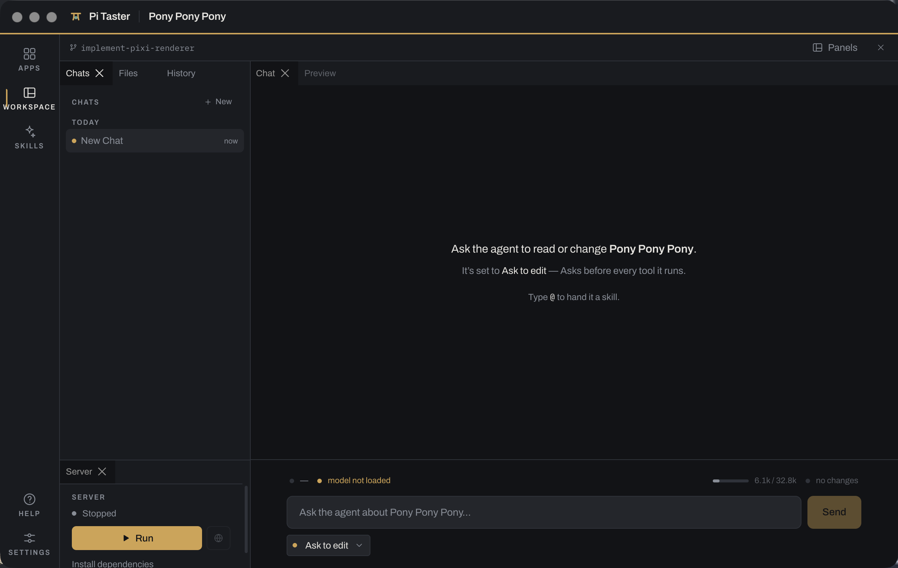

# Pi Taster

**A desktop app for tasting [Pi](https://pi.dev/) — a real coding agent, running
on models served by your own [Ollama](https://ollama.com).**

No API key, no account, and no inference request that leaves your machine. Pi
Taster gives the agent a place to work and you a way to watch it: describe what
you want in the chat panel, and it writes real source files to disk, runs the dev
server, and shows you the result running in a preview panel.

Every file it writes becomes a git commit, so anything it does can be undone —
including the changes it makes to **its own source**.

The workspace is a dock: chats, files, history, a terminal and a live preview,
dragged into whatever splits and tabs suit the work, and remembered per app.



## Try it

You'll need [Bun](https://bun.sh), [Ollama](https://ollama.com), and a model that
supports **tool calling**.

```bash
ollama serve
ollama pull qwen3-coder:30b     # or llama3.1, gpt-oss, mistral-nemo

bun install
bun run dev
```

Open **Settings → General**, pick your model, and create your first app. Full
setup notes, the command list, and troubleshooting are in
[Getting Started](docs/GETTING_STARTED.md).

## What you get

- **Sandboxed sub-apps.** Each one is a real project in `~/.pitaster/apps/`, with its own git repo. The agent can't reach outside the one that's open.
- **A live preview.** Run the app under the chat, click any element to attach it — markup, styles, screenshot — to your next message.
- **Approval you can see.** Every tool call is gated, inline in the transcript, with a diff attached before you say yes.
- **A history you can rewind.** Every write auto-commits. Browse the log, roll back, branch, merge.
- **Compiler errors the agent reads.** A TypeScript service checks each write and tells the agent what it just broke.
- **Skills and MCP sources.** Reusable instructions on demand, and third-party tools bridged in.
- **A visible context budget.** Local models have small windows. The meter shows where yours is going.

The full tour, with screenshots, is in [What Pi Taster Does](docs/FEATURES.md).

## How it's put together

A Bun workspace: the Electron app in `apps/electron/`, shared types in
`packages/core/`, and business logic in `packages/shared/`. Pi owns the agent loop
and its built-in tools; Pi Taster adds the permission gate, path confinement, git
auto-commit, code intelligence, and the MCP bridge. More in
[Architecture](docs/ARCHITECTURE.md).

Pi ships no sandbox, so confinement is Pi Taster's job and lives in one file:
[`permission-gate.ts`](apps/electron/src/main/agent/permission-gate.ts). What it
stops, what it doesn't, and what's left open on purpose is written up in
[Security](docs/SECURITY.md).

## Documentation

| Document | What's in it |
|----------|--------------|
| [Getting Started](docs/GETTING_STARTED.md) | Install, model setup, commands, troubleshooting |
| [What Pi Taster Does](docs/FEATURES.md) | The feature tour, panel by panel |
| [Architecture](docs/ARCHITECTURE.md) | Monorepo layout, the stack, who owns what |
| [Security](docs/SECURITY.md) | The confinement boundary, permission modes, known gaps |
| [AGENTS.md](AGENTS.md) | The deep version: design decisions and the bugs behind them |
| [CLAUDE.md](CLAUDE.md) | Claude Code–specific workflow on top of `AGENTS.md` |
| [docs/plans/](docs/plans/README.md) | One plan and one notes document per implementation session |

Pi Taster was built in numbered sessions, each with a plan and a record of what
actually got built. [Session 15](docs/plans/SESSION-15-NOTES.md) is the move from
a hand-rolled Anthropic loop to Pi on local models; [Session
17](docs/plans/SESSION-17-NOTES.md) covers the shell design and visual identity.

## License

[MIT](LICENSE) © Guy Ettinger
