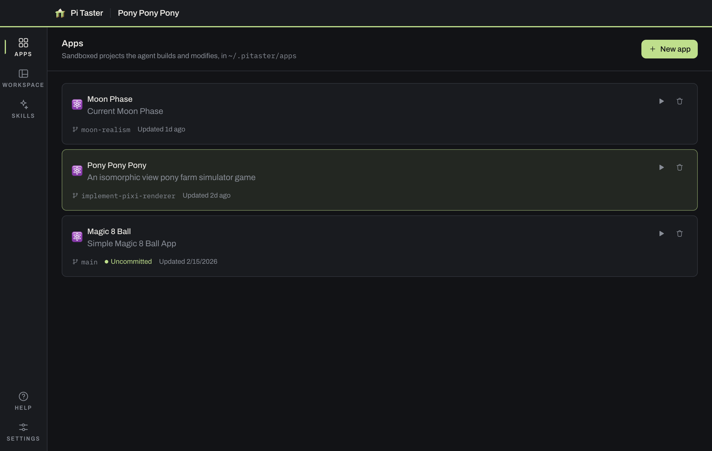
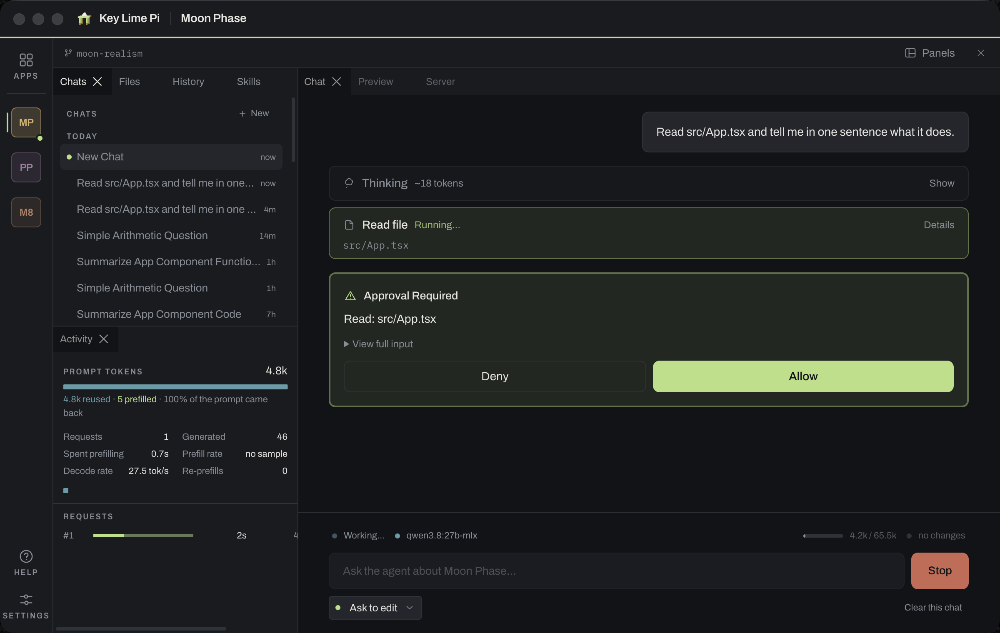
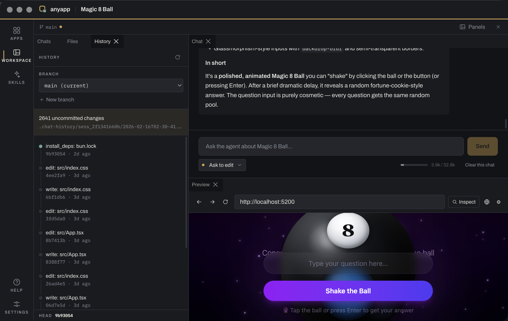
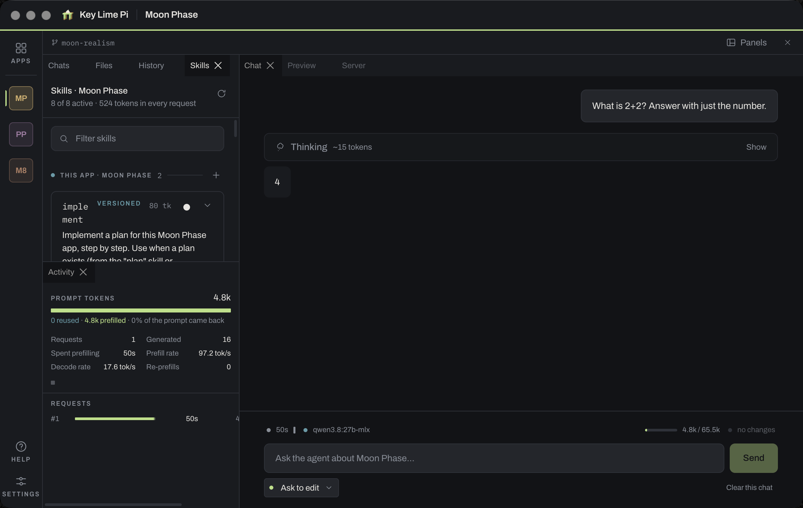

# What anyapp Does

A tour of the app, panel by panel. If you just want to get it running, start with
[Getting Started](GETTING_STARTED.md).

## It builds sandboxed sub-apps

Every app you create is a real project on disk at `~/.anyapp/apps/<name>`, with
its own git repository. Pick a starting point — React + Vite, Node CLI, Node
server, static site, or blank — and the agent takes it from there.

The agent is confined to whichever app is open. It cannot read or write a single
byte outside that directory, so an experiment in one app can't disturb another.

## You watch it run

Start the dev server from the app's own column and it appears in a preview panel
right below the chat. No alt-tabbing, no separate terminal.

Click **Inspect**, then click any element on the page, and that element comes
along with your next message — its markup, its computed styles, and a screenshot
of it. "Make this button bigger" stops being ambiguous.

## Every tool call is gated

The agent asks before it reads, writes, or runs anything, and you answer inline
in the transcript. You never leave the conversation to approve a step.

Four modes decide how much it asks:

| Mode | Behavior |
|------|----------|
| **Explore** | Read-only. It can look at anything in the app; it changes nothing. |
| **Ask to edit** | Prompt for approval on every tool use. |
| **Auto edit** | Auto-approve file operations. Shell commands still prompt. |
| **Auto — all** | Auto-approve everything. Use with caution. |

Writes come with a diff attached, in the transcript *and* in the approval prompt
— so in **Ask to edit** you're approving a change you've actually seen, not just
a filename. See [Security](SECURITY.md) for what each mode really permits.

## Nothing is unrecoverable

Every `write` and `edit` auto-commits. The History panel is the app's own git
log: browse it, roll back to any commit, branch off to try something risky, and
merge what works.

## The agent can check its own work

A TypeScript language service runs alongside each app, so compiler errors are
appended to the result of every successful write — the agent finds out it broke
something in the same breath as breaking it, instead of when you next run the
app.

The same service powers the code panel, so the squiggles you see and the errors
the agent sees come from one program. There are two navigation tools built on it:
`code_intel` (outline, jump to definition, find references, hover) and `refactor`
(rename, organize imports, apply fix).

## Skills are reusable instructions

A skill is a `SKILL.md` file the agent can load on demand. Drop one in
`~/.anyapp/skills/` to offer it to every app, or in `<app-root>/skills/` to keep
it with one app (where it's committed and rolls back alongside the code).

Six ship by default: keeping working notes, debugging, UI work, looking up
current docs, managing versions, and writing new skills. The Skills panel shows
what each one costs you in tokens on every request, and lets you switch any of
them off per app.

The six defaults are editable source in [`docs/skills/`](skills/) — run
`bun run sync:skills` after changing one. (Those are the *running app's* skills.
Claude Code's own live in `.claude/skills/` and have nothing to do with them.)

## It connects to MCP servers

Add a source in Settings and its tools show up to the agent as
`mcp__<source>__<tool>`. These always prompt for approval, even in **Auto edit**:
path confinement can't reach inside someone else's server process, so your
approval is the only boundary there is.

## The context window is visible

Local models have small windows, and anyapp spends yours deliberately — trimming
stale tool results, compacting when it must, and pruning the tool list when the
window is tight. The meter in the composer shows where you stand before you send
a word, and hovering it breaks the total down by what's taking up the room. There's
a **Summarize now** button when you want to reclaim space on your own terms.

## And it modifies itself

The same agent that builds sub-apps can be pointed at anyapp's own source. That
is the whole point of the name.
