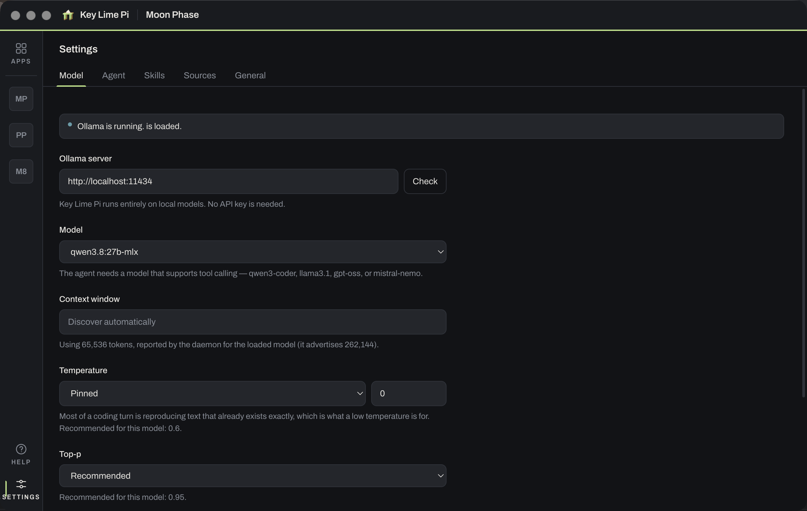

# Getting Started

## What you need

| | |
|---|---|
| [Bun](https://bun.sh) | Package manager and runtime for the monorepo |
| [Ollama](https://ollama.com) | Serves the model, locally |
| A **tool-calling** model | The agent works by calling tools. A model without tool support will connect and then sit there unable to do anything. |

Electron 39 or newer is required, because Pi needs Node ≥ 22.19. The repo pins
it, so this only matters if you're building against your own Electron.

## Install and run

```bash
# 1. Start Ollama and pull a tool-calling model
ollama serve
ollama pull qwen3-coder:30b     # or llama3.1, gpt-oss, mistral-nemo

# 2. Install and run Key Lime Pi
bun install
bun run dev
```

Then open **Settings → General** and pick your model. Key Lime Pi asks the daemon what
it's serving, so whatever you've pulled shows up in the list.



## Commands

| Command | Purpose |
|---------|---------|
| `bun install` | Install all workspace dependencies |
| `bun run dev` | Start the app with hot reload |
| `bun run build` | Build all packages |
| `bun run typecheck:all` | Type check the entire monorepo |
| `bun run sync:skills` | Regenerate the seeded skills from `docs/skills/` |
| `bun run --filter @keylimepi/electron dev` | Run a single workspace |

Run `bun run typecheck:all` after changing any source file. It's the gate the
self-modification flow relies on.

## Where your data lives

Everything is under `~/.keylimepi/`:

| Path | What's in it |
|------|--------------|
| `~/.keylimepi/apps/` | Your sub-apps — each one a real project with its own git repo |
| `~/.keylimepi/skills/` | Workspace skills, offered to every app |
| `~/.keylimepi/pi/` | Model configuration and Pi's chat transcripts |

Nothing is written outside that directory, and no request leaves your machine
except the ones you can see: the agent's `web_fetch` tool, and anything you let
it do with `bash`. Inference itself is always local.

## Troubleshooting

**The model connects but never uses a tool.** It doesn't support tool calling.
Try `qwen3-coder:30b`, `llama3.1`, `gpt-oss`, or `mistral-nemo`.

**Long turns time out or the agent seems to forget things.** The context window
Ollama *advertises* is the model's architectural maximum, not the one the daemon
actually served. Key Lime Pi discovers the real number by warming the model and
reading it back, but when both the daemon and the default are wrong you can set
an override in Settings. There's a fuller account of why in
[AGENTS.md](../AGENTS.md#the-context-window-is-not-what-ollama-advertises).

**The agent asks for approval on things you'd rather it just did.** Switch the
permission mode in the composer — see [Security](SECURITY.md) for what each mode
gives up.
