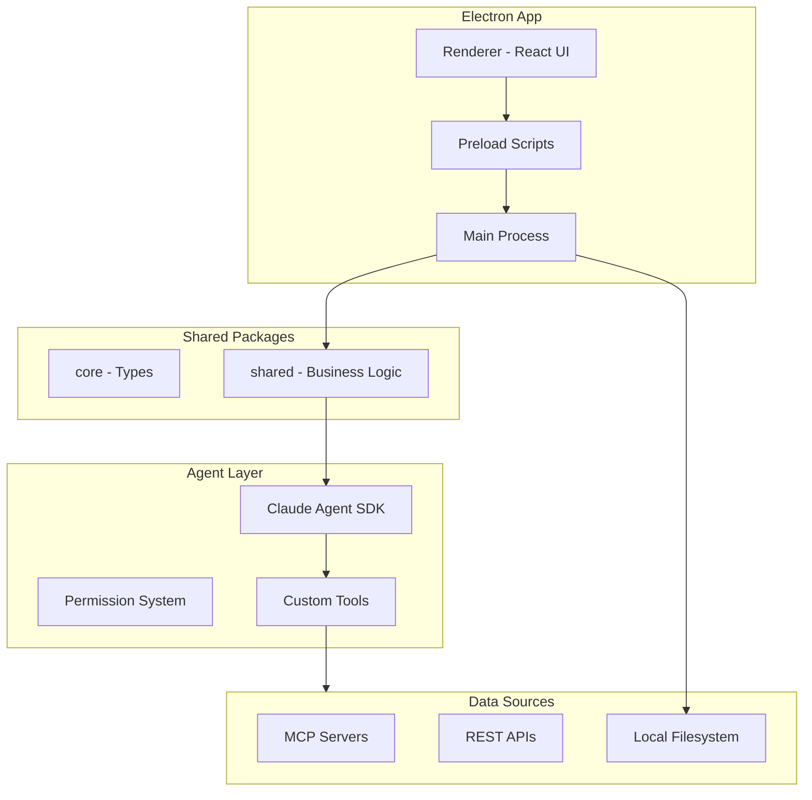
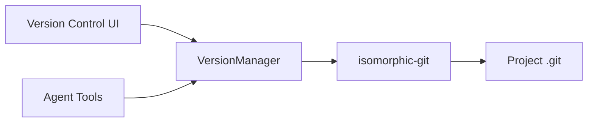

# Self-Modifying Electron App with Claude Agent SDK

This is the complete, comprehensive plan document. For phased implementation, see the individual session documents.

## Library Best Practices Summary (from Context7)


| Library          | Version | Key Patterns                                                                                     |
| ---------------- | ------- | ------------------------------------------------------------------------------------------------ |
| Claude Agent SDK | latest  | `createSdkMcpServer`, `tool` with Zod, `CanUseTool` callback, `includePartialMessages` streaming |
| Electron         | ^33.0.0 | `contextIsolation: true`, `sandbox: true`, `contextBridge.exposeInMainWorld`                     |
| electron-vite    | latest  | `defineConfig` with main/preload/renderer, standard folder structure                             |
| shadcn/ui        | latest  | `components.json` config, `@/components/ui` aliases, `new-york` style                            |
| MCP SDK          | ^1.25.0 | v1.x stable (v2 pre-alpha), `StdioClientTransport`, `McpServer.registerTool`                     |
| isomorphic-git   | ^1.27.0 | Pure JS git implementation, `git.commit`, `git.branch`, `git.checkout`, `git.merge`              |
| Bun              | latest  | `"workspaces": ["apps/*", "packages/*"]`, `"workspace:*"` dependencies                           |
| Tailwind CSS     | v4      | `@tailwindcss/vite` plugin, CSS variables                                                        |


## Architecture Overview




## Tech Stack


| Layer           | Technology                       |
| --------------- | -------------------------------- |
| Runtime         | Bun                              |
| Desktop         | Electron + React                 |
| UI              | shadcn/ui + Tailwind CSS v4      |
| AI              | @anthropic-ai/claude-agent-sdk   |
| Build           | esbuild (main) + Vite (renderer) |
| Package Manager | Bun workspaces (monorepo)        |


## Project Structure (electron-vite conventions)

```
anyapp/
├── apps/
│   └── electron/
│       ├── src/
│       │   ├── main/           # Electron main process
│       │   │   ├── index.ts    # App entry, BrowserWindow setup
│       │   │   ├── ipc.ts      # IPC handlers (ipcMain.handle)
│       │   │   └── agent.ts    # Claude Agent SDK integration
│       │   ├── preload/        # Context bridge (contextIsolation: true)
│       │   │   └── index.ts    # contextBridge.exposeInMainWorld
│       │   └── renderer/       # React UI (Vite-powered)
│       │       ├── src/
│       │       │   ├── main.tsx
│       │       │   ├── App.tsx
│       │       │   └── components/
│       │       │       └── ui/     # shadcn/ui components
│       │       ├── index.html
│       │       └── components.json # shadcn/ui config
│       ├── electron.vite.config.ts
│       └── package.json
├── packages/
│   ├── core/                   # @anyapp/core - Shared types
│   │   ├── src/
│   │   │   ├── index.ts
│   │   │   ├── agent.ts
│   │   │   ├── sources.ts
│   │   │   └── skills.ts
│   │   └── package.json
│   └── shared/                 # @anyapp/shared - Business logic
│       ├── src/
│       │   ├── agent/          # Claude Agent SDK wrapper
│       │   ├── sources/        # MCP client, API handlers
│       │   ├── skills/         # Skills loader and manager
│       │   ├── permissions/    # CanUseTool implementation
│       │   └── config/         # Config management
│       └── package.json
├── package.json                # Workspace root (Bun workspaces)
├── tsconfig.json
├── CLAUDE.md                   # Agent context documentation
└── bunfig.toml
```

### Bun Monorepo Root package.json

```json
{
  "name": "anyapp",
  "private": true,
  "workspaces": ["apps/*", "packages/*"],
  "scripts": {
    "dev": "bun run --filter @anyapp/electron dev",
    "build": "bun run --workspaces build",
    "typecheck:all": "bun run --workspaces typecheck"
  }
}
```

### Inter-workspace Dependencies

```json
// packages/shared/package.json
{
  "name": "@anyapp/shared",
  "dependencies": {
    "@anyapp/core": "workspace:*"
  }
}

// apps/electron/package.json
{
  "name": "@anyapp/electron",
  "dependencies": {
    "@anyapp/core": "workspace:*",
    "@anyapp/shared": "workspace:*"
  }
}
```

## Core Components

### 1. Self-Modification System (Claude Agent SDK)

The key to self-modification is giving the agent access to its own source code via custom tools using `createSdkMcpServer` and `tool` helper with Zod schemas:

```typescript
// apps/electron/src/main/agent.ts
import { query, tool, createSdkMcpServer } from "@anthropic-ai/claude-agent-sdk";
import { z } from "zod";

const selfModifyServer = createSdkMcpServer({
  name: "self-modify-tools",
  version: "1.0.0",
  tools: [
    tool(
      "read_source",
      "Read a source file from the project",
      { path: z.string().describe("Relative path to source file") },
      async ({ path }) => {
        const content = await fs.readFile(resolve(projectRoot, path), 'utf-8');
        return { content: [{ type: "text", text: content }] };
      }
    ),
    tool(
      "write_source",
      "Write content to a source file (requires edit permission)",
      {
        path: z.string().describe("Relative path to source file"),
        content: z.string().describe("New file content")
      },
      async ({ path, content }) => {
        // Permission check via CanUseTool callback
        await fs.writeFile(resolve(projectRoot, path), content);
        return { content: [{ type: "text", text: `Wrote ${path}` }] };
      }
    ),
    tool(
      "rebuild_app",
      "Run build command and return result",
      {},
      async () => {
        const result = await execAsync('bun run build');
        return { content: [{ type: "text", text: result.stdout }] };
      }
    )
  ]
});
```

**Permission handling with `CanUseTool`:**

```typescript
const canUseTool: CanUseTool = async (toolName, input, { signal, suggestions }) => {
  if (permissionMode === 'plan') {
    return { behavior: 'deny', message: 'Read-only mode active' };
  }
  if (permissionMode === 'bypassPermissions') {
    return { behavior: 'allow' };
  }
  // Show approval dialog for 'default' mode
  return await showApprovalDialog(toolName, input);
};
```

### 2. Sources System (MCP TypeScript SDK)

Use `@modelcontextprotocol/sdk` v1.x (stable) for MCP client/server:

```typescript
// packages/shared/src/sources/mcp-client.ts
import { Client } from '@modelcontextprotocol/sdk/client/index.js';
import { StdioClientTransport } from '@modelcontextprotocol/sdk/client/stdio.js';

export async function connectMcpSource(config: McpSourceConfig) {
  const client = new Client({
    name: 'anyapp-client',
    version: '1.0.0'
  });

  // Spawn server process via stdio transport
  const transport = new StdioClientTransport({
    command: config.command,  // e.g., 'npx'
    args: config.args         // e.g., ['-y', '@modelcontextprotocol/server-github']
  });

  await client.connect(transport);

  // Call tools with Zod-validated schemas
  const result = await client.callTool({
    name: config.toolName,
    arguments: config.toolArgs
  });

  return result;
}
```

### 3. Skills System

Skills are markdown files with YAML frontmatter, stored in `~/.anyapp/workspaces/{id}/skills/`:

```markdown
---
name: code-review
description: Reviews code for quality, security, and best practices following team standards. Use when reviewing pull requests, code changes, or when the user asks for a code review.
---

# Code Review

## Quick Start
When reviewing code:
1. Check for correctness and potential bugs
2. Verify security best practices
3. Assess code readability and maintainability

## Review Checklist
- [ ] Logic is correct and handles edge cases
- [ ] No security vulnerabilities
- [ ] Error handling is comprehensive
- [ ] Tests cover the changes
```

Skills are loaded as system prompts and referenced with `@skill-name` in conversations.

### 4. Version Control System (isomorphic-git Backend)

A git-backed versioning system with a simplified UI abstraction. Uses `isomorphic-git` (pure JavaScript, no native dependencies) as the backend, giving users branch, rollback, and merge capabilities without needing to know git commands.

**Why isomorphic-git:**

- Pure JavaScript - works in Node.js/Electron without native dependencies
- Full git implementation (commit, branch, checkout, merge, diff)
- Battle-tested - leverages 20+ years of git reliability
- Interoperable - advanced users can use git CLI, push to GitHub, etc.
- No custom snapshot storage needed - git handles everything

#### How It Works

The project directory is already a git repo. The VersionManager wraps `isomorphic-git` to provide a simplified API:




#### Core Types

```typescript
// packages/core/src/versions.ts

/**
 * A commit represents a saved state (maps to git commit).
 */
interface Commit {
  /** Git commit SHA. */
  oid: string
  /** Commit message (description of changes). */
  message: string
  /** Author name. */
  author: string
  /** ISO timestamp when committed. */
  timestamp: string
  /** Parent commit SHA(s). */
  parents: string[]
  /** Files changed in this commit. */
  files?: FileChange[]
}

/**
 * A file change in a commit.
 */
interface FileChange {
  /** Relative path from project root. */
  path: string
  /** Type of change. */
  type: 'add' | 'modify' | 'delete'
}

/**
 * A branch (maps to git branch).
 */
interface Branch {
  /** Branch name (e.g., "main", "experiment-dark-mode"). */
  name: string
  /** Current head commit SHA. */
  head: string
  /** Whether this is the current branch. */
  isCurrent: boolean
}

/**
 * Version control state.
 */
interface VersionState {
  /** Current branch name. */
  currentBranch: string
  /** Current HEAD commit SHA. */
  head: string
  /** Whether there are uncommitted changes. */
  hasChanges: boolean
  /** List of modified files (if hasChanges). */
  modifiedFiles: string[]
}

/**
 * Diff between two commits.
 */
interface FileDiff {
  /** File path. */
  path: string
  /** Type of change. */
  type: 'add' | 'modify' | 'delete'
  /** Old content (for modify/delete). */
  oldContent?: string
  /** New content (for add/modify). */
  newContent?: string
}

/**
 * Merge conflict information.
 */
interface MergeConflict {
  /** File path with conflict. */
  path: string
  /** Our version (current branch). */
  ours: string
  /** Their version (merging branch). */
  theirs: string
  /** Common ancestor version. */
  base: string
}
```

#### Version Manager Implementation

```typescript
// packages/shared/src/versions/manager.ts
import * as git from 'isomorphic-git'
import fs from 'node:fs'

const AUTHOR = { name: 'anyapp Agent', email: 'agent@anyapp.local' }

export class VersionManager {
  constructor(private dir: string) {}

  /**
   * Auto-commit modified files with a descriptive message.
   */
  async commit(options: {
    message: string
    files: string[]
  }): Promise<Commit> {
    // Stage files
    for (const filepath of options.files) {
      await git.add({ fs, dir: this.dir, filepath })
    }
    
    // Commit
    const oid = await git.commit({
      fs,
      dir: this.dir,
      message: options.message,
      author: AUTHOR
    })
    
    return this.getCommit(oid)
  }

  /**
   * Rollback to a specific commit (checkout + reset).
   */
  async rollback(commitOid: string): Promise<void> {
    await git.checkout({
      fs,
      dir: this.dir,
      ref: commitOid,
      force: true  // Discard uncommitted changes
    })
  }

  /**
   * Create a new branch from current HEAD or specific commit.
   */
  async createBranch(options: {
    name: string
    fromCommit?: string
  }): Promise<Branch> {
    await git.branch({
      fs,
      dir: this.dir,
      ref: options.name,
      checkout: true,  // Switch to new branch
      object: options.fromCommit
    })
    
    return this.getBranch(options.name)
  }

  /**
   * Switch to a different branch.
   */
  async switchBranch(branchName: string): Promise<void> {
    await git.checkout({
      fs,
      dir: this.dir,
      ref: branchName
    })
  }

  /**
   * Get diff between two commits.
   */
  async diff(fromOid: string, toOid: string): Promise<FileDiff[]> {
    // Use git.walk to compare trees
    const diffs: FileDiff[] = []
    
    await git.walk({
      fs,
      dir: this.dir,
      trees: [git.TREE({ ref: fromOid }), git.TREE({ ref: toOid })],
      map: async (filepath, [A, B]) => {
        if (filepath === '.') return
        
        const aOid = await A?.oid()
        const bOid = await B?.oid()
        
        if (aOid !== bOid) {
          diffs.push({
            path: filepath,
            type: !aOid ? 'add' : !bOid ? 'delete' : 'modify',
            oldContent: aOid ? await this.readBlob(aOid) : undefined,
            newContent: bOid ? await this.readBlob(bOid) : undefined
          })
        }
      }
    })
    
    return diffs
  }

  /**
   * Merge a branch into current branch.
   */
  async merge(branchName: string): Promise<{ 
    success: boolean
    conflicts?: MergeConflict[] 
  }> {
    try {
      await git.merge({
        fs,
        dir: this.dir,
        theirs: branchName,
        author: AUTHOR
      })
      return { success: true }
    } catch (error) {
      if (error.code === 'MergeConflictError') {
        return { 
          success: false, 
          conflicts: await this.getConflicts() 
        }
      }
      throw error
    }
  }

  /**
   * Get commit history for current branch.
   */
  async getHistory(options?: { depth?: number }): Promise<Commit[]> {
    const commits = await git.log({
      fs,
      dir: this.dir,
      depth: options?.depth ?? 50
    })
    
    return commits.map(c => ({
      oid: c.oid,
      message: c.commit.message,
      author: c.commit.author.name,
      timestamp: new Date(c.commit.author.timestamp * 1000).toISOString(),
      parents: c.commit.parent
    }))
  }

  /**
   * List all branches.
   */
  async listBranches(): Promise<Branch[]> {
    const branches = await git.listBranches({ fs, dir: this.dir })
    const current = await git.currentBranch({ fs, dir: this.dir })
    
    return Promise.all(branches.map(async name => ({
      name,
      head: await git.resolveRef({ fs, dir: this.dir, ref: name }),
      isCurrent: name === current
    })))
  }

  /**
   * Delete a branch.
   */
  async deleteBranch(branchName: string): Promise<void> {
    await git.deleteBranch({ fs, dir: this.dir, ref: branchName })
  }

  /**
   * Get current version control state.
   */
  async getState(): Promise<VersionState> {
    const currentBranch = await git.currentBranch({ fs, dir: this.dir }) ?? 'HEAD'
    const head = await git.resolveRef({ fs, dir: this.dir, ref: 'HEAD' })
    const status = await git.statusMatrix({ fs, dir: this.dir })
    
    const modifiedFiles = status
      .filter(([, head, workdir, stage]) => head !== workdir || head !== stage)
      .map(([filepath]) => filepath)
    
    return {
      currentBranch,
      head,
      hasChanges: modifiedFiles.length > 0,
      modifiedFiles
    }
  }
}
```

#### Integration with Self-Modification

The agent's `write_source` tool automatically commits changes:

```typescript
tool(
  "write_source",
  "Write content to a source file (auto-commits to git)",
  {
    path: z.string().describe("Relative path to source file"),
    content: z.string().describe("New file content"),
    message: z.string().describe("Brief description of the change")
  },
  async ({ path, content, message }) => {
    // Write the file
    await fs.writeFile(resolve(projectRoot, path), content);
    
    // Auto-commit
    const commit = await versionManager.commit({
      message,
      files: [path]
    });
    
    return { 
      content: [{ 
        type: "text", 
        text: `Wrote ${path} (committed: ${commit.oid.slice(0,7)})` 
      }] 
    };
  }
)
```

#### Agent Version Control Tools

The agent can directly interact with git through these tools:

```typescript
const versionTools = [
  tool(
    "version_create_branch",
    "Create a new branch for experimental changes",
    { 
      name: z.string().describe("Branch name (e.g., 'experiment-dark-mode')")
    },
    async ({ name }) => {
      await versionManager.createBranch({ name });
      return { content: [{ type: "text", text: `Created and switched to branch '${name}'` }] };
    }
  ),
  
  tool(
    "version_switch_branch",
    "Switch to a different branch (restores files to that branch's state)",
    { branchName: z.string().describe("Branch name to switch to") },
    async ({ branchName }) => {
      await versionManager.switchBranch(branchName);
      return { content: [{ type: "text", text: `Switched to branch '${branchName}'` }] };
    }
  ),
  
  tool(
    "version_rollback",
    "Rollback to a previous commit (restores files to that state)",
    { commitId: z.string().describe("Commit SHA to rollback to (first 7 chars ok)") },
    async ({ commitId }) => {
      await versionManager.rollback(commitId);
      return { content: [{ type: "text", text: `Rolled back to commit ${commitId}` }] };
    }
  ),
  
  tool(
    "version_history",
    "Get the commit history for the current branch",
    { depth: z.number().optional().describe("Max commits to return (default 10)") },
    async ({ depth = 10 }) => {
      const history = await versionManager.getHistory({ depth });
      const formatted = history.map(c => 
        `- ${c.oid.slice(0,7)}: "${c.message}" (${c.timestamp})`
      ).join('\n');
      return { content: [{ type: "text", text: formatted }] };
    }
  ),
  
  tool(
    "version_list_branches",
    "List all available branches",
    {},
    async () => {
      const branches = await versionManager.listBranches();
      const formatted = branches.map(b => 
        `- ${b.name}${b.isCurrent ? ' (current)' : ''}`
      ).join('\n');
      return { content: [{ type: "text", text: formatted }] };
    }
  ),
  
  tool(
    "version_merge",
    "Merge another branch into the current branch",
    { branchName: z.string().describe("Branch name to merge") },
    async ({ branchName }) => {
      const result = await versionManager.merge(branchName);
      if (result.success) {
        return { content: [{ type: "text", text: `Merged '${branchName}' successfully` }] };
      } else {
        const conflicts = result.conflicts?.map(c => c.path).join(', ');
        return { content: [{ type: "text", text: `Merge conflicts in: ${conflicts}` }] };
      }
    }
  ),
  
  tool(
    "version_status",
    "Get current version control status (branch, uncommitted changes)",
    {},
    async () => {
      const state = await versionManager.getState();
      let status = `Branch: ${state.currentBranch}\nHEAD: ${state.head.slice(0,7)}`;
      if (state.hasChanges) {
        status += `\nUncommitted changes:\n${state.modifiedFiles.map(f => `  - ${f}`).join('\n')}`;
      } else {
        status += '\nNo uncommitted changes';
      }
      return { content: [{ type: "text", text: status }] };
    }
  )
]
```

#### UI Components

```
┌─────────────────────────────────────────────────────────────┐
│  Version Control                                    [main ▼] │
├─────────────────────────────────────────────────────────────┤
│  ┌─────────────────────────────────────────────────────┐    │
│  │ Timeline                                            │    │
│  │                                                     │    │
│  │  ● Current (uncommitted changes)                    │    │
│  │  │                                                  │    │
│  │  ○ "Add dark mode toggle" - 2 min ago        [↩️]  │    │
│  │  │                                                  │    │
│  │  ○ "Fix chat scroll issue" - 15 min ago      [↩️]  │    │
│  │  │                                                  │    │
│  │  ○ "Initial setup" - 1 hour ago              [↩️]  │    │
│  │                                                     │    │
│  └─────────────────────────────────────────────────────┘    │
│                                                             │
│  [+ New Branch]  [Compare...]  [Merge Branch...]            │
└─────────────────────────────────────────────────────────────┘
```

**Key UI Features:**

- **Branch Switcher**: Dropdown to switch between branches
- **Timeline View**: Visual history of snapshots with rollback buttons
- **Diff Viewer**: Side-by-side comparison between snapshots
- **Branch Manager**: Create, rename, delete, merge branches
- **Uncommitted Changes**: Shows pending changes before snapshot

## Implementation Phases

### Phase 1: Foundation

- Set up Bun monorepo with apps/electron and packages/
- Configure Electron with Vite for hot reload
- Create basic React UI with shadcn/ui
- Establish IPC communication between main and renderer

### Phase 2: Agent Integration

- Integrate Claude Agent SDK in main process
- Implement basic chat interface with streaming responses
- Add file system tools for reading/writing project files
- Implement permission modes (explore/edit)

### Phase 3: Self-Modification

- Create tools that expose the app's own source code to the agent
- Implement rebuild and restart mechanisms
- Add safety guards (backup before edit, confirmation prompts)
- Test self-modification workflow

### Phase 4: Version Control (isomorphic-git)

- Implement VersionManager wrapping isomorphic-git API
- Add branch management (create, switch, delete, merge)
- Integrate auto-commit into write_source tool
- Build version control UI (timeline, branch switcher, diff viewer)
- Leverage git's built-in diff and merge capabilities

### Phase 5: Sources

- Implement MCP client for stdio-based servers
- Add REST API source with OAuth flow support
- Create filesystem source with watch capability
- Build source management UI

### Phase 6: Skills

- Implement skills file loader
- Add `@mention` syntax for skills in chat
- Create skills management UI
- Allow agent to create/edit skills

### Phase 7: Sub-Apps (Sandboxed Self-Modification)

- Make outer Electron container immutable
- Create AppManager for sub-app lifecycle (create, list, delete)
- Implement app templates (React, Node CLI, Node Server, Static, Blank)
- Each sub-app gets isolated git repository in `~/.anyapp/apps/`
- Build App Listing UI for managing sub-apps
- Scope agent context to active sub-app only
- Prevent path traversal outside app directory
- Dynamic system prompts based on active app context

## Key Files to Create

1. `apps/electron/src/main/agent.ts` - Claude Agent SDK wrapper with custom tools
2. `packages/shared/src/sources/mcp-client.ts` - MCP protocol implementation
3. `packages/shared/src/skills/loader.ts` - Skills file parser and loader
4. `packages/shared/src/permissions/guard.ts` - Permission checking logic (CanUseTool)
5. `apps/electron/src/renderer/components/Chat.tsx` - Main chat interface
6. `packages/core/src/versions.ts` - Version control type definitions (Commit, Branch, etc.)
7. `packages/shared/src/versions/manager.ts` - VersionManager wrapping isomorphic-git
8. `apps/electron/src/renderer/components/VersionControl.tsx` - Version control UI panel
9. `apps/electron/src/renderer/components/DiffViewer.tsx` - Side-by-side diff viewer
10. `packages/core/src/apps.ts` - Sub-app type definitions (SubApp, AppTemplate, etc.)
11. `packages/shared/src/apps/manager.ts` - AppManager for sub-app lifecycle
12. `apps/electron/src/renderer/components/AppListing.tsx` - App management UI
13. `apps/electron/src/renderer/components/AppHeader.tsx` - Active app context header

## Streaming Implementation (Claude Agent SDK)

Enable real-time streaming with `includePartialMessages: true`:

```typescript
// apps/electron/src/main/agent.ts
import { query } from "@anthropic-ai/claude-agent-sdk";

async function handleAgentQuery(prompt: string, webContents: WebContents) {
  for await (const message of query({
    prompt,
    options: {
      includePartialMessages: true,
      allowedTools: ["Read", "Bash", "write_source", "rebuild_app"]
    }
  })) {
    if (message.type === "stream_event") {
      const event = message.event;
      
      // Stream text as it arrives
      if (event.type === "content_block_delta" && event.delta.type === "text_delta") {
        webContents.send('agent:stream', { type: 'text', text: event.delta.text });
      }
      
      // Track tool execution
      if (event.type === "content_block_start" && event.content_block.type === "tool_use") {
        webContents.send('agent:stream', { 
          type: 'tool_start', 
          tool: event.content_block.name 
        });
      }
      
      if (event.type === "content_block_stop") {
        webContents.send('agent:stream', { type: 'tool_end' });
      }
    } else if (message.type === "result") {
      webContents.send('agent:stream', { type: 'complete' });
    }
  }
}
```

## Configuration Storage

App configuration at `~/.anyapp/`:

```
~/.anyapp/
├── config.json              # App settings, API keys
├── preferences.json         # UI preferences
└── workspaces/
    └── {workspace-id}/
        ├── config.json      # Workspace settings
        ├── sources/         # Source configurations
        ├── skills/          # Skill markdown files
        └── sessions/        # Chat history (JSONL)
```

**Version Control**: Uses the project's existing `.git` directory via `isomorphic-git`. No custom storage needed - all versioning (commits, branches, history) is stored in standard git format.

## Dependencies to Install

### Root package.json (workspace)

```json
{
  "devDependencies": {
    "typescript": "^5.5.0"
  }
}
```

### apps/electron/package.json

```json
{
  "dependencies": {
    "@anthropic-ai/claude-agent-sdk": "latest",
    "@modelcontextprotocol/sdk": "^1.25.0",
    "@tanstack/react-query": "^5.0.0",
    "isomorphic-git": "^1.27.0",
    "zod": "^3.25.0",
    "@electron-toolkit/preload": "latest",
    "lucide-react": "latest"
  },
  "devDependencies": {
    "electron": "^33.0.0",
    "electron-vite": "latest",
    "vite": "^6.0.0",
    "@vitejs/plugin-react": "latest",
    "tailwindcss": "^4.0.0",
    "@tailwindcss/vite": "latest",
    "typescript": "^5.5.0"
  }
}
```

### electron.vite.config.ts (electron-vite configuration)

```typescript
import { defineConfig } from 'electron-vite'
import { resolve } from 'path'
import react from '@vitejs/plugin-react'
import tailwindcss from '@tailwindcss/vite'

export default defineConfig({
  main: {
    build: {
      rollupOptions: {
        input: { index: resolve(__dirname, 'src/main/index.ts') }
      }
    }
  },
  preload: {
    build: {
      rollupOptions: {
        input: { index: resolve(__dirname, 'src/preload/index.ts') }
      }
    }
  },
  renderer: {
    root: 'src/renderer',
    plugins: [react(), tailwindcss()],
    build: {
      rollupOptions: {
        input: { index: resolve(__dirname, 'src/renderer/index.html') }
      }
    }
  }
})
```

### Secure Preload Script Pattern

```typescript
// src/preload/index.ts
import { contextBridge, ipcRenderer } from 'electron'

// GOOD: Expose specific functions, filter event data
contextBridge.exposeInMainWorld('electronAPI', {
  // Agent communication
  sendMessage: (message: string) => ipcRenderer.invoke('agent:message', message),
  onAgentStream: (callback: (chunk: string) => void) => {
    ipcRenderer.on('agent:stream', (_event, chunk) => callback(chunk))
  },
  
  // Permission handling
  getPermissionMode: () => ipcRenderer.invoke('permissions:get-mode'),
  setPermissionMode: (mode: string) => ipcRenderer.invoke('permissions:set-mode', mode),
  
  // Tool approval (for 'default' mode)
  onToolApproval: (callback: (tool: string, input: unknown) => void) => {
    ipcRenderer.on('agent:tool-approval', (_event, tool, input) => callback(tool, input))
  },
  respondToolApproval: (approved: boolean) => ipcRenderer.send('agent:tool-response', approved)
})

// BAD: Never expose raw ipcRenderer
// contextBridge.exposeInMainWorld('electronAPI', { on: ipcRenderer.on })
```

### shadcn/ui components.json

```json
{
  "$schema": "https://ui.shadcn.com/schema.json",
  "style": "new-york",
  "rsc": false,
  "tsx": true,
  "tailwind": {
    "config": "",
    "css": "src/renderer/src/styles/globals.css",
    "baseColor": "neutral",
    "cssVariables": true
  },
  "aliases": {
    "components": "@/components",
    "utils": "@/lib/utils",
    "ui": "@/components/ui"
  },
  "iconLibrary": "lucide"
}
```

## Security Considerations

- Filter sensitive env vars when spawning MCP subprocesses
- Encrypt stored credentials (AES-256-GCM)
- Implement permission prompts before destructive actions
- Sandbox agent file access to project directory by default

---

## Cursor Rules to Create

Create these rules in `.cursor/rules/` to provide consistent AI guidance during development.

### 1. Project Architecture Rule (Always Apply)

**File**: `.cursor/rules/project-architecture.mdc`

```markdown
---
description: anyapp project architecture and conventions
alwaysApply: true
---

# anyapp Architecture

## Monorepo Structure (Bun Workspaces)

- `apps/electron/` - Electron desktop app
- `packages/core/` - Shared TypeScript types (@anyapp/core)
- `packages/shared/` - Business logic (@anyapp/shared)

## electron-vite Folder Convention

- `src/main/` - Electron main process (Node.js environment)
- `src/preload/` - Context bridge scripts (isolated context)
- `src/renderer/` - React UI (browser environment, Vite-powered)

## Package Dependencies

Use `"workspace:*"` for inter-package dependencies:

\`\`\`json
{
  "dependencies": {
    "@anyapp/core": "workspace:*",
    "@anyapp/shared": "workspace:*"
  }
}
\`\`\`

## Key Commands

- `bun install` - Install all workspace dependencies
- `bun run dev` - Start development with hot reload
- `bun run build` - Build all packages
- `bun run typecheck:all` - Type check entire monorepo
- `bun run --filter @anyapp/electron dev` - Run specific workspace

## Import Conventions

- Types from `@anyapp/core`
- Business logic from `@anyapp/shared`
- UI components from `@/components/ui` (shadcn)
```

### 2. Electron Security Rule

**File**: `.cursor/rules/electron-security.mdc`

```markdown
---
description: Electron security best practices
globs: apps/electron/**/*.ts
alwaysApply: false
---

# Electron Security Best Practices

## BrowserWindow Configuration

Always set these webPreferences:

\`\`\`typescript
new BrowserWindow({
  webPreferences: {
    preload: path.join(__dirname, '../preload/index.js'),
    contextIsolation: true,  // REQUIRED - isolates preload from renderer
    nodeIntegration: false,  // REQUIRED - no Node.js in renderer
    sandbox: true            // RECOMMENDED - OS-level sandboxing
  }
})
\`\`\`

## Preload Script Patterns

### BAD - Never expose raw ipcRenderer

\`\`\`typescript
// DANGEROUS: Exposes full IPC capabilities
contextBridge.exposeInMainWorld('electronAPI', {
  on: ipcRenderer.on
})

// DANGEROUS: Leaks event object
contextBridge.exposeInMainWorld('electronAPI', {
  onUpdate: (callback) => ipcRenderer.on('update', callback)
})
\`\`\`

### GOOD - Expose specific functions, filter events

\`\`\`typescript
contextBridge.exposeInMainWorld('electronAPI', {
  // Use invoke for request/response
  sendMessage: (msg: string) => ipcRenderer.invoke('agent:message', msg),
  
  // Filter event data - never pass raw event
  onStream: (callback: (data: string) => void) => {
    ipcRenderer.on('agent:stream', (_event, data) => callback(data))
  }
})
\`\`\`

## IPC Handler Security

Validate all inputs in main process:

\`\`\`typescript
ipcMain.handle('agent:message', async (event, message) => {
  if (typeof message !== 'string' || message.length > 100000) {
    throw new Error('Invalid message')
  }
  // Process validated input
})
\`\`\`

## Environment Variable Filtering

Block sensitive vars when spawning subprocesses:

\`\`\`typescript
const BLOCKED_ENV_VARS = [
  'ANTHROPIC_API_KEY',
  'OPENAI_API_KEY', 
  'AWS_SECRET_ACCESS_KEY',
  'GITHUB_TOKEN'
]

const filteredEnv = Object.fromEntries(
  Object.entries(process.env)
    .filter(([key]) => !BLOCKED_ENV_VARS.includes(key))
)
\`\`\`

## Credential Storage

Use Electron's safeStorage for sensitive data:

\`\`\`typescript
import { safeStorage } from 'electron'

const encrypted = safeStorage.encryptString(apiKey)
const decrypted = safeStorage.decryptString(encrypted)
\`\`\`
```

### 3. Claude Agent SDK Rule

**File**: `.cursor/rules/claude-agent-sdk.mdc`

```markdown
---
description: Claude Agent SDK patterns and permission handling
globs: "**/{agent,permissions}/**/*.ts"
alwaysApply: false
---

# Claude Agent SDK Best Practices

## Creating Custom Tools

Use `createSdkMcpServer` with `tool` helper and Zod schemas:

\`\`\`typescript
import { createSdkMcpServer, tool } from "@anthropic-ai/claude-agent-sdk"
import { z } from "zod"

const server = createSdkMcpServer({
  name: "my-tools",
  version: "1.0.0",
  tools: [
    tool(
      "read_file",
      "Read contents of a file",
      { path: z.string().describe("File path to read") },
      async ({ path }) => {
        const content = await fs.readFile(path, 'utf-8')
        return { content: [{ type: "text", text: content }] }
      }
    )
  ]
})
\`\`\`

## Permission Modes

| Mode | Behavior |
|------|----------|
| `default` | Triggers `canUseTool` callback for approval |
| `acceptEdits` | Auto-approves file edits (mkdir, rm, mv, cp) |
| `bypassPermissions` | Auto-approves ALL tools (use with caution) |
| `plan` | Read-only, no tool execution |

## Implementing CanUseTool

\`\`\`typescript
const canUseTool: CanUseTool = async (toolName, input, { signal }) => {
  if (permissionMode === 'plan') {
    return { behavior: 'deny', message: 'Plan mode active' }
  }
  if (permissionMode === 'bypassPermissions') {
    return { behavior: 'allow' }
  }
  // Show UI for approval
  const approved = await showApprovalDialog(toolName, input)
  return approved ? { behavior: 'allow' } : { behavior: 'deny' }
}
\`\`\`

## Streaming Responses

Enable with `includePartialMessages: true`:

\`\`\`typescript
for await (const message of query({
  prompt,
  options: { includePartialMessages: true }
})) {
  if (message.type === "stream_event") {
    const event = message.event
    
    // Text streaming
    if (event.type === "content_block_delta" && 
        event.delta.type === "text_delta") {
      process.stdout.write(event.delta.text)
    }
    
    // Tool start
    if (event.type === "content_block_start" && 
        event.content_block.type === "tool_use") {
      console.log(`[Using ${event.content_block.name}...]`)
    }
    
    // Tool end
    if (event.type === "content_block_stop") {
      console.log(" done")
    }
  }
}
\`\`\`

## Tool Input Streaming

Accumulate JSON input as it arrives:

\`\`\`typescript
let toolInput = ""

if (event.type === "content_block_delta" && 
    event.delta.type === "input_json_delta") {
  toolInput += event.delta.partial_json
}
\`\`\`
```

### 4. MCP Integration Rule

**File**: `.cursor/rules/mcp-integration.mdc`

```markdown
---
description: MCP server/client implementation patterns
globs: "**/sources/**/*.ts"
alwaysApply: false
---

# MCP TypeScript SDK Best Practices

## Version Requirements

Use v1.x (stable). v2 is pre-alpha and not production ready.

\`\`\`json
{
  "dependencies": {
    "@modelcontextprotocol/sdk": "^1.25.0",
    "zod": "^3.25.0"
  }
}
\`\`\`

## Import Paths

Always use specific import paths with .js extension:

\`\`\`typescript
import { Client } from '@modelcontextprotocol/sdk/client/index.js'
import { StdioClientTransport } from '@modelcontextprotocol/sdk/client/stdio.js'
import { McpServer } from '@modelcontextprotocol/sdk/server/mcp.js'
import { StdioServerTransport } from '@modelcontextprotocol/sdk/server/stdio.js'
\`\`\`

## Creating an MCP Client (Stdio)

\`\`\`typescript
const client = new Client({
  name: 'anyapp-client',
  version: '1.0.0'
})

const transport = new StdioClientTransport({
  command: 'npx',
  args: ['-y', '@modelcontextprotocol/server-github']
})

await client.connect(transport)

// Call tools
const result = await client.callTool({
  name: 'list_repos',
  arguments: { owner: 'anthropics' }
})

// ALWAYS clean up
await client.close()
\`\`\`

## Creating an MCP Server

\`\`\`typescript
import * as z from 'zod'

const server = new McpServer({
  name: 'my-server',
  version: '1.0.0'
})

server.registerTool(
  'get_time',
  {
    title: 'Get Current Time',
    description: 'Returns current timestamp',
    inputSchema: {},
    outputSchema: {
      timestamp: z.string(),
      timezone: z.string()
    }
  },
  async () => {
    const output = {
      timestamp: new Date().toISOString(),
      timezone: Intl.DateTimeFormat().resolvedOptions().timeZone
    }
    return {
      content: [{ type: 'text', text: JSON.stringify(output) }],
      structuredContent: output
    }
  }
)

const transport = new StdioServerTransport()
await server.connect(transport)
\`\`\`

## Error Handling

\`\`\`typescript
try {
  await client.connect(transport)
} catch (error) {
  if (error.code === 'ENOENT') {
    console.error('MCP server command not found')
  }
  throw error
} finally {
  await client.close()
}
\`\`\`
```

### 5. React Practices Rule (Merged with shadcn/ui)

**File**: `.cursor/rules/react-practices.mdc`

```markdown
---
description: React fundamentals, component patterns, shadcn/ui, Tailwind CSS, and Electron IPC integration
globs: apps/electron/src/renderer/**/*.tsx
alwaysApply: false
---

# React Patterns & Best Practices

## React Fundamentals

- Components and hooks must be pure functions
- Import from `"react"` directly (e.g., `import { useState } from "react"`), never use UMD `React.` references
- Use `useCallback` for functions passed as props or dependencies to other hooks
- Use `useMemo` for expensive computations, not for simple object creation
- Avoid premature optimization - only memoize when profiling shows a performance benefit
- Exception: Functions returned from custom hooks should typically be wrapped with `useCallback`
- Refs are escape hatches - use sparingly and prefer state when possible

## Component Patterns

- Components use named exports (not default exports)
- Props interfaces defined with TSDoc comments
- Use shadcn/ui components from `@/components/ui/`
- Use `cn()` utility from `@/lib/utils` for className merging

\`\`\`typescript
import { useState } from "react"
import { cn } from "@/lib/utils"
import { Button } from "@/components/ui/button"

/**
 * Props for the ChatInput component.
 */
interface ChatInputProps {
  /** Callback when message is sent. */
  onSend: (message: string) => void
  /** Whether input is disabled. */
  disabled?: boolean
}

/**
 * Chat input component with send button.
 */
export function ChatInput({ onSend, disabled = false }: ChatInputProps) {
  const [value, setValue] = useState("")
  
  const handleSend = useCallback(() => {
    if (value.trim()) {
      onSend(value)
      setValue("")
    }
  }, [value, onSend])
  
  return (
    <div className={cn("flex gap-2 p-4", disabled && "opacity-50")}>
      <input 
        value={value}
        onChange={(e) => setValue(e.target.value)}
        disabled={disabled}
        className="flex-1 rounded border px-3 py-2"
      />
      <Button onClick={handleSend} disabled={disabled}>Send</Button>
    </div>
  )
}
\`\`\`

## shadcn/ui Configuration

\`\`\`json
{
  "$schema": "https://ui.shadcn.com/schema.json",
  "style": "new-york",
  "rsc": false,
  "tsx": true,
  "tailwind": {
    "config": "",
    "css": "src/renderer/src/styles/globals.css",
    "baseColor": "neutral",
    "cssVariables": true
  },
  "aliases": {
    "components": "@/components",
    "utils": "@/lib/utils",
    "ui": "@/components/ui"
  },
  "iconLibrary": "lucide"
}
\`\`\`

## Tailwind CSS Patterns

- Use utility classes directly in components (utility-first approach)
- Extract repeated patterns into reusable components, not custom CSS classes
- Use mobile-first responsive design (`sm:`, `md:`, `lg:` for larger screens)
- Map props to complete class names statically (not dynamically constructed)
- Prefer Tailwind classnames; only use inline `style` for truly dynamic values

## Naming Conventions

- **Hooks**: `use` prefix with camelCase (e.g., `useAgentStream`)
- **Components**: PascalCase (e.g., `ChatMessage`)
- **Files**: kebab-case (e.g., `chat-message.tsx`)
- **Constants**: `SCREAMING_SNAKE_CASE` (e.g., `MAX_MESSAGE_LENGTH`)

## Import Organization

\`\`\`typescript
// 1. React imports
import { useState, useEffect, useCallback } from "react"

// 2. Third-party imports
import { useQuery } from "@tanstack/react-query"

// 3. Local imports - components
import { Button } from "@/components/ui/button"

// 4. Local imports - utilities
import { cn } from "@/lib/utils"

// 5. Local imports - types
import type { Message } from "@anyapp/core"
\`\`\`

## Electron IPC Integration

\`\`\`typescript
export function Chat() {
  const [messages, setMessages] = useState<Message[]>([])
  const [isStreaming, setIsStreaming] = useState(false)
  
  useEffect(() => {
    // Listen for streamed responses
    window.electronAPI.onAgentStream((chunk) => {
      if (chunk.type === 'text') {
        setMessages(prev => appendToLast(prev, chunk.text))
      } else if (chunk.type === 'complete') {
        setIsStreaming(false)
      }
    })
  }, [])
  
  const sendMessage = useCallback(async (content: string) => {
    setIsStreaming(true)
    await window.electronAPI.sendMessage(content)
  }, [])
  
  return (
    <div className="flex min-h-svh flex-col">
      <MessageList messages={messages} />
      <ChatInput onSend={sendMessage} disabled={isStreaming} />
    </div>
  )
}
\`\`\`

## Type Safety for IPC

\`\`\`typescript
// src/renderer/src/types/electron.d.ts
interface ElectronAPI {
  sendMessage: (message: string) => Promise<void>
  onAgentStream: (callback: (chunk: StreamChunk) => void) => void
  getPermissionMode: () => Promise<PermissionMode>
  setPermissionMode: (mode: PermissionMode) => Promise<void>
}

declare global {
  interface Window {
    electronAPI: ElectronAPI
  }
}
\`\`\`

## Anti-Patterns (Avoid These)

- **Don't mutate state directly** - Always use setter functions or return new objects
- **Don't construct Tailwind classes dynamically** - Use complete static class names
- **Don't use `React.FC`** - Use regular function declarations with typed props
- **Don't use default exports** - Use named exports for components
- **Don't fetch data in useEffect** - Use TanStack Query for data fetching
\`\`\`
```

### 6. Self-Modification Safety Rule

**File**: `.cursor/rules/self-modification.mdc`

```markdown
---
description: Safety patterns for self-modifying code
globs: "**/agent/**/*.ts"
alwaysApply: false
---

# Self-Modification Safety Patterns

## Pre-Modification Checklist

Before modifying any source file:

1. Create backup of original file
2. Validate the modification is syntactically correct
3. Check permission mode allows writes
4. Log the modification with timestamp

## Backup Pattern

\`\`\`typescript
async function safeWriteSource(path: string, content: string) {
  const backupPath = `${path}.backup.${Date.now()}`
  
  // 1. Backup original
  if (await fileExists(path)) {
    await fs.copyFile(path, backupPath)
  }
  
  // 2. Validate TypeScript syntax
  const diagnostics = await validateTypeScript(content)
  if (diagnostics.length > 0) {
    throw new Error(`TypeScript errors: ${diagnostics.join(', ')}`)
  }
  
  // 3. Write new content
  await fs.writeFile(path, content)
  
  // 4. Type check the project
  const typeCheckResult = await exec('bun run typecheck:all')
  if (typeCheckResult.exitCode !== 0) {
    // Rollback on failure
    await fs.copyFile(backupPath, path)
    throw new Error(`Type check failed: ${typeCheckResult.stderr}`)
  }
  
  // 5. Log modification
  await logModification(path, backupPath)
}
\`\`\`

## Rollback Mechanism

\`\`\`typescript
async function rollbackModification(path: string) {
  const backups = await glob(`${path}.backup.*`)
  const latest = backups.sort().pop()
  
  if (latest) {
    await fs.copyFile(latest, path)
    console.log(`Rolled back ${path} to ${latest}`)
  }
}
\`\`\`

## Permission Mode Enforcement

\`\`\`typescript
function checkWritePermission(permissionMode: PermissionMode): void {
  if (permissionMode === 'plan') {
    throw new Error('Cannot modify files in plan/explore mode')
  }
}
\`\`\`

## Modification Logging

\`\`\`typescript
interface ModificationLog {
  timestamp: string
  path: string
  backupPath: string
  action: 'create' | 'update' | 'delete'
  success: boolean
}

async function logModification(path: string, backupPath: string) {
  const log: ModificationLog = {
    timestamp: new Date().toISOString(),
    path,
    backupPath,
    action: 'update',
    success: true
  }
  await appendJsonLine('~/.anyapp/modifications.jsonl', log)
}
\`\`\`

## Restart Safety

\`\`\`typescript
async function requestAppRestart() {
  // Always confirm with user before restart
  const confirmed = await dialog.showMessageBox({
    type: 'question',
    buttons: ['Restart', 'Cancel'],
    message: 'App needs to restart to apply changes. Restart now?'
  })
  
  if (confirmed.response === 0) {
    app.relaunch()
    app.exit(0)
  }
}
\`\`\`
```

### 7. TypeScript Practices Rule

**File**: `.cursor/rules/typescript-practices.mdc`

```markdown
---
description: TypeScript conventions and TSDoc documentation patterns for types, interfaces, functions, and components
globs:
  - "**/*.ts"
  - "**/*.tsx"
alwaysApply: false
---

# TypeScript Conventions and TSDoc Documentation

## TypeScript Conventions

- Prefer `interface` over `type` for object shapes
- Use TSDoc comments (not JSDoc) for documenting types, interfaces, functions, and components
- Use `type` keyword for type-only imports
- Define response interfaces for API calls
- **Don't use `any` type** - Use `unknown` and narrow with type guards, or define proper interfaces

## Function Parameter Patterns

Functions with more than two parameters must use object parameters with a typed interface:

\`\`\`typescript
// ❌ Bad: More than 2 parameters
function createUser(name: string, email: string, age: number, role: string) {
  // ...
}

// ✅ Good: Object parameter with interface
interface CreateUserParams {
  /** The user's full name. */
  name: string
  /** The user's email address. */
  email: string
  /** The user's age. */
  age: number
  /** The user's role. */
  role: string
}

function createUser(params: CreateUserParams) {
  // ...
}
\`\`\`

## TSDoc Documentation Patterns

### Interface Documentation

Use inline TSDoc comments on each property:

\`\`\`typescript
/**
 * Represents a chat message.
 */
interface Message {
  /** The unique identifier for the message. */
  id: string
  /** The message content. */
  content: string
  /** The sender's role. */
  role: 'user' | 'assistant'
  /** Timestamp when message was created. */
  createdAt: Date
}
\`\`\`

### Function Documentation

Document parameters, return values, and exceptions:

\`\`\`typescript
/**
 * Sends a message to the agent and streams the response.
 * @param message - The message content to send
 * @param options - Optional configuration for the request
 * @returns A promise that resolves when streaming is complete
 * @throws {Error} If the agent is not connected
 */
async function sendMessage(
  message: string, 
  options?: SendOptions
): Promise<void> {
  // ...
}
\`\`\`

### Component Props Documentation

\`\`\`typescript
import type { ReactNode } from "react"

/**
 * Props for the Card component.
 */
interface CardProps {
  /** Card title displayed in header. */
  title: string
  /** Optional card content. */
  children?: ReactNode
  /** Optional click handler. */
  onClick?: () => void
}
\`\`\`

## Type Organization

- Local types: Define in the same file if only used there
- Shared types: Place in `packages/core/src/` for cross-package use
- Extract to separate file when used by 3+ files
```

### 8. React Query Practices Rule

**File**: `.cursor/rules/react-query-practices.mdc`

```markdown
---
description: TanStack Query patterns for data fetching, mutations, and cache management
globs:
  - "**/hooks/**"
  - "**/queries.ts"
  - "**/mutations.ts"
alwaysApply: false
---

# React Query Patterns (TanStack Query)

Use `@tanstack/react-query` for all data fetching in the renderer process.

## Query Hook Pattern

Query hooks use `useQuery` with typed response interfaces and `queryOptions` helper:

\`\`\`typescript
import { useQuery, queryOptions } from "@tanstack/react-query"

/**
 * Response data for workspace sessions.
 */
interface SessionsResponse {
  /** List of session objects. */
  sessions: Session[]
  /** Total count of sessions. */
  total: number
}

/**
 * Creates query options for fetching workspace sessions.
 * @param workspaceId - The workspace identifier
 */
const sessionsQueryOptions = (workspaceId: string) =>
  queryOptions({
    queryKey: ["sessions", "list", workspaceId],
    queryFn: async () => {
      return window.electronAPI.getSessions(workspaceId) as Promise<SessionsResponse>
    },
    staleTime: 30 * 1000, // 30 seconds
  })

/**
 * Hook to fetch workspace sessions.
 * @param workspaceId - The workspace identifier
 */
export function useSessions(workspaceId: string) {
  return useQuery(sessionsQueryOptions(workspaceId))
}
\`\`\`

## Mutation Hook Pattern

Mutations use `useMutation` and invalidate related queries:

\`\`\`typescript
import { useMutation, useQueryClient } from "@tanstack/react-query"

/**
 * Parameters for creating a new session.
 */
interface CreateSessionParams {
  /** The workspace identifier. */
  workspaceId: string
  /** Optional session title. */
  title?: string
}

/**
 * Hook to create a new chat session.
 */
export function useCreateSession() {
  const queryClient = useQueryClient()

  return useMutation({
    mutationFn: async (params: CreateSessionParams) => {
      return window.electronAPI.createSession(params)
    },
    onSuccess: (data, variables) => {
      // Invalidate sessions list
      void queryClient.invalidateQueries({
        queryKey: ["sessions", "list", variables.workspaceId],
      })
    },
  })
}
\`\`\`

## Optimistic Updates

For better UX, use optimistic updates when appropriate:

\`\`\`typescript
export function useUpdateSessionTitle() {
  const queryClient = useQueryClient()

  return useMutation({
    mutationFn: async (params: { sessionId: string; title: string }) => {
      return window.electronAPI.updateSession(params)
    },
    onMutate: async (newData) => {
      // Cancel outgoing refetches
      await queryClient.cancelQueries({
        queryKey: ["sessions", "detail", newData.sessionId],
      })

      // Snapshot previous value
      const previousSession = queryClient.getQueryData<Session>([
        "sessions", "detail", newData.sessionId,
      ])

      // Optimistically update
      queryClient.setQueryData(
        ["sessions", "detail", newData.sessionId],
        (old: Session | undefined) =>
          old ? { ...old, title: newData.title } : undefined
      )

      return { previousSession }
    },
    onError: (err, newData, context) => {
      // Rollback on error
      if (context?.previousSession) {
        queryClient.setQueryData(
          ["sessions", "detail", newData.sessionId],
          context.previousSession
        )
      }
    },
  })
}
\`\`\`

## Query Key Structure

Query keys follow hierarchical structure: `["domain", "resource", ...params]`

\`\`\`typescript
queryKey: ["sessions", "list", workspaceId]
queryKey: ["sessions", "detail", sessionId]
queryKey: ["sources", "list", workspaceId]
queryKey: ["skills", "list", workspaceId]
\`\`\`

## Key Patterns Checklist

- Configure `staleTime` appropriately (30s-5min based on data volatility)
- Use `enabled` option to conditionally enable queries
- Use `queryOptions` helper for reusable query configurations
- Invalidate queries in mutation `onSuccess` callbacks
- Use `mutateAsync` for promise-based mutations when composing side effects
- **Don't fetch data in `useEffect`** - Use TanStack Query hooks
```

### 9. Documentation Practices Rule

**File**: `.cursor/rules/documentation-practices.mdc`

```markdown
---
description: Documentation conventions for markdown files and when to create docs
globs: docs/**
alwaysApply: false
---

# Documentation Practices

## Location and Naming

- All project documentation files (`*.md`) go in `docs/`
- Use `SCREAMING_SNAKE_CASE.md` for feature docs (e.g., `SELF_MODIFICATION_SYSTEM.md`)
- Exception: `README.md` stays at repository root
- Exception: `CLAUDE.md` stays at repository root (agent context)

## When to Create Documentation

Create documentation for:

- New features with non-obvious behavior
- Complex workflows spanning multiple files
- Architecture decisions that affect multiple areas
- Learnings that are non-obvious or surprising (what worked, what didn't, why)
- Integration guides for external services (MCP servers, APIs)

## Documentation Structure

\`\`\`markdown
# Feature Name

## Overview
Brief description of what this feature does.

## Architecture
How the feature is structured across the codebase.

## Usage
How to use the feature with examples.

## Configuration
Any settings or environment variables.

## Troubleshooting
Common issues and solutions.
\`\`\`

## Code Examples in Docs

- Include working code examples
- Use language-specific code blocks
- Keep examples minimal but complete
- Update examples when code changes

## Don't Document

- Obvious behavior already clear from code
- Implementation details that change frequently
- Information already in TSDoc comments
```

---

## Skills to Create

Create these skills in `.cursor/skills/` to enable specialized agent behaviors:

### 1. Self-Modification Skill

**Directory**: `.cursor/skills/self-modify/`

**SKILL.md**:

```yaml
---
name: self-modify
description: Modify the anyapp app's own source code safely. Use when the user wants to change app behavior, add features, or fix bugs in the app itself.
---
```

**Instructions**:

- Read current file before modifying
- Make incremental changes, not wholesale rewrites
- Preserve existing imports and type safety
- Run `bun run typecheck:all` after changes
- If build fails, analyze error and fix or rollback
- Notify user before restarting the app

### 2. Source Connection Skill

**Directory**: `.cursor/skills/connect-source/`

**SKILL.md**:

```yaml
---
name: connect-source
description: Connect to external data sources including MCP servers, REST APIs, and local filesystems. Use when user wants to add integrations or connect to services.
---
```

**Instructions**:

- Identify source type (MCP, REST API, filesystem)
- For MCP: Check if server exists (npx, local binary)
- For REST API: Look for OpenAPI spec or documentation
- For filesystem: Get path and access permissions
- Create source config in `~/.anyapp/workspaces/{id}/sources/`
- Test connection before saving
- Handle OAuth flows for APIs that require it

### 3. UI Enhancement Skill

**Directory**: `.cursor/skills/enhance-ui/`

**SKILL.md**:

```yaml
---
name: enhance-ui
description: Improve the anyapp user interface using shadcn/ui and Tailwind. Use when user requests UI changes, new components, or visual improvements.
---
```

**Instructions**:

- Use shadcn/ui components from `@/components/ui`
- Follow existing component patterns in renderer
- Use Tailwind CSS v4 utility classes
- Ensure dark mode compatibility
- Test responsive behavior
- Update IPC handlers if new data is needed

### 4. Debug and Fix Skill

**Directory**: `.cursor/skills/debug-fix/`

**SKILL.md**:

```yaml
---
name: debug-fix
description: Debug issues and fix bugs in anyapp. Use when user reports errors, unexpected behavior, or needs troubleshooting help.
---
```

**Instructions**:

- Check logs at `~/Library/Logs/anyapp/`
- Read error stack traces carefully
- Identify affected module (main, preload, renderer, shared)
- Check IPC communication if cross-process issue
- Verify permission mode if tool execution fails
- Create minimal reproduction before fixing
- Test fix thoroughly before committing

### 5. Create Skill Skill (Meta)

**Directory**: `.cursor/skills/create-skill/`

**SKILL.md**:

```yaml
---
name: create-skill
description: Create new skills for the anyapp agent. Use when user wants to add new agent capabilities or specialized behaviors.
---
```

**Instructions**:

- Ask user for skill purpose and trigger scenarios
- Create skill directory in `~/.anyapp/workspaces/{id}/skills/`
- Write SKILL.md with frontmatter and instructions
- Keep instructions under 500 lines
- Include concrete examples
- Skills are available immediately via @mention

### 6. Version Management Skill

**Directory**: `.cursor/skills/manage-versions/`

**SKILL.md**:

```yaml
---
name: manage-versions
description: Manage version control for app modifications. Use when user wants to create branches, rollback changes, view history, or experiment with modifications safely.
---
```

**Instructions**:

- Before risky modifications, suggest creating a new branch
- Use `version_create_branch` for experimental features
- Use `version_history` to show recent changes
- Use `version_rollback` to restore previous state
- After successful experiments, explain how to merge back to main
- Keep branch names descriptive (e.g., "experiment-dark-mode")
- Auto-snapshots are created on every `write_source`, but explain this to user

**Common Workflows**:

1. **Safe experimentation**: Create branch → Make changes → Test → Merge or discard
2. **Quick rollback**: `version_history` → Find good snapshot → `version_rollback`
3. **Compare states**: Use diff viewer to see what changed between snapshots

---

## Additional Documentation to Create

### CLAUDE.md (Project Root)

Create a `CLAUDE.md` file in the project root for Claude Code / Agent SDK context:

```markdown
# anyapp - Self-Modifying Electron App

## Project Overview
anyapp is a self-modifying Electron app built with Claude Agent SDK. The agent can read and modify its own source code.

## Architecture
- **apps/electron/**: Electron app (main, preload, renderer)
- **packages/core/**: Shared TypeScript types
- **packages/shared/**: Business logic (agent, sources, skills, permissions)

## Key Commands
- `bun install`: Install dependencies
- `bun run electron:dev`: Development with hot reload
- `bun run electron:start`: Build and run
- `bun run typecheck:all`: Type check all packages

## Permission Modes
- `explore`: Read-only, no modifications allowed
- `ask`: Prompt for approval (default)
- `auto`: Auto-approve all operations

## Self-Modification
The agent can modify files in this project. Always:
1. Backup before editing
2. Validate changes compile
3. Run type checking
4. Confirm with user before restart

## Config Location
User data stored at `~/.anyapp/`
```

This documentation ensures Claude has proper context when working on the project.
