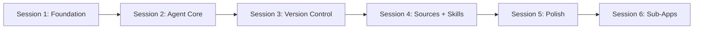

# Key Lime Pi Implementation Plan

## Overview

This project implements a **self-modifying Electron app** driven by Pi running on local Ollama models. The app can read and modify its own source code, with full version control, external source connections, and a skills system.

## Implementation Strategy

The implementation is split into **6 independent sessions**, each resulting in a working checkpoint that can be committed. This approach:

- Prevents context window overflow
- Allows parallel subagent usage within sessions
- Creates clear commit checkpoints
- Enables incremental testing

## Documents

| Document | Description |
|----------|-------------|
| [FULL-PLAN.md](FULL-PLAN.md) | Complete comprehensive plan with all details |

## Sessions

| Session | Focus | Deliverable | Status | Notes |
|---------|-------|-------------|--------|-------|
| [1. Foundation](SESSION-1-FOUNDATION.md) | Monorepo + Electron + Rules | Working app shell with coding standards | Complete | [Notes](SESSION-1-NOTES.md) |
| [2. Agent Core](SESSION-2-AGENT-CORE.md) | Claude SDK + Permissions | Agent that can read/write files | Complete | [Notes](SESSION-2-NOTES.md) |
| [3. Version Control](SESSION-3-VERSION-CONTROL.md) | isomorphic-git | Branching, rollback, history | Complete | [Notes](SESSION-3-NOTES.md) |
| [4. Sources + Skills](SESSION-4-SOURCES-SKILLS.md) | MCP + Skills | External connections + reusable instructions | Complete | [Notes](SESSION-4-NOTES.md) |
| [5. Polish](SESSION-5-POLISH.md) | UI + Integration | Complete, polished application | Complete | [Notes](SESSION-5-NOTES.md) |
| [6. Sub-Apps](SESSION-6-SUB-APPS.md) | Sandboxed Apps | App management with isolated self-modification | Planned | 6 sub-sessions |
| [7. Chat](SESSION-7-CHAT.md) | Chat UI | Enhanced chat experience | Complete | [Notes](SESSION-7-NOTES.md) |
| [8. App Preview](SESSION-8-APP-PREVIEW.md) | Dev Server + Preview | Run and view apps during development | Planned | 6 sub-sessions |
| [9. Chat History](SESSION-9-CHAT-HISTORY.md) | Persistent History | Chat history saved per app | Complete | [Notes](SESSION-9-NOTES.md) |
| [10. Rate Limits](SESSION-10-RATE-LIMITS.md) | API rate limits | 429 handling, retry with backoff | Complete | [Notes](SESSION-10-NOTES.md) |
| [11. Chat Sessions](SESSION-11-CHAT-SESSIONS.md) | Multiple Sessions | Named chat sessions per app | Complete | [Notes](SESSION-11-NOTES.md) |
| [12. Add Source](SESSION-12-ADD-SOURCE.md) | Source CRUD UI | Add/edit/delete MCP sources from UI | Complete | [Notes](SESSION-12-NOTES.md) |
| [13. Addressable UI](SESSION-13-ADDRESSABLE-UI.md) | Element Inspection | Click elements in preview to add to chat context | Complete | 3 sub-sessions |
| [14. Agent Config](SESSION-14-AGENT-CONFIG.md) | Claude Code Setup | AGENTS.md, path-scoped rules, skills, review subagents | Complete | [Notes](SESSION-14-NOTES.md) |
| [15. Pi Agent](SESSION-15-PI-AGENT.md) | Pi + Ollama | Replace the hand-rolled Anthropic loop with Pi on local models | Complete | [Notes](SESSION-15-NOTES.md) |
| [16. MCP Tools](SESSION-16-MCP-TOOLS.md) | MCP on the agent | Connected MCP sources' tools reach the agent, gated by approval | Complete | [Notes](SESSION-16-NOTES.md) |
| [17. Shell Design](SESSION-17-SHELL-DESIGN.md) | Layout + identity | Draggable header, contextual nav, design tokens, logo | Complete | [Notes](SESSION-17-NOTES.md) |
| [18. Internet Access](SESSION-18-INTERNET-ACCESS.md) | Network tools | `web_fetch` and `install_deps`, gated; subprocess env leak fixed | Complete | [Notes](SESSION-18-NOTES.md) |
| [19. Local Model Context](SESSION-19-LOCAL-MODEL-CONTEXT.md) | Context budget | Real context window, scaled compaction, visible recovery, context shaping | Complete | [Notes](SESSION-19-NOTES.md) |
| [20. Editing Loop](SESSION-20-EDITING-LOOP.md) | Edit reliability | Pi's editing guidance restored, grounded edit failures, `replace_lines`, shell safe paths | Complete | [Notes](SESSION-20-NOTES.md) |
| [21. Skills](SESSION-21-SKILLS.md) | Skills that reach the model | `load_skill`, app-scoped skills, per-app enable, authoring UI, corrected seeds | Complete | [Notes](SESSION-21-NOTES.md) |
| [22. Code Intelligence](SESSION-22-CODE-INTELLIGENCE.md) | Compiler + editing surface | TypeScript service, diagnostics on every write, `code_intel`/`refactor`, diffs in the transcript and the approval prompt, a code panel | Complete | [Notes](SESSION-22-NOTES.md) |
| [23. Context Report](SESSION-23-CONTEXT-REPORT.md) | An always-on context meter | Session-free context report, attributable breakdown on hover, compaction threshold shown, manual summarize | Complete | [Notes](SESSION-23-CONTEXT-REPORT.md) |
| [24. Session Changes](SESSION-24-SESSION-CHANGES.md) | The files a session changed | Changed-files strip in the composer, per-file diffs, `VersionManager.diff` reads contents, restored diffs | Complete | [Notes](SESSION-24-NOTES.md) |
| [25. Ollama Interaction](SESSION-25-OLLAMA-INTERACTION.md) | Prefill, prefix cache, thinking | Sealed prefix so the prompt is append-only, request telemetry, reasoning surfaced and controllable, model-aware sampling | Complete | [Notes](SESSION-25-NOTES.md) · [Audit](SESSION-25-AUDIT.md) |
| [26. The Instrument Row](SESSION-26-INSTRUMENT-ROW.md) | Composer chrome | Four strips become one fixed-height gauge row; Activity, Daemon and Changes panels; telemetry over IPC | Complete | [Notes](SESSION-26-NOTES.md) |
| 28. Multiple Workspaces | Concurrency + shell | Open-app rail at 64px, Skills into the dock and Settings, five Settings tabs; per-app workspace runtimes in main, one visible turn queue, every workspace mounted at once | Complete | [Notes](SESSION-28-NOTES.md) |
| 29. Key Lime Pi | Rename | `Pi Taster` → `Key Lime Pi`, `pitaster` → `keylimepi`; workspace migration becomes a chain across both renames; two carry-over defects from the last rename fixed | Complete | [Notes](SESSION-29-NOTES.md) |

## Session 6 Sub-Sessions

Session 6 is larger and broken into 6 sub-sessions to fit within agent context limits:

| Sub-Session | Focus |
|-------------|-------|
| [6.1](SESSION-6.1-TYPES-AND-MANAGER.md) | Type definitions + AppManager base |
| [6.2](SESSION-6.2-APP-TEMPLATES.md) | App templates + createApp |
| [6.3](SESSION-6.3-APP-LISTING-UI.md) | App listing UI components |
| [6.4](SESSION-6.4-IPC-INTEGRATION.md) | IPC handlers + preload API |
| [6.5](SESSION-6.5-AGENT-SCOPING.md) | Agent scoping + security |
| [6.6](SESSION-6.6-INTEGRATION.md) | Main app integration |

## Session 8 Sub-Sessions

Session 8 adds the app preview system, broken into 6 sub-sessions:

| Sub-Session | Focus |
|-------------|-------|
| [8.1](SESSION-8.1-TYPES-AND-RUNNER.md) | Running app types + AppRunner class |
| [8.2](SESSION-8.2-IPC-AND-PRELOAD.md) | IPC handlers + preload API |
| [8.3](SESSION-8.3-CONTEXT-AND-TERMINAL.md) | Running apps context + terminal panel |
| [8.4](SESSION-8.4-PREVIEW-PANEL.md) | Embedded webview preview |
| [8.5](SESSION-8.5-APP-CONTROLS.md) | Run controls + status indicators |
| [8.6](SESSION-8.6-LAYOUT-INTEGRATION.md) | Layout integration |

## Session 13 Sub-Sessions

Session 13 adds the addressable UI element inspection, broken into 3 sub-sessions:

| Sub-Session | Focus |
|-------------|-------|
| [13.1](SESSION-13.1-INSPECTOR-OVERLAY.md) | Inspector overlay + DOM extraction |
| [13.2](SESSION-13.2-CONTEXT-INJECTION.md) | Screenshot capture + element messages |
| [13.3](SESSION-13.3-AGENT-INTEGRATION.md) | Agent awareness + keyboard shortcuts |

## Session 15 Sub-Sessions

Session 15 replaces the agent infrastructure, broken into 4 sub-sessions:

| Sub-Session | Focus |
|-------------|-------|
| [15.1](SESSION-15.1-ESM-RUNTIME.md) | Electron 39 + ESM main process + build config |
| [15.2](SESSION-15.2-OLLAMA-PROVIDER.md) | Ollama discovery, models.json, model picker |
| [15.3](SESSION-15.3-PI-AGENT-CORE.md) | The agent swap - deletes agent.ts |
| [15.4](SESSION-15.4-PI-SESSIONS.md) | Pi SessionManager, deletions, docs |

## How to Use

### Starting a New Session

1. Open the session document (e.g., `SESSION-1-FOUNDATION.md`)
2. Follow the tasks in order
3. Use subagents for parallel work where indicated
4. Complete the verification checklist
5. Run the commit checkpoint command
6. Start fresh context for next session

### Resuming Work

If a session was partially completed:
1. Check git log for last commit
2. Review verification checklist to see what's done
3. Continue from where you left off

### Using Subagents

Some sessions indicate parallel subagent work:

```
Main Agent (orchestrator)
├── Subagent A: Task 1
├── Subagent B: Task 2
└── Main Agent: Integration
```

Launch subagents with specific, scoped tasks. They work best for:
- Creating multiple independent files
- Implementing isolated modules
- Writing tests

## Architecture

```
KeyLimePi/
├── apps/
│   └── electron/           # Electron desktop app (IMMUTABLE)
│       └── src/
│           ├── main/       # Main process (Node.js)
│           ├── preload/    # Context bridge
│           └── renderer/   # React UI (Vite)
├── packages/
│   ├── core/              # Shared TypeScript types (IMMUTABLE)
│   └── shared/            # Business logic (IMMUTABLE)
│       └── src/
│           ├── apps/      # AppManager for sub-apps
│           ├── versions/  # VersionManager (isomorphic-git)
│           ├── sources/   # MCP client, source manager
│           └── skills/    # Skills loader
├── docs/
│   └── plans/             # These session documents
└── ~/.keylimepi/
    └── apps/              # Sub-apps directory (SANDBOXED)
        └── {app-id}/      # Each app has isolated git versioning
```

## Tech Stack

| Component | Technology |
|-----------|------------|
| Runtime | Bun |
| Desktop | Electron + electron-vite |
| UI | React 19 + shadcn/ui + Tailwind v4 |
| AI | Pi (@earendil-works/pi-coding-agent) on Ollama |
| Version Control | isomorphic-git |
| Sources | MCP TypeScript SDK v1.x |

## Session Dependencies



Each session builds on the previous, but commits create stable checkpoints.

## Quick Reference

### Key Commands

```bash
# Install dependencies (from project root)
bun install

# Development - run from apps/electron directory
cd apps/electron && bun run dev

# Or from root (after PATH includes bun)
bun run dev

# Build
bun run build

# Type check
bun run typecheck:all
```

> **Note**: If `bun` is not in PATH, use full path: `~/.bun/bin/bun`

### Key Files

| File | Purpose |
|------|---------|
| `apps/electron/src/main/agent/` | Pi agent session, tools, permission gate |
| `packages/shared/src/versions/manager.ts` | Version control |
| `packages/shared/src/sources/mcp-client.ts` | MCP connections |
| `packages/shared/src/skills/loader.ts` | Skills system |
| `packages/shared/src/apps/manager.ts` | Sub-app lifecycle management |
| `packages/core/src/apps.ts` | Sub-app type definitions |

### Configuration

User data stored at `~/.keylimepi/`:
- `config.json` - App settings
- `skills/` - User skills
- `workspaces/` - Workspace data
- `apps/` - Sub-apps (each with isolated git repo)

## Estimated Timeline

| Session | Estimated Effort |
|---------|------------------|
| Session 1 | 1-2 hours |
| Session 2 | 2-3 hours |
| Session 3 | 2-3 hours |
| Session 4 | 2-3 hours |
| Session 5 | 2-3 hours |
| Session 6 | 3-4 hours |
| **Total** | **12-18 hours** |

## Getting Started

Begin with [SESSION-1-FOUNDATION.md](SESSION-1-FOUNDATION.md).
