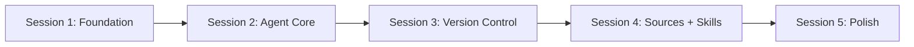

# CLIRabbit Implementation Plan

## Overview

This project implements a **self-modifying Electron app** using the Anthropic SDK. The app can read and modify its own source code, with full version control, external source connections, and a skills system.

## Implementation Strategy

The implementation is split into **5 independent sessions**, each resulting in a working checkpoint that can be committed. This approach:

- Prevents context window overflow
- Allows parallel subagent usage within sessions
- Creates clear commit checkpoints
- Enables incremental testing

## Documents

| Document | Description |
|----------|-------------|
| [FULL-PLAN.md](FULL-PLAN.md) | Complete comprehensive plan with all details |

## Sessions

| Session | Focus | Deliverable | Status | Notes |
|---------|-------|-------------|--------|-------|
| [1. Foundation](SESSION-1-FOUNDATION.md) | Monorepo + Electron + Rules | Working app shell with coding standards | Complete | [Notes](SESSION-1-NOTES.md) |
| [2. Agent Core](SESSION-2-AGENT-CORE.md) | Claude SDK + Permissions | Agent that can read/write files | Complete | [Notes](SESSION-2-NOTES.md) |
| [3. Version Control](SESSION-3-VERSION-CONTROL.md) | isomorphic-git | Branching, rollback, history | Complete | [Notes](SESSION-3-NOTES.md) |
| [4. Sources + Skills](SESSION-4-SOURCES-SKILLS.md) | MCP + Skills | External connections + reusable instructions | Complete | [Notes](SESSION-4-NOTES.md) |
| [5. Polish](SESSION-5-POLISH.md) | UI + Integration | Complete, polished application | Complete | [Notes](SESSION-5-NOTES.md) |

## How to Use

### Starting a New Session

1. Open the session document (e.g., `SESSION-1-FOUNDATION.md`)
2. Follow the tasks in order
3. Use subagents for parallel work where indicated
4. Complete the verification checklist
5. Run the commit checkpoint command
6. Start fresh context for next session

### Resuming Work

If a session was partially completed:
1. Check git log for last commit
2. Review verification checklist to see what's done
3. Continue from where you left off

### Using Subagents

Some sessions indicate parallel subagent work:

```
Main Agent (orchestrator)
├── Subagent A: Task 1
├── Subagent B: Task 2
└── Main Agent: Integration
```

Launch subagents with specific, scoped tasks. They work best for:
- Creating multiple independent files
- Implementing isolated modules
- Writing tests

## Architecture

```
CLIRabbit/
├── apps/
│   └── electron/           # Electron desktop app
│       └── src/
│           ├── main/       # Main process (Node.js)
│           ├── preload/    # Context bridge
│           └── renderer/   # React UI (Vite)
├── packages/
│   ├── core/              # Shared TypeScript types
│   └── shared/            # Business logic
│       └── src/
│           ├── versions/  # VersionManager (isomorphic-git)
│           ├── sources/   # MCP client, source manager
│           └── skills/    # Skills loader
└── docs/
    └── plans/             # These session documents
```

## Tech Stack

| Component | Technology |
|-----------|------------|
| Runtime | Bun |
| Desktop | Electron + electron-vite |
| UI | React 19 + shadcn/ui + Tailwind v4 |
| AI | Anthropic SDK (@anthropic-ai/sdk) |
| Version Control | isomorphic-git |
| Sources | MCP TypeScript SDK v1.x |

## Session Dependencies



Each session builds on the previous, but commits create stable checkpoints.

## Quick Reference

### Key Commands

```bash
# Install dependencies (from project root)
bun install

# Development - run from apps/electron directory
cd apps/electron && bun run dev

# Or from root (after PATH includes bun)
bun run dev

# Build
bun run build

# Type check
bun run typecheck:all
```

> **Note**: If `bun` is not in PATH, use full path: `~/.bun/bin/bun`

### Key Files

| File | Purpose |
|------|---------|
| `apps/electron/src/main/agent.ts` | Claude SDK integration |
| `packages/shared/src/versions/manager.ts` | Version control |
| `packages/shared/src/sources/mcp-client.ts` | MCP connections |
| `packages/shared/src/skills/loader.ts` | Skills system |

### Configuration

User data stored at `~/.clirabbit/`:
- `config.json` - App settings
- `skills/` - User skills
- `workspaces/` - Workspace data

## Estimated Timeline

| Session | Estimated Effort |
|---------|------------------|
| Session 1 | 1-2 hours |
| Session 2 | 2-3 hours |
| Session 3 | 2-3 hours |
| Session 4 | 2-3 hours |
| Session 5 | 2-3 hours |
| **Total** | **9-14 hours** |

## Getting Started

Begin with [SESSION-1-FOUNDATION.md](SESSION-1-FOUNDATION.md).
