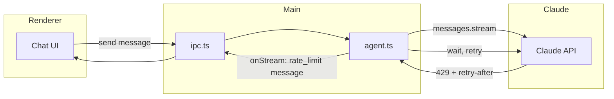

# Session 10: Respect Claude API Rate Limits

## Overview

This session adds handling for Claude API rate limits so the app backs off on 429 responses, uses the `retry-after` header when present, and optionally surfaces rate-limit state to the user. Implementation follows [Anthropic's rate limits documentation](https://platform.claude.com/docs/en/api/rate-limits).

**Estimated scope**: Small–Medium  
**Prerequisites**: Session 2 (Agent Core) complete  
**Deliverable**: 429 handling, retry with backoff, optional UI feedback

## Why This Matters

- **Spend limits** cap monthly API cost per organization; hitting the cap blocks usage until the next month.
- **Rate limits** cap requests per minute (RPM), input tokens per minute (ITPM), and output tokens per minute (OTPM) by model and tier.
- Limits use a [token bucket](https://en.wikipedia.org/wiki/Token_bucket): capacity replenishes over time rather than resetting at fixed intervals.
- Exceeding any limit returns a **429** with a `retry-after` header; retrying too early fails again.
- Short bursts can exceed the nominal per-minute rate (e.g. 60 RPM may be enforced as ~1 request/second).

## Key API Details (from docs)

| Limit type | Description |
|------------|-------------|
| **RPM** | Max requests per minute |
| **ITPM** | Max input tokens per minute (uncached input + cache creation count; cache reads do not count for most models) |
| **OTPM** | Max output tokens per minute (estimated from `max_tokens` at request start) |

**Response headers** (when available):

- `retry-after` – seconds to wait before retry
- `anthropic-ratelimit-requests-limit` / `anthropic-ratelimit-requests-remaining` / `anthropic-ratelimit-requests-reset`
- `anthropic-ratelimit-input-tokens-limit` / `anthropic-ratelimit-input-tokens-remaining` / `anthropic-ratelimit-input-tokens-reset`
- `anthropic-ratelimit-output-tokens-limit` / `anthropic-ratelimit-output-tokens-remaining` / `anthropic-ratelimit-output-tokens-reset`

**Tier 1 example** (standard tier): Claude Sonnet 4.x — 50 RPM, 30,000 ITPM, 8,000 OTPM.

## Goals

1. **Detect 429** – Recognize rate limit errors from the Anthropic SDK (Messages API).
2. **Retry with backoff** – Wait at least `retry-after` seconds (or a sensible default) before retrying; cap retries to avoid infinite loops.
3. **User-visible feedback** – On rate limit, show a clear message (e.g. “Rate limited; retrying in Xs…” or “Rate limited. Please try again later.”).
4. **Optional: header parsing** – If the SDK exposes response headers, parse and optionally display remaining capacity (future enhancement).

---

## Architecture

- **agent.ts**: Wrap the Messages API call in retry logic; on 429, read `retry-after`, wait, then retry up to N times; emit a stream chunk (e.g. `type: 'rate_limit'`) so the UI can show “Rate limited; retrying…”.
- **ipc.ts**: No change required if we only add new stream chunk types and the renderer already handles unknown types gracefully.
- **Renderer**: Handle the new chunk type to show a brief status (e.g. “Rate limited; retrying in Xs…”).

---

## Tasks

### Task 1: Detect 429 and extract retry-after

**File**: `apps/electron/src/main/agent.ts`

- In `runAgentQuery`, catch errors from `client.messages.stream()` (and from consuming the stream / `finalMessage()`).
- Identify 429: check `error.status === 429` or `error?.statusCode === 429` (depending on SDK shape; Anthropic SDK may use `APIError` or similar with a `status` field).
- Parse `retry-after` from the error response if exposed (e.g. `error.response?.headers?.['retry-after']` or SDK-equivalent). Value can be seconds (integer) or an HTTP-date; prefer seconds for simplicity.
- If no `retry-after`, use a default (e.g. 60 seconds) to avoid hammering the API.

**References**: [Claude API errors](https://platform.claude.com/docs/en/api/errors) (429), [rate limits](https://platform.claude.com/docs/en/api/rate-limits) (retry-after).

### Task 2: Retry loop with backoff

**File**: `apps/electron/src/main/agent.ts`

- Wrap the streaming request (create stream + consume it + handle tool use and follow-up requests) in a retry loop.
- Max retries: e.g. 2–3 (so total attempts = 1 + 2 or 1 + 3). Avoid infinite retries.
- On 429:
  1. Emit a stream chunk so the UI can show “Rate limited; retrying in Xs…” (e.g. `onStream({ type: 'rate_limit', retryAfterSeconds: n })`).
  2. Wait `retry-after` seconds (or default).
  3. Retry the same logical request (same `messages`, same tools).
- Non-429 errors: do not retry; propagate error and call `onStream({ type: 'error', error: message })` as today.

### Task 3: Stream chunk type for rate limits

**File**: `packages/core/src/` (e.g. `chat.ts` or a small `stream.ts`) and `apps/electron/src/main/agent.ts`

- Extend the stream chunk type (or document it in core) to include a rate-limit variant, e.g. `{ type: 'rate_limit', retryAfterSeconds: number }`.
- In `runAgentQuery`, emit this chunk before waiting so the UI can show a countdown or message.

**File**: `apps/electron/src/renderer/` (Chat or stream handler)

- Handle the new chunk type: show a short-lived message like “Rate limited; retrying in Xs…” or “Rate limited. Retrying…” and optionally a simple countdown. Do not block the rest of the UI.

### Task 4: Verification and docs

- **Manual test**: With a low-tier or constrained API key, trigger enough requests to get a 429 (or simulate by mocking the client to return 429 once). Confirm:
  - The app waits and retries.
  - The user sees a rate-limit message.
  - After retries are exhausted, a clear error is shown.
- **Docs**: In this plan or in a short “Rate limits” section in project docs, note that the app respects 429 and retry-after, and link to [Claude API rate limits](https://platform.claude.com/docs/en/api/rate-limits).

---

## Verification Checklist

- [ ] 429 from Messages API is caught in `agent.ts`.
- [ ] `retry-after` is read when present; a default wait is used when not.
- [ ] Retry loop has a bounded max retries (e.g. 2–3).
- [ ] Stream chunk type includes `rate_limit` with `retryAfterSeconds`.
- [ ] Chat (or stream handler) shows a user-visible “Rate limited; retrying…” (or similar) message.
- [ ] Non-429 errors are not retried and still surface to the user.
- [ ] Typecheck passes: `bun run typecheck:all`.

---

## Optional Follow-ups (out of scope for this session)

- **Prompt caching**: Use [prompt caching](https://platform.claude.com/docs/en/build-with-claude/prompt-caching) for system prompt / tools / history to reduce ITPM and improve effective throughput.
- **Header-based UI**: If the SDK exposes rate limit headers, show “X requests / Y tokens remaining” in settings or during chat.
- **Configurable max retries**: Allow user or config to set max retries for 429.

---

## References

- [Claude API – Rate limits](https://platform.claude.com/docs/en/api/rate-limits)
- [Claude API – Errors](https://platform.claude.com/docs/en/api/errors) (429)
- [Token bucket algorithm](https://en.wikipedia.org/wiki/Token_bucket)
