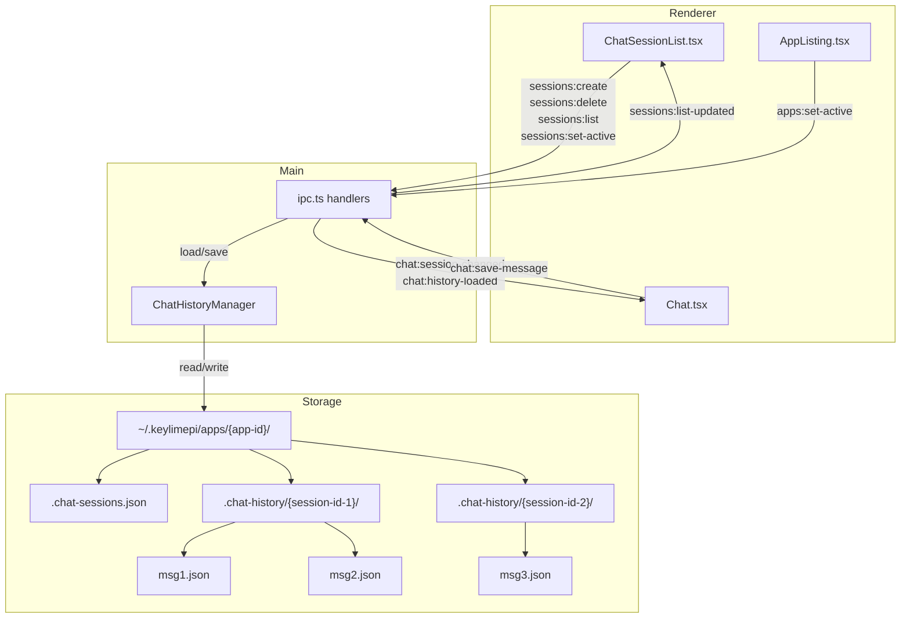

# Session 11: Multiple Chat Sessions

## Overview

This session adds support for multiple chat sessions per app. Currently, each app has a single flat chat history. This session introduces named chat sessions so users can maintain separate conversation threads — e.g., one for "build the homepage" and another for "fix the API." Users can create, rename, delete, and switch between sessions.

**Estimated scope**: Medium-Large  
**Prerequisites**: Session 9 (Chat History) complete  
**Deliverable**: Multiple named chat sessions per app with full CRUD and session switching

## Current Problems

1. **Single conversation per app** — All messages for an app live in one flat `.chat-history/` directory; there's no way to start a fresh conversation without clearing history
2. **Context pollution** — Long conversations accumulate unrelated context, degrading agent quality
3. **No conversation organization** — Users can't separate work into logical threads (e.g., "UI work" vs "backend refactor")
4. **Unused Session type** — `packages/core/src/messages.ts` defines a `Session` type that is never used
5. **No "New Chat" action** — The only way to reset context is "Clear" which permanently deletes all history

## Goals

1. **Multiple sessions per app** — Each app can have N named chat sessions
2. **Session CRUD** — Create, rename, delete sessions
3. **Session switching** — Switch between sessions with history loading
4. **Default session** — First session auto-created when an app is selected (backward compatible)
5. **Independent context** — Each session maintains its own Claude SDK `conversationHistory`
6. **Session metadata** — Track title, creation time, last message time, message count

---

## Architecture



## Storage Format

### Before (current)

```
~/.keylimepi/apps/{app-id}/
├── .keylimepi-meta.json
├── .chat-history/
│   ├── 2024-01-15T10-30-00-000Z_abc123.json
│   └── 2024-01-15T10-30-05-500Z_def456.json
└── [app files...]
```

### After (new)

```
~/.keylimepi/apps/{app-id}/
├── .keylimepi-meta.json
├── .chat-sessions.json              ← Session metadata manifest
├── .chat-history/
│   ├── {session-id-1}/              ← One directory per session
│   │   ├── 2024-01-15T10-30-00-000Z_abc123.json
│   │   └── 2024-01-15T10-30-05-500Z_def456.json
│   └── {session-id-2}/
│       └── 2024-01-16T09-00-00-000Z_ghi789.json
└── [app files...]
```

### Session Manifest Format (`.chat-sessions.json`)

```json
{
  "activeSessionId": "sess_abc123",
  "sessions": [
    {
      "id": "sess_abc123",
      "title": "Build Homepage",
      "createdAt": "2024-01-15T10:30:00.000Z",
      "updatedAt": "2024-01-15T11:45:00.000Z",
      "messageCount": 12
    },
    {
      "id": "sess_def456",
      "title": "Fix API Routes",
      "createdAt": "2024-01-16T09:00:00.000Z",
      "updatedAt": "2024-01-16T09:15:00.000Z",
      "messageCount": 4
    }
  ]
}
```

### Migration Strategy

On first load of an app with the old flat `.chat-history/` format (no `.chat-sessions.json`):

1. Create a default session (`id: "default"`, `title: "Chat"`)
2. Move existing message files into `.chat-history/default/`
3. Write the new `.chat-sessions.json` manifest
4. Proceed as normal

This ensures zero data loss and backward compatibility.

---

## Tasks

### Task 1: Add Chat Session Types

**File**: `packages/core/src/chat.ts`

Update the existing `Session` type in `messages.ts` and add session-related types to `chat.ts`:

```typescript
/**
 * A chat session within an app.
 */
export interface ChatSession {
  /** Unique session ID (e.g., "sess_abc123"). */
  id: string
  /** User-facing session title. */
  title: string
  /** ISO timestamp when created. */
  createdAt: string
  /** ISO timestamp when last message was sent/received. */
  updatedAt: string
  /** Number of messages in this session. */
  messageCount: number
}

/**
 * Session manifest stored in .chat-sessions.json per app.
 */
export interface ChatSessionManifest {
  /** The currently active session ID for this app. */
  activeSessionId: string | null
  /** All sessions for this app. */
  sessions: ChatSession[]
}

/**
 * Parameters for creating a new chat session.
 */
export interface CreateChatSessionParams {
  /** Optional title (defaults to "New Chat"). */
  title?: string
}
```

**Update**: `packages/core/src/index.ts` — Already exports from `chat.ts`, no change needed.

**Consider**: Remove or deprecate the unused `Session` type in `messages.ts` to avoid confusion.

---

### Task 2: Update ChatHistoryManager

**File**: `packages/shared/src/chat/manager.ts`

Refactor the manager to be session-aware. All existing methods gain a `sessionId` parameter. Add new methods for session CRUD.

```typescript
import type { 
  PersistedMessage, 
  ChatSession, 
  ChatSessionManifest, 
  CreateChatSessionParams 
} from '@keylimepi/core'

export class ChatHistoryManager {
  private appsDir: string

  constructor() {
    this.appsDir = join(homedir(), '.Key Lime Pi', 'apps')
  }

  // --- Session Manifest ---

  /**
   * Get the path to the sessions manifest file.
   */
  private getManifestPath(appId: string): string {
    return join(this.appsDir, appId, '.chat-sessions.json')
  }

  /**
   * Load the session manifest for an app.
   * If no manifest exists, checks for legacy flat history and migrates.
   */
  async loadManifest(appId: string): Promise<ChatSessionManifest> {
    const manifestPath = this.getManifestPath(appId)
    
    try {
      const data = await fs.readFile(manifestPath, 'utf-8')
      return JSON.parse(data)
    } catch {
      // No manifest — check for legacy flat history to migrate
      return this.migrateOrCreateManifest(appId)
    }
  }

  /**
   * Save the session manifest.
   */
  async saveManifest(appId: string, manifest: ChatSessionManifest): Promise<void> {
    const manifestPath = this.getManifestPath(appId)
    await fs.mkdir(join(this.appsDir, appId), { recursive: true })
    await fs.writeFile(manifestPath, JSON.stringify(manifest, null, 2))
  }

  /**
   * Migrate legacy flat .chat-history/ to session-based structure,
   * or create a fresh manifest if no history exists.
   */
  private async migrateOrCreateManifest(appId: string): Promise<ChatSessionManifest> {
    const legacyDir = join(this.appsDir, appId, '.chat-history')
    
    try {
      const files = await fs.readdir(legacyDir)
      const jsonFiles = files.filter(f => f.endsWith('.json'))
      
      if (jsonFiles.length > 0) {
        // Legacy messages exist — migrate into a "default" session
        const sessionDir = join(legacyDir, 'default')
        await fs.mkdir(sessionDir, { recursive: true })
        
        for (const file of jsonFiles) {
          await fs.rename(
            join(legacyDir, file),
            join(sessionDir, file)
          )
        }
        
        const manifest: ChatSessionManifest = {
          activeSessionId: 'default',
          sessions: [{
            id: 'default',
            title: 'Chat',
            createdAt: new Date().toISOString(),
            updatedAt: new Date().toISOString(),
            messageCount: jsonFiles.length
          }]
        }
        
        await this.saveManifest(appId, manifest)
        return manifest
      }
    } catch {
      // No legacy directory — fresh app
    }
    
    // No history at all — empty manifest
    const manifest: ChatSessionManifest = {
      activeSessionId: null,
      sessions: []
    }
    await this.saveManifest(appId, manifest)
    return manifest
  }

  // --- Session CRUD ---

  /**
   * Create a new chat session.
   */
  async createSession(appId: string, params?: CreateChatSessionParams): Promise<ChatSession> {
    const manifest = await this.loadManifest(appId)
    
    const session: ChatSession = {
      id: `sess_${nanoid(10)}`,
      title: params?.title || 'New Chat',
      createdAt: new Date().toISOString(),
      updatedAt: new Date().toISOString(),
      messageCount: 0
    }
    
    // Create the session directory
    const sessionDir = this.getHistoryDir(appId, session.id)
    await fs.mkdir(sessionDir, { recursive: true })
    
    // Add to manifest and set as active
    manifest.sessions.push(session)
    manifest.activeSessionId = session.id
    await this.saveManifest(appId, manifest)
    
    return session
  }

  /**
   * Delete a chat session and all its messages.
   */
  async deleteSession(appId: string, sessionId: string): Promise<void> {
    const manifest = await this.loadManifest(appId)
    
    // Remove session from manifest
    manifest.sessions = manifest.sessions.filter(s => s.id !== sessionId)
    
    // If we deleted the active session, activate the most recent remaining
    if (manifest.activeSessionId === sessionId) {
      const sorted = [...manifest.sessions].sort(
        (a, b) => new Date(b.updatedAt).getTime() - new Date(a.updatedAt).getTime()
      )
      manifest.activeSessionId = sorted[0]?.id ?? null
    }
    
    await this.saveManifest(appId, manifest)
    
    // Delete the session directory
    const sessionDir = this.getHistoryDir(appId, sessionId)
    try {
      await fs.rm(sessionDir, { recursive: true, force: true })
    } catch {
      // Directory may not exist
    }
  }

  /**
   * Rename a chat session.
   */
  async renameSession(appId: string, sessionId: string, title: string): Promise<ChatSession> {
    const manifest = await this.loadManifest(appId)
    const session = manifest.sessions.find(s => s.id === sessionId)
    
    if (!session) {
      throw new Error(`Session "${sessionId}" not found`)
    }
    
    session.title = title
    session.updatedAt = new Date().toISOString()
    await this.saveManifest(appId, manifest)
    
    return session
  }

  /**
   * List all sessions for an app.
   */
  async listSessions(appId: string): Promise<ChatSession[]> {
    const manifest = await this.loadManifest(appId)
    return manifest.sessions
  }

  /**
   * Get the active session ID for an app.
   */
  async getActiveSessionId(appId: string): Promise<string | null> {
    const manifest = await this.loadManifest(appId)
    return manifest.activeSessionId
  }

  /**
   * Set the active session for an app.
   */
  async setActiveSession(appId: string, sessionId: string): Promise<void> {
    const manifest = await this.loadManifest(appId)
    
    if (!manifest.sessions.find(s => s.id === sessionId)) {
      throw new Error(`Session "${sessionId}" not found`)
    }
    
    manifest.activeSessionId = sessionId
    await this.saveManifest(appId, manifest)
  }

  // --- Message Operations (now session-aware) ---

  /**
   * Get the chat history directory for a session.
   */
  getHistoryDir(appId: string, sessionId: string): string {
    return join(this.appsDir, appId, '.chat-history', sessionId)
  }

  /**
   * Load all messages for a specific session.
   */
  async loadHistory(appId: string, sessionId: string): Promise<PersistedMessage[]> {
    const historyDir = this.getHistoryDir(appId, sessionId)
    
    try {
      const files = await fs.readdir(historyDir)
      const jsonFiles = files
        .filter(f => f.endsWith('.json'))
        .sort()

      const messages: PersistedMessage[] = []
      for (const file of jsonFiles) {
        try {
          const content = await fs.readFile(join(historyDir, file), 'utf-8')
          messages.push(JSON.parse(content))
        } catch {
          // Skip malformed files
        }
      }

      return messages
    } catch {
      return []
    }
  }

  /**
   * Save a message to a session's history directory.
   * Also updates the session's updatedAt and messageCount in the manifest.
   */
  async saveMessage(appId: string, sessionId: string, message: PersistedMessage): Promise<void> {
    const historyDir = this.getHistoryDir(appId, sessionId)
    await fs.mkdir(historyDir, { recursive: true })

    const filename = this.generateFilename(message)
    const filepath = join(historyDir, filename)
    await fs.writeFile(filepath, JSON.stringify(message, null, 2))

    // Update manifest metadata
    try {
      const manifest = await this.loadManifest(appId)
      const session = manifest.sessions.find(s => s.id === sessionId)
      if (session) {
        session.updatedAt = new Date().toISOString()
        session.messageCount += 1
        await this.saveManifest(appId, manifest)
      }
    } catch {
      // Non-critical — manifest update failure shouldn't block message save
    }
  }

  /**
   * Clear all messages in a session.
   */
  async clearHistory(appId: string, sessionId: string): Promise<void> {
    const historyDir = this.getHistoryDir(appId, sessionId)

    try {
      const files = await fs.readdir(historyDir)
      await Promise.all(files.map(f => fs.unlink(join(historyDir, f))))
    } catch {
      // Directory doesn't exist
    }

    // Reset message count in manifest
    try {
      const manifest = await this.loadManifest(appId)
      const session = manifest.sessions.find(s => s.id === sessionId)
      if (session) {
        session.messageCount = 0
        session.updatedAt = new Date().toISOString()
        await this.saveManifest(appId, manifest)
      }
    } catch {
      // Non-critical
    }
  }

  // generateFilename and deleteMessage remain unchanged
}
```

**Key changes:**

- `getHistoryDir(appId)` → `getHistoryDir(appId, sessionId)`
- `loadHistory(appId)` → `loadHistory(appId, sessionId)`
- `saveMessage(appId, message)` → `saveMessage(appId, sessionId, message)`
- `clearHistory(appId)` → `clearHistory(appId, sessionId)`
- New methods: `loadManifest`, `saveManifest`, `createSession`, `deleteSession`, `renameSession`, `listSessions`, `getActiveSessionId`, `setActiveSession`
- Migration logic for existing flat history

---

### Task 3: Add IPC Handlers

**File**: `apps/electron/src/main/ipc.ts`

Add new IPC handlers for session operations and update existing chat handlers to be session-aware.

**New state tracking:**

```typescript
/** Currently active session ID for the active app. */
let activeSessionId: string | null = null
```

**New session handlers:**

```typescript
// Session management IPC handlers

ipcMain.handle('sessions:list', async () => {
  if (!activeAppId) return []
  return chatHistoryManager.listSessions(activeAppId)
})

ipcMain.handle('sessions:create', async (_, params?: CreateChatSessionParams) => {
  if (!activeAppId) throw new Error('No active app')
  
  const session = await chatHistoryManager.createSession(activeAppId, params)
  
  // Switch to the new session
  activeSessionId = session.id
  conversationHistory = []
  
  // Notify renderer
  mainWindow.webContents.send('chat:history-loaded', [])
  mainWindow.webContents.send('chat:session-changed', session.id)
  
  return session
})

ipcMain.handle('sessions:delete', async (_, sessionId: string) => {
  if (!activeAppId) throw new Error('No active app')
  if (typeof sessionId !== 'string' || sessionId.length === 0) {
    throw new Error('Invalid session ID')
  }
  
  await chatHistoryManager.deleteSession(activeAppId, sessionId)
  
  // If we deleted the active session, load the new active
  if (activeSessionId === sessionId) {
    const newActiveId = await chatHistoryManager.getActiveSessionId(activeAppId)
    activeSessionId = newActiveId
    
    if (newActiveId) {
      const history = await chatHistoryManager.loadHistory(activeAppId, newActiveId)
      rebuildConversationHistory(history)
      mainWindow.webContents.send('chat:history-loaded', history)
    } else {
      conversationHistory = []
      mainWindow.webContents.send('chat:history-loaded', [])
    }
    mainWindow.webContents.send('chat:session-changed', newActiveId)
  }
})

ipcMain.handle('sessions:rename', async (_, sessionId: string, title: string) => {
  if (!activeAppId) throw new Error('No active app')
  if (typeof sessionId !== 'string' || sessionId.length === 0) {
    throw new Error('Invalid session ID')
  }
  if (typeof title !== 'string' || title.length === 0) {
    throw new Error('Invalid title')
  }
  return chatHistoryManager.renameSession(activeAppId, sessionId, title)
})

ipcMain.handle('sessions:set-active', async (_, sessionId: string) => {
  if (!activeAppId) throw new Error('No active app')
  if (typeof sessionId !== 'string' || sessionId.length === 0) {
    throw new Error('Invalid session ID')
  }
  
  await chatHistoryManager.setActiveSession(activeAppId, sessionId)
  activeSessionId = sessionId
  
  // Load history for the new session
  const history = await chatHistoryManager.loadHistory(activeAppId, sessionId)
  rebuildConversationHistory(history)
  
  mainWindow.webContents.send('chat:history-loaded', history)
  mainWindow.webContents.send('chat:session-changed', sessionId)
})

ipcMain.handle('sessions:get-active', async () => {
  return activeSessionId
})
```

**Helper function to extract:**

```typescript
/**
 * Rebuild the in-memory conversationHistory from persisted messages.
 */
function rebuildConversationHistory(history: PersistedMessage[]): void {
  conversationHistory = []
  for (const msg of history) {
    const textContent = msg.blocks
      .filter((b): b is SerializedTextBlock => b.type === 'text')
      .map(b => b.content)
      .join('')
    
    if (textContent) {
      conversationHistory.push({
        role: msg.role,
        content: textContent
      })
    }
  }
}
```

**Update `apps:set-active` handler:**

```typescript
ipcMain.handle('apps:set-active', async (_, id: string | null) => {
  conversationHistory = []
  activeAppId = id
  activeSessionId = null
  
  if (id) {
    // Load manifest (triggers migration if needed)
    const manifest = await chatHistoryManager.loadManifest(id)
    activeSessionId = manifest.activeSessionId
    
    if (activeSessionId) {
      const history = await chatHistoryManager.loadHistory(id, activeSessionId)
      rebuildConversationHistory(history)
      mainWindow.webContents.send('chat:history-loaded', history)
    }
    
    // Send sessions list to renderer
    mainWindow.webContents.send('sessions:list-updated', manifest.sessions)
    mainWindow.webContents.send('chat:session-changed', activeSessionId)
  }
  
  return activeAppId
})
```

**Update existing chat handlers to be session-aware:**

```typescript
ipcMain.handle('chat:load-history', async () => {
  if (!activeAppId || !activeSessionId) return []
  return chatHistoryManager.loadHistory(activeAppId, activeSessionId)
})

ipcMain.handle('chat:save-message', async (_, message: PersistedMessage) => {
  if (!activeAppId || !activeSessionId) throw new Error('No active session')
  if (!message || typeof message.id !== 'string') throw new Error('Invalid message')
  await chatHistoryManager.saveMessage(activeAppId, activeSessionId, message)
})

ipcMain.handle('chat:clear-history', async () => {
  if (!activeAppId || !activeSessionId) throw new Error('No active session')
  await chatHistoryManager.clearHistory(activeAppId, activeSessionId)
  conversationHistory = []
})
```

**Update cleanup:**

```typescript
export function cleanupIpcHandlers(): void {
  // ... existing cleanup ...
  
  // Session handlers
  ipcMain.removeHandler('sessions:list')
  ipcMain.removeHandler('sessions:create')
  ipcMain.removeHandler('sessions:delete')
  ipcMain.removeHandler('sessions:rename')
  ipcMain.removeHandler('sessions:set-active')
  ipcMain.removeHandler('sessions:get-active')
  
  // Reset session state
  activeSessionId = null
}
```

---

### Task 4: Update Preload API

**File**: `apps/electron/src/preload/index.ts`

Add session methods to the exposed API:

```typescript
// Chat session methods

/**
 * List all chat sessions for the active app.
 */
listChatSessions: (): Promise<ChatSession[]> => {
  return ipcRenderer.invoke('sessions:list')
},

/**
 * Create a new chat session.
 */
createChatSession: (params?: CreateChatSessionParams): Promise<ChatSession> => {
  return ipcRenderer.invoke('sessions:create', params)
},

/**
 * Delete a chat session.
 */
deleteChatSession: (sessionId: string): Promise<void> => {
  return ipcRenderer.invoke('sessions:delete', sessionId)
},

/**
 * Rename a chat session.
 */
renameChatSession: (sessionId: string, title: string): Promise<ChatSession> => {
  return ipcRenderer.invoke('sessions:rename', sessionId, title)
},

/**
 * Set the active chat session.
 */
setActiveChatSession: (sessionId: string): Promise<void> => {
  return ipcRenderer.invoke('sessions:set-active', sessionId)
},

/**
 * Get the active chat session ID.
 */
getActiveChatSession: (): Promise<string | null> => {
  return ipcRenderer.invoke('sessions:get-active')
},

/**
 * Listen for session change events.
 */
onChatSessionChanged: (callback: (sessionId: string | null) => void): void => {
  ipcRenderer.on('chat:session-changed', (_event, sessionId) => callback(sessionId))
},

/**
 * Remove session change listener.
 */
offChatSessionChanged: (): void => {
  ipcRenderer.removeAllListeners('chat:session-changed')
},

/**
 * Listen for sessions list updates.
 */
onSessionsListUpdated: (callback: (sessions: ChatSession[]) => void): void => {
  ipcRenderer.on('sessions:list-updated', (_event, sessions) => callback(sessions))
},

/**
 * Remove sessions list update listener.
 */
offSessionsListUpdated: (): void => {
  ipcRenderer.removeAllListeners('sessions:list-updated')
},
```

---

### Task 5: Update Type Definitions

**File**: `apps/electron/src/renderer/src/types/electron.d.ts`

Add imports and type definitions for session operations:

```typescript
import type { 
  SubApp, CreateAppParams, AppTemplate, PersistedMessage, 
  ChatSession, CreateChatSessionParams 
} from '@keylimepi/core'

interface ElectronAPI {
  // ... existing methods ...

  // Chat session methods
  /** List all chat sessions for the active app. */
  listChatSessions: () => Promise<ChatSession[]>
  /** Create a new chat session. */
  createChatSession: (params?: CreateChatSessionParams) => Promise<ChatSession>
  /** Delete a chat session. */
  deleteChatSession: (sessionId: string) => Promise<void>
  /** Rename a chat session. */
  renameChatSession: (sessionId: string, title: string) => Promise<ChatSession>
  /** Set the active chat session. */
  setActiveChatSession: (sessionId: string) => Promise<void>
  /** Get the active chat session ID. */
  getActiveChatSession: () => Promise<string | null>
  /** Listen for session change events. */
  onChatSessionChanged: (callback: (sessionId: string | null) => void) => void
  /** Remove session change listener. */
  offChatSessionChanged: () => void
  /** Listen for sessions list updates. */
  onSessionsListUpdated: (callback: (sessions: ChatSession[]) => void) => void
  /** Remove sessions list update listener. */
  offSessionsListUpdated: () => void
}

// Add to exports
export type { 
  // ... existing exports ...
  ChatSession,
  CreateChatSessionParams
}
```

---

### Task 6: Create ChatSessionList Component

**File**: `apps/electron/src/renderer/src/components/ChatSessionList.tsx` (new)

A sidebar/panel component showing all sessions for the active app with create/delete/rename actions.

```typescript
import { useState, useEffect, useCallback } from 'react'
import type { ChatSession } from '@keylimepi/core'

/**
 * Props for the ChatSessionList component.
 */
interface ChatSessionListProps {
  /** Currently active session ID. */
  activeSessionId: string | null
  /** Callback when a session is selected. */
  onSessionSelect: (sessionId: string) => void
  /** Callback when a new session is created. */
  onSessionCreate: () => void
}

/**
 * Sidebar list showing all chat sessions for the active app.
 */
export function ChatSessionList({ 
  activeSessionId, 
  onSessionSelect, 
  onSessionCreate 
}: ChatSessionListProps) {
  const [sessions, setSessions] = useState<ChatSession[]>([])
  const [editingId, setEditingId] = useState<string | null>(null)
  const [editTitle, setEditTitle] = useState('')

  // Load sessions on mount
  useEffect(() => {
    window.electronAPI.listChatSessions().then(setSessions).catch(() => {})
    
    // Listen for updates
    window.electronAPI.onSessionsListUpdated(setSessions)
    return () => {
      window.electronAPI.offSessionsListUpdated()
    }
  }, [])

  const handleDelete = useCallback(async (e: React.MouseEvent, sessionId: string) => {
    e.stopPropagation()
    await window.electronAPI.deleteChatSession(sessionId)
    // Refresh sessions list
    const updated = await window.electronAPI.listChatSessions()
    setSessions(updated)
  }, [])

  const handleRenameStart = useCallback((e: React.MouseEvent, session: ChatSession) => {
    e.stopPropagation()
    setEditingId(session.id)
    setEditTitle(session.title)
  }, [])

  const handleRenameConfirm = useCallback(async (sessionId: string) => {
    if (editTitle.trim()) {
      await window.electronAPI.renameChatSession(sessionId, editTitle.trim())
      const updated = await window.electronAPI.listChatSessions()
      setSessions(updated)
    }
    setEditingId(null)
  }, [editTitle])

  // Sort sessions by updatedAt (most recent first)
  const sortedSessions = [...sessions].sort(
    (a, b) => new Date(b.updatedAt).getTime() - new Date(a.updatedAt).getTime()
  )

  return (
    <div className="flex h-full flex-col border-r border-neutral-800 w-56">
      {/* Header with New Chat button */}
      <div className="flex items-center justify-between border-b border-neutral-800 px-3 py-2">
        <span className="text-xs font-medium uppercase tracking-wider text-neutral-500">
          Sessions
        </span>
        <button
          onClick={onSessionCreate}
          className="rounded px-2 py-1 text-xs text-blue-400 hover:bg-neutral-800 hover:text-blue-300"
          title="New Chat Session"
        >
          + New
        </button>
      </div>

      {/* Sessions list */}
      <div className="flex-1 overflow-y-auto">
        {sortedSessions.length === 0 ? (
          <div className="px-3 py-4 text-center text-xs text-neutral-600">
            No sessions yet
          </div>
        ) : (
          sortedSessions.map(session => (
            <div
              key={session.id}
              onClick={() => onSessionSelect(session.id)}
              className={`group flex cursor-pointer items-center gap-2 px-3 py-2 text-sm ${
                session.id === activeSessionId
                  ? 'bg-neutral-800 text-neutral-100'
                  : 'text-neutral-400 hover:bg-neutral-800/50 hover:text-neutral-200'
              }`}
            >
              {editingId === session.id ? (
                <input
                  value={editTitle}
                  onChange={e => setEditTitle(e.target.value)}
                  onBlur={() => handleRenameConfirm(session.id)}
                  onKeyDown={e => {
                    if (e.key === 'Enter') handleRenameConfirm(session.id)
                    if (e.key === 'Escape') setEditingId(null)
                  }}
                  autoFocus
                  className="flex-1 rounded bg-neutral-700 px-1 py-0.5 text-sm text-neutral-100 outline-none"
                />
              ) : (
                <>
                  <div className="flex-1 truncate">
                    <div className="truncate">{session.title}</div>
                    <div className="text-[10px] text-neutral-600">
                      {session.messageCount} messages
                    </div>
                  </div>
                  
                  {/* Actions — visible on hover */}
                  <div className="hidden gap-1 group-hover:flex">
                    <button
                      onClick={e => handleRenameStart(e, session)}
                      className="rounded p-0.5 text-xs text-neutral-500 hover:text-neutral-300"
                      title="Rename"
                    >
                      ✏️
                    </button>
                    <button
                      onClick={e => handleDelete(e, session.id)}
                      className="rounded p-0.5 text-xs text-neutral-500 hover:text-red-400"
                      title="Delete"
                    >
                      🗑️
                    </button>
                  </div>
                </>
              )}
            </div>
          ))
        )}
      </div>
    </div>
  )
}
```

---

### Task 7: Update Chat Component

**File**: `apps/electron/src/renderer/src/components/Chat.tsx`

Add session awareness to the Chat component:

**New props:**

```typescript
interface ChatProps {
  /** Current permission mode. */
  permissionMode: PermissionMode
  /** Callback to change permission mode. */
  onModeChange: (mode: PermissionMode) => void
  /** Input ref for external control. */
  inputRef?: React.RefObject<HTMLInputElement | null>
  /** External input value (controlled). */
  externalInput?: string
  /** External input change handler (controlled). */
  onExternalInputChange?: (value: string) => void
  /** Currently active session ID. */
  activeSessionId: string | null
}
```

**Key changes in Chat.tsx:**

1. Accept `activeSessionId` prop
2. Clear messages when `activeSessionId` changes (the IPC event `chat:history-loaded` will repopulate)
3. Listen for `chat:session-changed` events
4. Show empty state prompt to create a session when `activeSessionId` is null
5. Update `clearHistory` to only clear the current session

```typescript
// Reset messages when active session changes
useEffect(() => {
  setMessages([])
  setIsStreaming(false)
  setPendingApproval(null)
}, [activeSessionId])

// Disable input when no active session
const canSend = activeSessionId !== null && !isStreaming && currentInput.trim().length > 0
```

---

### Task 8: Update App.tsx Layout

**File**: `apps/electron/src/renderer/src/App.tsx`

Integrate the session list alongside the chat panel:

**New state:**

```typescript
const [activeSessionId, setActiveSessionId] = useState<string | null>(null)
```

**Listen for session changes:**

```typescript
useEffect(() => {
  window.electronAPI.onChatSessionChanged((sessionId) => {
    setActiveSessionId(sessionId)
  })
  return () => {
    window.electronAPI.offChatSessionChanged()
  }
}, [])
```

**Session action handlers:**

```typescript
const handleSessionSelect = useCallback(async (sessionId: string) => {
  await window.electronAPI.setActiveChatSession(sessionId)
}, [])

const handleSessionCreate = useCallback(async () => {
  await window.electronAPI.createChatSession()
  // Session list and active session updated via IPC events
}, [])
```

**Updated layout for chat panel — add session sidebar:**

```typescript
{mainPanel === 'chat' && (
  activeApp ? (
    <div className="flex h-full">
      {/* Session sidebar */}
      <ChatSessionList
        activeSessionId={activeSessionId}
        onSessionSelect={handleSessionSelect}
        onSessionCreate={handleSessionCreate}
      />
      {/* Chat panel */}
      <div className="flex-1">
        <Chat
          permissionMode={permissionMode}
          onModeChange={handleModeChange}
          inputRef={chatInputRef}
          externalInput={chatInput}
          onExternalInputChange={setChatInput}
          activeSessionId={activeSessionId}
        />
      </div>
    </div>
  ) : (
    <NoAppSelected onGoToApps={() => setMainPanel('apps')} />
  )
)}
```

**Update `handleAppSelect` to reset session state:**

```typescript
const handleAppSelect = useCallback(async (app: SubApp) => {
  setActiveApp(app)
  setActiveSessionId(null) // Will be set by IPC event
  await window.electronAPI.setActiveApp(app.id)
  setMainPanel('chat')
}, [])
```

---

### Task 9: Auto-Create Default Session

When an app is selected that has no sessions yet, automatically create a default "New Chat" session. This happens in the `apps:set-active` IPC handler:

```typescript
// In apps:set-active handler, after loading manifest:
if (id && manifest.sessions.length === 0) {
  // Auto-create first session
  const session = await chatHistoryManager.createSession(id, { title: 'Chat' })
  activeSessionId = session.id
  mainWindow.webContents.send('sessions:list-updated', [session])
  mainWindow.webContents.send('chat:session-changed', session.id)
}
```

This ensures users never see an empty state requiring manual session creation — the experience is seamless for new apps.

---

## Data Flow Summary

### App Selected → Session Loaded

```
1. User clicks app in AppListing
2. App.tsx calls setActiveApp(appId)
3. IPC: apps:set-active
   a. Load manifest (migrate if needed)
   b. Auto-create default session if none exist
   c. Set activeSessionId from manifest
   d. Load history for active session
   e. Rebuild conversationHistory
   f. Emit: sessions:list-updated → ChatSessionList
   g. Emit: chat:session-changed → App.tsx state
   h. Emit: chat:history-loaded → Chat.tsx messages
4. UI updates with session list and chat history
```

### New Session Created

```
1. User clicks "+ New" in ChatSessionList
2. App.tsx calls createChatSession()
3. IPC: sessions:create
   a. Create session in manifest
   b. Create session directory
   c. Set as active, clear conversationHistory
   d. Emit: chat:history-loaded (empty)
   e. Emit: chat:session-changed
   f. Return new session
4. App.tsx refreshes session list
5. Chat.tsx shows empty state for new session
```

### Session Switched

```
1. User clicks session in ChatSessionList
2. App.tsx calls setActiveChatSession(sessionId)
3. IPC: sessions:set-active
   a. Update manifest activeSessionId
   b. Load history for session
   c. Rebuild conversationHistory
   d. Emit: chat:history-loaded
   e. Emit: chat:session-changed
4. Chat.tsx displays loaded messages
```

### Session Deleted

```
1. User clicks delete on a session
2. ChatSessionList calls deleteChatSession(sessionId)
3. IPC: sessions:delete
   a. Remove from manifest
   b. Delete session directory
   c. If deleted active: activate most recent, load its history
   d. Emit events to update UI
4. UI updates
```

---

## Verification Checklist

- [ ] Types compile without errors (`bun run typecheck:all`)
- [ ] Legacy flat `.chat-history/` migrates to session-based structure
- [ ] Existing messages are preserved during migration
- [ ] New apps get a default session automatically
- [ ] Sessions can be created, renamed, and deleted
- [ ] Switching sessions loads correct history and rebuilds Claude context
- [ ] Messages are saved to the correct session directory
- [ ] Deleting the active session activates the next most recent
- [ ] Chat input is disabled when no session is active
- [ ] Session list updates in real-time (create, delete, rename)
- [ ] Clear history only affects the current session
- [ ] App switching resets session state and loads new app's sessions

---

## Commit Checkpoint

```bash
git add -A && git commit -m "feat: add multiple chat sessions per app

- Add ChatSession, ChatSessionManifest types to @keylimepi/core
- Refactor ChatHistoryManager for session-aware storage
- Add migration from flat .chat-history/ to session directories
- Add session CRUD IPC handlers (create, delete, rename, list, set-active)
- Create ChatSessionList sidebar component
- Update Chat component with session awareness
- Auto-create default session for new apps
- Each session maintains independent Claude conversation context"
```

---

## Considerations

- **Session Limits**: Consider capping sessions per app (e.g., 50) to prevent excessive filesystem usage. Can be added later if needed.
- **Session Title Auto-generation**: A future enhancement could auto-title sessions based on the first message (e.g., "Build the homepage" → title: "Build Homepage"). This could use Claude to generate a title after the first exchange.
- **Session Search**: With many sessions, users may want to search across sessions. This is out of scope but the file-based storage makes it feasible.
- **Manifest Corruption**: If `.chat-sessions.json` becomes corrupted, the migration logic can reconstruct it by scanning the `.chat-history/` subdirectories.
- **Concurrent Writes**: The manifest is a single JSON file that could face race conditions if multiple writes happen simultaneously. For a desktop app with single-user access, this is unlikely but could be mitigated with a write lock if needed.
- **Session Sidebar Collapse**: The 224px session sidebar may be too wide for some users. A future enhancement could add a collapse/expand toggle.
