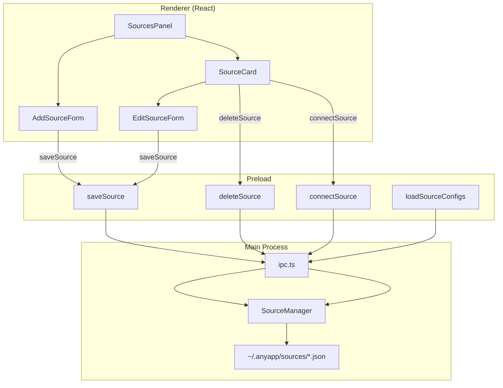

# Session 12: Add Source via UI

## Overview

This session adds the ability to create, edit, and delete MCP source configurations directly from the Sources panel in the UI. Currently, sources can only be added by manually creating JSON files in `~/.anyapp/sources/`. The backend APIs (`saveSource`, `deleteSource`) already exist in the preload and IPC layers but are unused by the renderer. This session builds the missing UI components and wires them to the existing infrastructure.

**Estimated scope**: Small–Medium  
**Prerequisites**: Session 4 (Sources + Skills) complete  
**Deliverable**: Full CRUD for MCP sources from the Sources panel UI

## Why This Matters

- Users must currently hand-edit JSON files to add a source — a poor experience for a desktop app.
- The `saveSource` and `deleteSource` preload APIs were built in Session 4 but never connected to UI components.
- MCP servers are the primary integration mechanism for extending agent capabilities; adding them should be frictionless.

## Current State

### What exists

| Layer | Status | Details |
|-------|--------|---------|
| **Types** (`packages/core/src/sources.ts`) | Complete | `McpSourceConfig`, `AnySourceConfig`, `ConnectedSource` |
| **Business logic** (`packages/shared/src/sources/manager.ts`) | Complete | `saveSource()`, `deleteSource()`, `loadSources()`, `connect()` |
| **IPC handlers** (`apps/electron/src/main/ipc.ts`) | Complete | `sources:save`, `sources:delete`, `sources:load-configs`, `sources:connect`, `sources:disconnect` |
| **Preload** (`apps/electron/src/preload/index.ts`) | Complete | `saveSource()`, `deleteSource()`, `loadSourceConfigs()`, `connectSource()`, `disconnectSource()` |
| **Renderer types** (`electron.d.ts`) | Complete | `ElectronAPI.saveSource`, `ElectronAPI.deleteSource` typed |
| **Sources panel** (`SourcesPanel.tsx`) | Partial | List, connect, disconnect — but no add/edit/delete UI |

### What's missing

1. **Add Source form** — No UI to create a new source configuration
2. **Delete button** — No way to remove a source from the UI
3. **Edit capability** — No way to modify an existing source's configuration
4. **Form validation** — Client-side validation for source config fields
5. **Auto-connect option** — Optionally connect immediately after adding

---

## Architecture



**Key principle**: The renderer only calls existing preload APIs. No changes needed in main process, preload, or shared packages.

---

## Task 1: Add Source Form Component

Create an inline form that appears at the top of the SourcesPanel when the user clicks "+ Add".

### apps/electron/src/renderer/src/components/AddSourceForm.tsx

```tsx
/**
 * Inline form for adding a new MCP source configuration.
 */

import { useState, useCallback } from 'react'

/**
 * Props for the AddSourceForm component.
 */
interface AddSourceFormProps {
  /** Callback when form is submitted with a valid config. */
  onSave: (config: McpSourceFormData) => void
  /** Callback when form is cancelled. */
  onCancel: () => void
  /** Whether a save is in progress. */
  isSaving?: boolean
}

/**
 * Form data for an MCP source.
 */
interface McpSourceFormData {
  /** Display name for the source. */
  name: string
  /** Command to run (e.g., 'npx', 'node', 'docker'). */
  command: string
  /** Command arguments as a single string (split on save). */
  args: string
  /** Environment variables as key=value lines. */
  env: string
}

/**
 * Generate a URL-safe ID from a name.
 */
function generateId(name: string): string {
  const slug = name
    .toLowerCase()
    .replace(/[^a-z0-9]+/g, '-')
    .replace(/^-|-$/g, '')
  return slug || `source-${Date.now()}`
}

/**
 * Parse environment variable lines into a record.
 * Accepts "KEY=VALUE" format, one per line.
 */
function parseEnvLines(text: string): Record<string, string> {
  const env: Record<string, string> = {}
  for (const line of text.split('\n')) {
    const trimmed = line.trim()
    if (!trimmed || trimmed.startsWith('#')) continue
    const eqIndex = trimmed.indexOf('=')
    if (eqIndex > 0) {
      const key = trimmed.slice(0, eqIndex).trim()
      const value = trimmed.slice(eqIndex + 1).trim()
      env[key] = value
    }
  }
  return env
}

/**
 * Validates the form data and returns an error message or null.
 */
function validate(data: McpSourceFormData): string | null {
  if (!data.name.trim()) return 'Name is required'
  if (!data.command.trim()) return 'Command is required'
  return null
}

/**
 * Inline form for adding a new MCP source.
 */
export function AddSourceForm({ onSave, onCancel, isSaving = false }: AddSourceFormProps) {
  const [name, setName] = useState('')
  const [command, setCommand] = useState('')
  const [args, setArgs] = useState('')
  const [env, setEnv] = useState('')
  const [error, setError] = useState<string | null>(null)

  const handleSubmit = useCallback(() => {
    const data: McpSourceFormData = { name, command, args, env }
    const validationError = validate(data)
    if (validationError) {
      setError(validationError)
      return
    }
    setError(null)
    onSave(data)
  }, [name, command, args, env, onSave])

  return (
    <div className="border-b border-neutral-800 bg-neutral-900/50 p-3">
      <h3 className="mb-3 text-sm font-medium text-neutral-200">Add MCP Source</h3>

      <div className="space-y-2">
        {/* Name */}
        <input
          type="text"
          value={name}
          onChange={(e) => setName(e.target.value)}
          placeholder="Display name"
          className="w-full rounded border border-neutral-700 bg-neutral-800 px-3 py-1.5 text-sm
                     focus:border-blue-500 focus:outline-none"
          autoFocus
        />

        {/* Command */}
        <input
          type="text"
          value={command}
          onChange={(e) => setCommand(e.target.value)}
          placeholder="Command (e.g., npx, node, docker)"
          className="w-full rounded border border-neutral-700 bg-neutral-800 px-3 py-1.5 text-sm
                     focus:border-blue-500 focus:outline-none"
        />

        {/* Arguments */}
        <input
          type="text"
          value={args}
          onChange={(e) => setArgs(e.target.value)}
          placeholder="Arguments (e.g., -y @modelcontextprotocol/server-filesystem /path)"
          className="w-full rounded border border-neutral-700 bg-neutral-800 px-3 py-1.5 text-sm
                     focus:border-blue-500 focus:outline-none"
        />

        {/* Environment variables (optional, collapsible) */}
        <details className="text-sm">
          <summary className="cursor-pointer text-neutral-400 hover:text-neutral-200">
            Environment variables (optional)
          </summary>
          <textarea
            value={env}
            onChange={(e) => setEnv(e.target.value)}
            placeholder={"KEY=value\nANOTHER_KEY=value"}
            rows={3}
            className="mt-2 w-full rounded border border-neutral-700 bg-neutral-800 px-3 py-1.5
                       font-mono text-xs focus:border-blue-500 focus:outline-none"
          />
        </details>

        {/* Error */}
        {error && (
          <p className="text-xs text-red-400">{error}</p>
        )}

        {/* Actions */}
        <div className="flex gap-2 pt-1">
          <button
            onClick={handleSubmit}
            disabled={isSaving}
            className="flex-1 rounded bg-blue-600 px-3 py-1.5 text-sm text-white
                       hover:bg-blue-700 disabled:cursor-not-allowed disabled:opacity-50"
          >
            {isSaving ? 'Saving...' : 'Add Source'}
          </button>
          <button
            onClick={onCancel}
            disabled={isSaving}
            className="rounded border border-neutral-700 px-3 py-1.5 text-sm
                       hover:bg-neutral-800 disabled:opacity-50"
          >
            Cancel
          </button>
        </div>
      </div>
    </div>
  )
}

export { generateId, parseEnvLines, validate }
export type { McpSourceFormData }
```

---

## Task 2: Update SourcesPanel with Add / Delete

Modify `SourcesPanel.tsx` to integrate the add form, delete buttons, and optional auto-connect after save.

### apps/electron/src/renderer/src/components/SourcesPanel.tsx

Key changes:

1. **Add "+" button** in the header that toggles the `AddSourceForm`
2. **Wire `onSave`** to build an `McpSourceConfig`, call `saveSource()`, optionally `connectSource()`, then refresh
3. **Add delete button** on each source card with confirmation
4. **Add auto-connect checkbox** in the add form (or auto-connect by default)

```tsx
/**
 * Updated SourcesPanel with add, delete, and edit capabilities.
 */

import { useState, useEffect, useCallback } from 'react'
import { AddSourceForm, generateId, parseEnvLines } from './AddSourceForm'
import type { McpSourceFormData } from './AddSourceForm'

// ... existing interfaces (SourceConfig, ConnectedSource, McpTool) ...

export function SourcesPanel({ isVisible }: SourcesPanelProps) {
  const [sources, setSources] = useState<ConnectedSource[]>([])
  const [isLoading, setIsLoading] = useState(true)
  const [error, setError] = useState<string | null>(null)
  const [connectingId, setConnectingId] = useState<string | null>(null)
  const [isAdding, setIsAdding] = useState(false)
  const [isSaving, setIsSaving] = useState(false)
  const [deletingId, setDeletingId] = useState<string | null>(null)

  const loadSources = useCallback(async () => {
    // ... existing loadSources logic (unchanged) ...
  }, [])

  // ... existing useEffect, handleConnect, handleDisconnect (unchanged) ...

  /**
   * Handle saving a new source from the form.
   */
  const handleAddSource = useCallback(async (formData: McpSourceFormData) => {
    try {
      setIsSaving(true)
      setError(null)

      const config = {
        id: generateId(formData.name),
        name: formData.name.trim(),
        type: 'mcp' as const,
        enabled: true,
        createdAt: new Date().toISOString(),
        command: formData.command.trim(),
        args: formData.args.trim().split(/\s+/).filter(Boolean),
        env: parseEnvLines(formData.env)
      }

      await window.electronAPI.saveSource(config)
      setIsAdding(false)

      // Refresh list, then auto-connect
      await loadSources()
      await window.electronAPI.connectSource(config.id)
      await loadSources()
    } catch (err) {
      const errorMessage = err instanceof Error ? err.message : 'Failed to save source'
      setError(errorMessage)
    } finally {
      setIsSaving(false)
    }
  }, [loadSources])

  /**
   * Handle deleting a source.
   */
  const handleDelete = useCallback(async (id: string) => {
    try {
      setDeletingId(id)
      await window.electronAPI.deleteSource(id)
      await loadSources()
    } catch (err) {
      const errorMessage = err instanceof Error ? err.message : 'Failed to delete source'
      setError(errorMessage)
    } finally {
      setDeletingId(null)
    }
  }, [loadSources])

  if (!isVisible) return null

  return (
    <div className="flex w-72 flex-col border-l border-neutral-800 bg-neutral-900">
      {/* Header — add the "+" button */}
      <div className="flex items-center justify-between border-b border-neutral-800 px-3 py-2">
        <h2 className="text-sm font-medium text-neutral-300">Sources</h2>
        <div className="flex items-center gap-1">
          <button
            onClick={() => setIsAdding(!isAdding)}
            className="rounded p-1 text-neutral-500 hover:bg-neutral-800 hover:text-neutral-300"
            title="Add source"
          >
            {/* Plus icon SVG */}
          </button>
          <button onClick={loadSources} /* ... existing refresh button ... */ />
        </div>
      </div>

      {/* Add Source Form (shown when isAdding is true) */}
      {isAdding && (
        <AddSourceForm
          onSave={handleAddSource}
          onCancel={() => setIsAdding(false)}
          isSaving={isSaving}
        />
      )}

      {/* ... existing loading/error/empty/list rendering ... */}
      {/* Each source card now includes a delete button */}
    </div>
  )
}
```

### Delete button on each source card

Add a small trash icon button to each source entry. Require a confirmation click (e.g., click once to show "Confirm?", click again to delete) to prevent accidental deletions.

```tsx
{/* Inside the source map — add delete affordance */}
<button
  onClick={() => {
    if (deletingId === source.config.id) {
      handleDelete(source.config.id)
    } else {
      setDeletingId(source.config.id)
      // Reset after 3 seconds if not confirmed
      setTimeout(() => setDeletingId(null), 3000)
    }
  }}
  className="shrink-0 rounded px-2 py-1 text-xs text-red-400 hover:bg-neutral-800"
  title="Delete source"
>
  {deletingId === source.config.id ? 'Confirm?' : 'Delete'}
</button>
```

---

## Task 3: Edit Source Support

Allow users to edit an existing source's configuration. When the user clicks an "Edit" button on a source card, the form pre-fills with existing values and saves in place (same ID, updated fields).

### Approach

1. Add an `editingSource` state to `SourcesPanel` (`McpSourceConfig | null`)
2. Reuse `AddSourceForm` with an optional `initialData` prop for pre-filling
3. On save during edit, disconnect first (if connected), save the updated config, then optionally reconnect

### AddSourceForm changes

```tsx
interface AddSourceFormProps {
  onSave: (config: McpSourceFormData) => void
  onCancel: () => void
  isSaving?: boolean
  /** If provided, pre-fills the form for editing an existing source. */
  initialData?: {
    name: string
    command: string
    args: string
    env: string
  }
  /** Button label override (e.g., "Save Changes" for edit mode). */
  submitLabel?: string
}
```

Initialize `useState` hooks from `initialData` when present.

### SourcesPanel edit flow

```tsx
const handleEditSource = useCallback(async (formData: McpSourceFormData) => {
  if (!editingSource) return
  try {
    setIsSaving(true)
    // Disconnect if currently connected
    const existing = sources.find(s => s.config.id === editingSource.id)
    if (existing?.connected) {
      await window.electronAPI.disconnectSource(editingSource.id)
    }

    const updatedConfig = {
      ...editingSource,
      name: formData.name.trim(),
      command: formData.command.trim(),
      args: formData.args.trim().split(/\s+/).filter(Boolean),
      env: parseEnvLines(formData.env)
    }

    await window.electronAPI.saveSource(updatedConfig)
    setEditingSource(null)
    await loadSources()
  } catch (err) {
    setError(err instanceof Error ? err.message : 'Failed to save')
  } finally {
    setIsSaving(false)
  }
}, [editingSource, sources, loadSources])
```

---

## Task 4: Empty State Update

Update the empty state in `SourcesPanel` to feature a prominent "Add Source" call-to-action button instead of just a text instruction to edit files.

### Before

```tsx
<p className="text-sm text-neutral-500">No sources configured</p>
<p className="mt-1 text-xs text-neutral-600">
  Add MCP servers in ~/.anyapp/sources/
</p>
```

### After

```tsx
<p className="text-sm text-neutral-500">No sources configured</p>
<button
  onClick={() => setIsAdding(true)}
  className="mt-3 rounded bg-blue-600 px-4 py-2 text-sm text-white hover:bg-blue-700"
>
  + Add MCP Source
</button>
<p className="mt-2 text-xs text-neutral-600">
  Connect MCP servers to extend agent capabilities
</p>
```

---

## Task 5: ID Collision Handling

When generating an ID from the source name, handle the case where a source with that ID already exists.

### Approach

```tsx
const handleAddSource = useCallback(async (formData: McpSourceFormData) => {
  // ...
  let id = generateId(formData.name)

  // Check for collision against loaded configs
  const existingConfigs = await window.electronAPI.loadSourceConfigs()
  const existingIds = new Set(existingConfigs.map(c => c.id))

  if (existingIds.has(id)) {
    // Append a numeric suffix
    let suffix = 2
    while (existingIds.has(`${id}-${suffix}`)) suffix++
    id = `${id}-${suffix}`
  }

  const config = {
    id,
    // ... rest of config
  }
  // ...
}, [loadSources])
```

---

## Task 6: Verification and Testing

### Manual test plan

1. **Add a source** — Click "+", fill in name/command/args, submit. Verify:
   - Source appears in the list
   - JSON file is created at `~/.anyapp/sources/{id}.json`
   - Source auto-connects (green dot)
   - Tools are listed if connection succeeds
   - Error is shown if connection fails (e.g., bad command)

2. **Add source from empty state** — With no sources, click the empty-state button. Verify the form appears.

3. **Edit a source** — Click "Edit" on an existing source, change the command, save. Verify:
   - Source disconnects, config file is updated, reconnects with new config
   - Tools list updates

4. **Delete a source** — Click "Delete", confirm. Verify:
   - Source disappears from list
   - JSON file is removed from disk
   - If connected, it disconnects cleanly

5. **Validation** — Try submitting with:
   - Empty name → error shown
   - Empty command → error shown
   - Valid input → saves successfully

6. **ID collision** — Add two sources with the same name. Verify distinct IDs (e.g., `my-source`, `my-source-2`).

7. **Cancel** — Open form, fill in fields, click Cancel. Verify form closes and no source is created.

### Example test source

Use the MCP filesystem server for a quick test:

```
Name: Filesystem
Command: npx
Args: -y @modelcontextprotocol/server-filesystem /tmp
```

---

## Verification Checklist

- [ ] "+" button appears in SourcesPanel header
- [ ] `AddSourceForm` renders with name, command, args, and env fields
- [ ] Environment variables section is collapsible
- [ ] Form validates required fields (name, command)
- [ ] `saveSource` preload API is called with correct `McpSourceConfig` shape
- [ ] Source auto-connects after save (with loading state)
- [ ] New source appears in list after save
- [ ] Empty state shows "Add MCP Source" button
- [ ] Delete button on each source with confirmation
- [ ] `deleteSource` preload API is called; source removed from list
- [ ] Edit button pre-fills form with existing config
- [ ] Edit disconnects, saves, and optionally reconnects
- [ ] ID collision produces unique IDs
- [ ] Cancel closes form without side effects
- [ ] `bun run typecheck:all` passes

---

## Files Changed

| File | Change |
|------|--------|
| `apps/electron/src/renderer/src/components/AddSourceForm.tsx` | **New** — Form component |
| `apps/electron/src/renderer/src/components/SourcesPanel.tsx` | **Modified** — Add/edit/delete UI, import AddSourceForm |

**No changes needed** in:
- `packages/core/` (types already complete)
- `packages/shared/` (SourceManager already has `saveSource`/`deleteSource`)
- `apps/electron/src/main/ipc.ts` (IPC handlers already exist)
- `apps/electron/src/preload/` (preload APIs already exposed)
- `apps/electron/src/renderer/src/types/electron.d.ts` (types already declared)

---

## Commit Checkpoint

```bash
git add -A
git commit -m "feat(sources): add/edit/delete MCP sources from UI

Session 12 improvements:
- AddSourceForm component with name, command, args, env fields
- Collapsible environment variables section
- Client-side validation for required fields
- Auto-connect after adding a source
- Delete with confirmation on each source card
- Edit mode pre-fills form from existing config
- Empty state with prominent 'Add MCP Source' button
- ID collision handling with numeric suffixes"
```

---

## Future Enhancements (Out of scope for this session)

1. **SSE/Streamable HTTP transport** — Support MCP servers over HTTP in addition to stdio
2. **Source import/export** — Import sources from a JSON file or share configs
3. **API and Filesystem sources** — Build UI forms for the `api` and `filesystem` source types (types exist, implementation pending)
4. **Source health monitoring** — Periodic ping/reconnect for connected sources
5. **Source ordering/grouping** — Drag-to-reorder or group sources by type
6. **Bulk operations** — Connect all / disconnect all buttons
7. **Source templates** — Pre-configured popular MCP servers (filesystem, GitHub, etc.) as one-click installs
