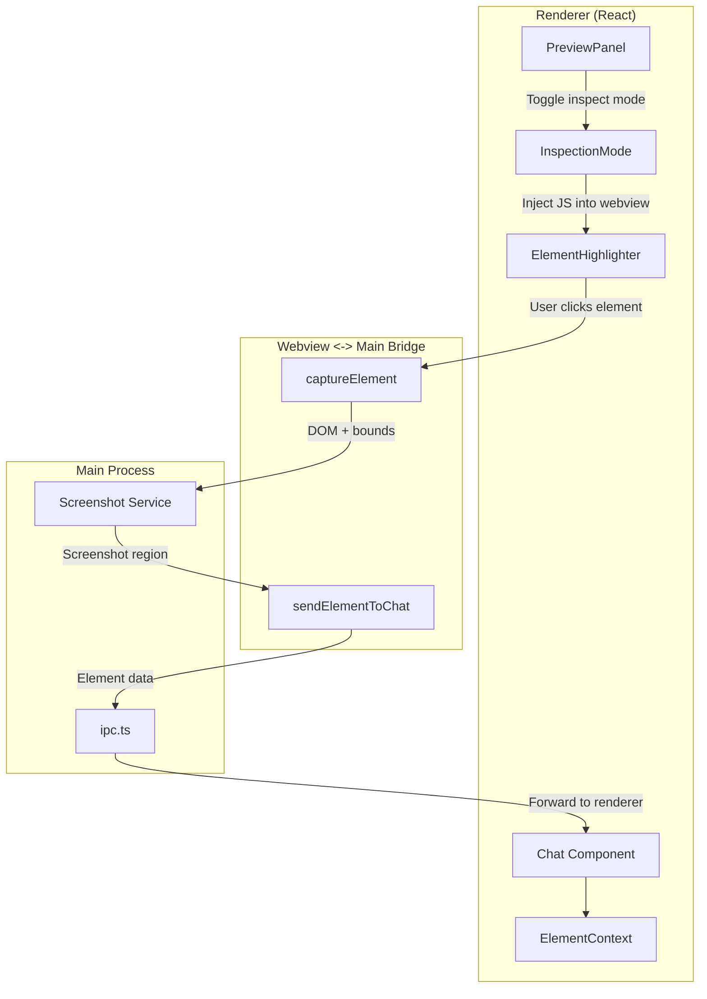

# Session 13: Addressable UI Elements

## Overview

This session adds an **element inspection mode** that allows users to select UI elements in the preview panel by clicking them. Selected elements are captured (screenshot + DOM info) and injected into the chat context, enabling the agent to make precise, targeted changes to specific UI components.

**Estimated scope**: Medium (may split into 3 sub-sessions if needed)
**Prerequisites**: Session 8 complete (App Preview)
**Deliverable**: Element selection mode with context injection for targeted UI modifications

## Why This Matters

- **Precision**: Users can point at exactly what they want changed instead of describing it in words
- **Visual Context**: Agent receives both DOM structure and visual appearance of selected elements
- **Efficiency**: Reduces back-and-forth clarification about which component needs changes
- **Accessibility**: Makes it easier to request UI changes without knowing component names or file locations

## Current State

### What exists

| Component | Status | Details |
|-----------|--------|---------|
| **Preview Panel** | Complete | Embedded webview showing running apps (Session 8.4) |
| **Chat Context** | Complete | Messages with text, tool uses, results (Session 7) |
| **Screenshot API** | Missing | Need to capture element regions |
| **DOM Inspection** | Missing | Need to extract element info from preview |
| **Selection Mode UI** | Missing | Visual feedback for selection mode |

### What's missing

1. **Inspection Mode Toggle** — Button to enter/exit element selection mode
2. **Element Highlighter** — Visual overlay showing selectable elements on hover
3. **Element Capture** — Extract DOM info (tag, classes, text, attributes) + screenshot
4. **Context Injection** — Add captured element to chat as a special message type
5. **Agent Instructions** — Update agent prompts to interpret element context
6. **Multi-select** — Allow selecting multiple elements to compare/modify together

---

## Architecture



**Key principle**: Use webview preload script to inject inspection overlay. Capture element info + screenshot, send to chat context.

---

## Implementation Strategy

This session is split into 3 sub-sessions to fit within agent context limits:

| Sub-Session | Focus | Scope |
|-------------|-------|-------|
| [13.1: Inspector Overlay](SESSION-13.1-INSPECTOR-OVERLAY.md) | Overlay injection, DOM extraction, hover highlights | Small (~1 hour) |
| [13.2: Context Injection](SESSION-13.2-CONTEXT-INJECTION.md) | Screenshot capture, IPC, element messages | Small (~1 hour) |
| [13.3: Agent Integration](SESSION-13.3-AGENT-INTEGRATION.md) | Agent awareness, system prompt, polish | Small (~1 hour) |

Each sub-session produces a working increment and can be completed independently.

---

## Implementation Details

The detailed implementation tasks are split across the sub-session documents. Below is a summary of the overall architecture and key components.

## Task 1: Element Inspector Overlay (See 13.1)

Create a script that injects into the preview webview to enable element selection.

### packages/shared/src/inspector/overlay.ts

```typescript
/**
 * Client-side overlay for element inspection in preview webview.
 * Injected via webview.executeJavaScript() from renderer.
 */

/**
 * Element information extracted from DOM.
 */
export interface ElementInfo {
  /** Tag name (e.g., 'button', 'div'). */
  tag: string
  /** Element text content (trimmed). */
  text: string
  /** CSS classes. */
  classes: string[]
  /** ID attribute. */
  id?: string
  /** Data attributes. */
  dataAttributes: Record<string, string>
  /** Computed styles (selected properties). */
  styles: {
    position: string
    display: string
    width: string
    height: string
    backgroundColor?: string
    color?: string
  }
  /** Bounding rect relative to viewport. */
  bounds: {
    x: number
    y: number
    width: number
    height: number
  }
  /** XPath selector for the element. */
  xpath: string
  /** CSS selector (best attempt). */
  selector: string
}

/**
 * Generate a CSS selector for an element.
 */
function generateSelector(element: Element): string {
  // Prefer ID
  if (element.id) {
    return `#${element.id}`
  }

  // Build path from classes and tag
  const parts: string[] = []
  let current: Element | null = element

  while (current && current !== document.body) {
    let selector = current.tagName.toLowerCase()
    if (current.className) {
      const classes = Array.from(current.classList).filter(c =>
        // Skip utility classes
        !c.startsWith('tw-') && !c.match(/^(p|m|text|bg|flex|grid)-/)
      )
      if (classes.length > 0) {
        selector += `.${classes.slice(0, 2).join('.')}`
      }
    }
    parts.unshift(selector)
    current = current.parentElement
    if (parts.length > 4) break // Limit depth
  }

  return parts.join(' > ')
}

/**
 * Generate an XPath for an element.
 */
function generateXPath(element: Element): string {
  const parts: string[] = []
  let current: Element | null = element

  while (current && current !== document.body) {
    let index = 0
    let sibling = current.previousElementSibling
    while (sibling) {
      if (sibling.tagName === current.tagName) index++
      sibling = sibling.previousElementSibling
    }
    const tagName = current.tagName.toLowerCase()
    const part = index > 0 ? `${tagName}[${index + 1}]` : tagName
    parts.unshift(part)
    current = current.parentElement
  }

  return '//' + parts.join('/')
}

/**
 * Extract element information.
 */
function extractElementInfo(element: Element): ElementInfo {
  const rect = element.getBoundingClientRect()
  const computed = window.getComputedStyle(element)

  // Extract data attributes
  const dataAttributes: Record<string, string> = {}
  Array.from(element.attributes).forEach(attr => {
    if (attr.name.startsWith('data-')) {
      dataAttributes[attr.name] = attr.value
    }
  })

  return {
    tag: element.tagName.toLowerCase(),
    text: element.textContent?.trim().slice(0, 100) || '',
    classes: Array.from(element.classList),
    id: element.id || undefined,
    dataAttributes,
    styles: {
      position: computed.position,
      display: computed.display,
      width: computed.width,
      height: computed.height,
      backgroundColor: computed.backgroundColor,
      color: computed.color
    },
    bounds: {
      x: rect.x,
      y: rect.y,
      width: rect.width,
      height: rect.height
    },
    xpath: generateXPath(element),
    selector: generateSelector(element)
  }
}

/**
 * Global state for the inspector overlay.
 */
let isActive = false
let highlightOverlay: HTMLDivElement | null = null
let selectedElement: Element | null = null

/**
 * Create the highlight overlay element.
 */
function createOverlay(): HTMLDivElement {
  const overlay = document.createElement('div')
  overlay.id = 'pitaster-inspector-highlight'
  overlay.style.cssText = `
    position: fixed;
    pointer-events: none;
    border: 2px solid #3b82f6;
    background: rgba(59, 130, 246, 0.1);
    z-index: 999999;
    transition: all 0.1s ease;
  `
  document.body.appendChild(overlay)
  return overlay
}

/**
 * Update overlay position to highlight an element.
 */
function highlightElement(element: Element): void {
  if (!highlightOverlay) return
  const rect = element.getBoundingClientRect()
  highlightOverlay.style.left = `${rect.left}px`
  highlightOverlay.style.top = `${rect.top}px`
  highlightOverlay.style.width = `${rect.width}px`
  highlightOverlay.style.height = `${rect.height}px`
  highlightOverlay.style.display = 'block'
}

/**
 * Hide the overlay.
 */
function hideOverlay(): void {
  if (highlightOverlay) {
    highlightOverlay.style.display = 'none'
  }
}

/**
 * Handle mousemove to highlight elements under cursor.
 */
function handleMouseMove(e: MouseEvent): void {
  if (!isActive) return

  const element = document.elementFromPoint(e.clientX, e.clientY)
  if (element && element !== highlightOverlay) {
    highlightElement(element)
  }
}

/**
 * Handle click to select an element.
 */
function handleClick(e: MouseEvent): void {
  if (!isActive) return

  e.preventDefault()
  e.stopPropagation()

  const element = document.elementFromPoint(e.clientX, e.clientY)
  if (element && element !== highlightOverlay) {
    selectedElement = element
    const info = extractElementInfo(element)

    // Send to parent via postMessage
    window.parent.postMessage({
      type: 'pitaster:element-selected',
      data: info
    }, '*')

    // Flash selection
    if (highlightOverlay) {
      highlightOverlay.style.borderColor = '#10b981'
      highlightOverlay.style.backgroundColor = 'rgba(16, 185, 129, 0.2)'
      setTimeout(() => {
        if (highlightOverlay) {
          highlightOverlay.style.borderColor = '#3b82f6'
          highlightOverlay.style.backgroundColor = 'rgba(59, 130, 246, 0.1)'
        }
      }, 300)
    }
  }
}

/**
 * Activate inspector mode.
 */
export function activate(): void {
  if (isActive) return
  isActive = true

  // Create overlay if needed
  if (!highlightOverlay) {
    highlightOverlay = createOverlay()
  }

  // Add event listeners
  document.addEventListener('mousemove', handleMouseMove, true)
  document.addEventListener('click', handleClick, true)

  // Change cursor
  document.body.style.cursor = 'crosshair'

  console.log('[Pi Taster] Inspector mode activated')
}

/**
 * Deactivate inspector mode.
 */
export function deactivate(): void {
  if (!isActive) return
  isActive = false

  // Remove listeners
  document.removeEventListener('mousemove', handleMouseMove, true)
  document.removeEventListener('click', handleClick, true)

  // Reset cursor
  document.body.style.cursor = ''

  // Hide overlay
  hideOverlay()

  console.log('[Pi Taster] Inspector mode deactivated')
}

/**
 * Check if inspector is active.
 */
export function isActiveMode(): boolean {
  return isActive
}

// Expose global API for injection via executeJavaScript
;(window as any).__piTasterInspector = {
  activate,
  deactivate,
  isActive: isActiveMode
}
```

---

## Task 2: Preview Panel Integration

Add an "Inspect" button to the preview panel toolbar and inject the inspector overlay.

### apps/electron/src/renderer/src/components/PreviewPanel.tsx

Add to the component:

```tsx
const [isInspecting, setIsInspecting] = useState(false)
const webviewRef = useRef<WebviewTag | null>(null)

/**
 * Toggle inspector mode in the webview.
 */
const toggleInspector = useCallback(async () => {
  if (!webviewRef.current) return

  try {
    if (isInspecting) {
      // Deactivate
      await webviewRef.current.executeJavaScript('window.__piTasterInspector?.deactivate()')
      setIsInspecting(false)
    } else {
      // Load inspector script if not already loaded
      const hasInspector = await webviewRef.current.executeJavaScript(
        'typeof window.__piTasterInspector !== "undefined"'
      )

      if (!hasInspector) {
        // Read and inject the overlay script
        const overlayScript = await window.electronAPI.getInspectorScript()
        await webviewRef.current.executeJavaScript(overlayScript)
      }

      // Activate
      await webviewRef.current.executeJavaScript('window.__piTasterInspector?.activate()')
      setIsInspecting(true)
    }
  } catch (err) {
    console.error('Failed to toggle inspector:', err)
  }
}, [isInspecting])

/**
 * Handle element selection messages from webview.
 */
useEffect(() => {
  const handleMessage = (event: MessageEvent) => {
    if (event.data?.type === 'pitaster:element-selected') {
      const elementInfo = event.data.data
      // TODO: Send to chat context
      console.log('Element selected:', elementInfo)
    }
  }

  window.addEventListener('message', handleMessage)
  return () => window.removeEventListener('message', handleMessage)
}, [])
```

Add an "Inspect" button to the preview toolbar:

```tsx
<button
  onClick={toggleInspector}
  className={`rounded px-2 py-1 text-xs transition ${
    isInspecting
      ? 'bg-blue-600 text-white'
      : 'bg-neutral-700 text-neutral-300 hover:bg-neutral-600'
  }`}
  title={isInspecting ? 'Exit inspect mode' : 'Inspect elements'}
>
  {isInspecting ? '✓ Inspecting' : '🔍 Inspect'}
</button>
```

---

## Task 3: Inspector Script IPC

Add IPC to load the inspector overlay script on demand.

### apps/electron/src/main/ipc.ts

```typescript
/**
 * Load the inspector overlay script as a string.
 */
ipcMain.handle('inspector:get-script', async () => {
  try {
    // Read the compiled inspector script
    const scriptPath = path.join(__dirname, '../../packages/shared/dist/inspector/overlay.js')
    const script = await fs.promises.readFile(scriptPath, 'utf-8')
    return script
  } catch (err) {
    console.error('Failed to load inspector script:', err)
    throw new Error('Inspector script not found')
  }
})
```

### apps/electron/src/preload/index.ts

```typescript
getInspectorScript: () => ipcRenderer.invoke('inspector:get-script')
```

### apps/electron/src/renderer/src/types/electron.d.ts

```typescript
getInspectorScript: () => Promise<string>
```

---

## Task 4: Element Context Message Type

Add a new message type for element context.

### packages/core/src/messages.ts

```typescript
/**
 * Element context attached to a message.
 */
export interface ElementContext {
  /** Element info from DOM. */
  element: {
    tag: string
    text: string
    classes: string[]
    id?: string
    selector: string
    xpath: string
    bounds: {
      x: number
      y: number
      width: number
      height: number
    }
  }
  /** Screenshot of the element (base64 data URL). */
  screenshot?: string
  /** Timestamp when element was captured. */
  capturedAt: string
}

/**
 * Update ContentBlock to support element context.
 */
export interface ContentBlock {
  type: ContentBlockType | 'element'
  content: string
  tool?: string
  input?: Record<string, unknown>
  timestamp?: string
  status?: 'pending' | 'running' | 'complete' | 'approved' | 'denied'
  /** Element context for 'element' type blocks. */
  elementContext?: ElementContext
}
```

---

## Task 5: Element Screenshot Capture

Add screenshot capture for selected elements.

### apps/electron/src/main/screenshot.ts (new)

```typescript
/**
 * Screenshot service for capturing element regions.
 */

import { screen, desktopCapturer, BrowserWindow } from 'electron'
import sharp from 'sharp'

/**
 * Capture a region of the screen.
 */
export async function captureRegion(
  window: BrowserWindow,
  bounds: { x: number; y: number; width: number; height: number }
): Promise<string> {
  try {
    // Get window position
    const [winX, winY] = window.getPosition()
    const [winWidth, winHeight] = window.getSize()

    // Capture the entire screen
    const sources = await desktopCapturer.getSources({
      types: ['screen'],
      thumbnailSize: screen.getPrimaryDisplay().size
    })

    if (sources.length === 0) {
      throw new Error('No screen sources available')
    }

    const screenshot = sources[0].thumbnail

    // Convert to buffer
    const buffer = screenshot.toPNG()

    // Crop to element region
    const cropped = await sharp(buffer)
      .extract({
        left: Math.floor(winX + bounds.x),
        top: Math.floor(winY + bounds.y),
        width: Math.floor(bounds.width),
        height: Math.floor(bounds.height)
      })
      .png()
      .toBuffer()

    // Return as base64 data URL
    return `data:image/png;base64,${cropped.toString('base64')}`
  } catch (err) {
    console.error('Screenshot capture failed:', err)
    throw err
  }
}
```

### apps/electron/src/main/ipc.ts

```typescript
import { captureRegion } from './screenshot'

/**
 * Capture element screenshot.
 */
ipcMain.handle(
  'inspector:capture-element',
  async (event, elementInfo: ElementInfo) => {
    try {
      const window = BrowserWindow.fromWebContents(event.sender)
      if (!window) throw new Error('Window not found')

      const screenshot = await captureRegion(window, elementInfo.bounds)

      return {
        element: {
          tag: elementInfo.tag,
          text: elementInfo.text,
          classes: elementInfo.classes,
          id: elementInfo.id,
          selector: elementInfo.selector,
          xpath: elementInfo.xpath,
          bounds: elementInfo.bounds
        },
        screenshot,
        capturedAt: new Date().toISOString()
      }
    } catch (err) {
      console.error('Element capture failed:', err)
      throw err
    }
  }
)
```

---

## Task 6: Chat Integration

Add UI to display element context in chat and inject it into agent messages.

### apps/electron/src/renderer/src/components/ElementContextBubble.tsx (new)

```tsx
/**
 * Display an element context block in chat.
 */

import type { ElementContext } from '@pitaster/core/messages'

interface ElementContextBubbleProps {
  context: ElementContext
}

export function ElementContextBubble({ context }: ElementContextBubbleProps) {
  const { element, screenshot } = context

  return (
    <div className="my-2 overflow-hidden rounded-lg border border-blue-500/30 bg-blue-950/20">
      {/* Screenshot */}
      {screenshot && (
        <div className="border-b border-blue-500/30 bg-neutral-900/50 p-2">
          
        </div>
      )}

      {/* Element info */}
      <div className="space-y-1 p-3 text-xs">
        <div>
          <span className="text-neutral-500">Tag:</span>{' '}
          <code className="text-blue-400">{element.tag}</code>
        </div>

        {element.id && (
          <div>
            <span className="text-neutral-500">ID:</span>{' '}
            <code className="text-blue-400">#{element.id}</code>
          </div>
        )}

        {element.classes.length > 0 && (
          <div>
            <span className="text-neutral-500">Classes:</span>{' '}
            <code className="text-neutral-400">{element.classes.join(' ')}</code>
          </div>
        )}

        {element.text && (
          <div>
            <span className="text-neutral-500">Text:</span>{' '}
            <span className="text-neutral-300">{element.text}</span>
          </div>
        )}

        <details className="mt-2">
          <summary className="cursor-pointer text-neutral-500 hover:text-neutral-300">
            Selectors
          </summary>
          <div className="mt-1 space-y-1 pl-2">
            <div>
              <span className="text-neutral-600">CSS:</span>{' '}
              <code className="text-neutral-400">{element.selector}</code>
            </div>
            <div>
              <span className="text-neutral-600">XPath:</span>{' '}
              <code className="text-neutral-400">{element.xpath}</code>
            </div>
          </div>
        </details>
      </div>
    </div>
  )
}
```

### apps/electron/src/renderer/src/components/Chat.tsx

Update to handle 'element' content blocks:

```tsx
// In the content block renderer:
{block.type === 'element' && block.elementContext && (
  <ElementContextBubble context={block.elementContext} />
)}
```

---

## Task 7: Wire Element Selection to Chat

Connect the preview panel element selection to chat context injection.

### apps/electron/src/renderer/src/components/PreviewPanel.tsx

Update the message handler:

```tsx
/**
 * Handle element selection messages from webview.
 */
useEffect(() => {
  const handleMessage = async (event: MessageEvent) => {
    if (event.data?.type === 'pitaster:element-selected') {
      const elementInfo = event.data.data

      try {
        // Capture screenshot
        const elementContext = await window.electronAPI.captureElement(elementInfo)

        // Inject into chat
        await window.electronAPI.addElementContext(elementContext)

        // Exit inspect mode
        setIsInspecting(false)
        if (webviewRef.current) {
          await webviewRef.current.executeJavaScript('window.__piTasterInspector?.deactivate()')
        }
      } catch (err) {
        console.error('Failed to capture element:', err)
      }
    }
  }

  window.addEventListener('message', handleMessage)
  return () => window.removeEventListener('message', handleMessage)
}, [])
```

### apps/electron/src/main/ipc.ts

```typescript
/**
 * Add element context to the current chat.
 */
ipcMain.handle('chat:add-element-context', async (event, context: ElementContext) => {
  // Notify all renderer windows to inject element context
  BrowserWindow.getAllWindows().forEach(win => {
    win.webContents.send('chat:element-context-added', context)
  })
})
```

### apps/electron/src/renderer/src/components/Chat.tsx

Listen for element context events and add to messages:

```tsx
useEffect(() => {
  const handleElementContext = (context: ElementContext) => {
    // Add a new user message with element context
    const message: Message = {
      id: nanoid(),
      role: 'user',
      blocks: [
        {
          type: 'text',
          content: 'Please help me modify this element:'
        },
        {
          type: 'element',
          content: '',
          elementContext: context
        }
      ],
      timestamp: new Date().toISOString()
    }

    setMessages(prev => [...prev, message])
  }

  window.electronAPI.onElementContextAdded(handleElementContext)
}, [])
```

---

## Task 8: Agent Awareness

Update the agent to recognize and use element context in responses.

### apps/electron/src/main/agent.ts

When building the messages array for the API, convert element context blocks:

```typescript
/**
 * Convert element context to Claude message format.
 */
function convertElementContextToPrompt(context: ElementContext): string {
  const { element, screenshot } = context

  let prompt = `[UI Element Context]\n`
  prompt += `Tag: ${element.tag}\n`
  if (element.id) prompt += `ID: #${element.id}\n`
  if (element.classes.length > 0) prompt += `Classes: ${element.classes.join(' ')}\n`
  if (element.text) prompt += `Text: "${element.text}"\n`
  prompt += `Selector: ${element.selector}\n`
  prompt += `Bounds: ${element.bounds.width}x${element.bounds.height} at (${element.bounds.x}, ${element.bounds.y})\n`

  if (screenshot) {
    prompt += `\n[Screenshot attached as image]\n`
  }

  return prompt
}

// When processing messages:
for (const block of message.blocks) {
  if (block.type === 'element' && block.elementContext) {
    content.push({
      type: 'text',
      text: convertElementContextToPrompt(block.elementContext)
    })

    if (block.elementContext.screenshot) {
      content.push({
        type: 'image',
        source: {
          type: 'base64',
          media_type: 'image/png',
          data: block.elementContext.screenshot.replace(/^data:image\/png;base64,/, '')
        }
      })
    }
  }
}
```

---

## Task 9: Multi-Select Support (Optional Enhancement)

Allow selecting multiple elements for comparison or batch modifications.

### Approach

1. **Hold Shift** to add elements to selection instead of replacing
2. **Show selection counter** in inspect mode UI
3. **Inject all selected elements** as separate element blocks in one message

Implementation details TBD based on user feedback.

---

## Verification Checklist

- [ ] Inspector overlay injects successfully into preview webview
- [ ] Elements highlight on hover when in inspect mode
- [ ] Clicking an element captures DOM info
- [ ] Element screenshot is captured correctly
- [ ] Element context appears in chat as a new message
- [ ] Screenshot is displayed in the element bubble
- [ ] Element info (tag, classes, selector) is readable
- [ ] Inspector mode exits after selection
- [ ] Agent receives element context in API messages
- [ ] Agent can reference element selector in responses
- [ ] Inspect button toggles active state visually
- [ ] Works across different app templates (React, static sites)
- [ ] `bun run typecheck:all` passes

---

## Files Changed

| File | Change |
|------|--------|
| `packages/shared/src/inspector/overlay.ts` | **New** — Element inspector overlay script |
| `packages/core/src/messages.ts` | **Modified** — Add `ElementContext` type and 'element' block type |
| `apps/electron/src/main/screenshot.ts` | **New** — Screenshot capture service |
| `apps/electron/src/main/ipc.ts` | **Modified** — Add `inspector:get-script`, `inspector:capture-element`, `chat:add-element-context` |
| `apps/electron/src/preload/index.ts` | **Modified** — Add `getInspectorScript`, `captureElement`, `addElementContext` APIs |
| `apps/electron/src/renderer/src/types/electron.d.ts` | **Modified** — Type inspector APIs |
| `apps/electron/src/renderer/src/components/PreviewPanel.tsx` | **Modified** — Add inspect button, inject overlay, handle selections |
| `apps/electron/src/renderer/src/components/ElementContextBubble.tsx` | **New** — Render element context in chat |
| `apps/electron/src/renderer/src/components/Chat.tsx` | **Modified** — Handle element blocks, listen for context events |
| `apps/electron/src/main/agent.ts` | **Modified** — Convert element context to Claude API messages |

---

## Dependencies

Add to `apps/electron/package.json`:

```json
{
  "dependencies": {
    "sharp": "^0.33.0"
  }
}
```

---

## Commit Checkpoint

```bash
bun install
bun run typecheck:all
bun run build

git add -A
git commit -m "feat: addressable UI element inspection (Session 13)

- Element inspector overlay with hover highlights
- Click-to-select elements in preview webview
- Element screenshot capture with sharp
- Element context message type in chat
- ElementContextBubble component for rich display
- Agent receives element context with screenshots
- Inspect mode toggle in preview panel toolbar
- DOM info extraction (tag, classes, selectors)
- IPC for inspector script loading and capture"
```

---

## Sub-Session Breakdown (If Needed)

If this session becomes too large for one context, split as follows:

### 13.1: Element Capture
**Scope**: Overlay injection, DOM extraction, preview panel integration
**Deliverable**: Clicking elements in preview logs element info to console

**Tasks**: 1, 2, 3

### 13.2: Context Injection
**Scope**: Screenshot capture, IPC, message types
**Deliverable**: Element context messages appear in chat with screenshots

**Tasks**: 4, 5, 6, 7

### 13.3: Agent Integration
**Scope**: Agent awareness, chat UI polish
**Deliverable**: Agent responds to element context with targeted file edits

**Tasks**: 8, 9

Each sub-session is ~1 hour and produces a working increment.

---

## Future Enhancements (Out of Scope)

1. **Element history** — Save previously selected elements for reuse
2. **Computed styles** — Include full computed styles in context
3. **Accessibility info** — Capture ARIA attributes, roles, labels
4. **Component detection** — Identify React component names from dev tools
5. **Batch editing** — Select multiple elements, apply changes to all
6. **Element comparison** — Compare two elements side-by-side
7. **Live preview** — Show changes in preview as agent modifies files
8. **Undo/redo** — Revert element modifications
9. **Export selections** — Save element contexts for documentation or testing
10. **Mobile breakpoints** — Switch preview to mobile viewport sizes for responsive testing
