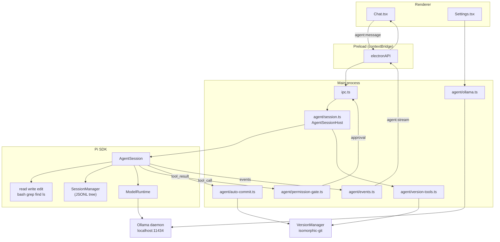

# Session 15: Pi Agent on Ollama

## Overview

Replace Pi Taster's hand-rolled Anthropic agent loop with [Pi](https://pi.dev/)
(`@earendil-works/pi-coding-agent`, MIT), configured to run entirely on local
models served by [Ollama](https://ollama.com/).

`apps/electron/src/main/agent.ts` is 1223 lines built directly on
`@anthropic-ai/sdk@^0.36.0`: a `while (continueLoop)` loop over
`client.messages.stream()`, 11 scoped tools, a hand-written permission gate, and a
hardcoded `model: 'claude-sonnet-4-20250514'` (line 1104). `SESSION-14-NOTES.md`
already lists this as debt.

**Estimated scope**: Large (~7 hours across 4 sub-sessions)
**Prerequisites**: Session 14 complete
**Deliverable**: The agent runs on a local Ollama model with no API key, a real
session tree, working cancellation, and correct tool correlation.

## Why This Matters

- **No API key, no network.** Inference is local. `~/.pitaster/.apikey` and the
  `safeStorage` plumbing go away entirely.
- **Cancellation actually exists.** `runAgentQuery` accepts a `signal` and checks it
  (`agent.ts:1116`), but `ipc.ts` never passes one. There is no `AbortController`,
  no `agent:abort` channel, and no stop button anywhere in the app.
- **History stops being lossy.** `rebuildConversationHistory` (`ipc.ts:178-193`)
  keeps only `text` blocks, so switching session or app silently drops every
  `tool_use`/`tool_result`/image from the model's context.
- **Tool correlation gets fixed.** `tool_start` fires twice per tool and
  `Chat.tsx:275` matches `tool_end` to "the first block whose status is running".
  Parallel tool use corrupts the UI today.
- **~310 dead lines go.** `selfModifyTools` (502-655) and `executeTool` (663-813)
  are unreachable from `runAgentQuery` and resolve paths against `PROJECT_ROOT`
  with no normalization.

## Current State

### What exists

| Component | Status | Details |
|-----------|--------|---------|
| Agent loop | Working, hand-rolled | `agent.ts:1032-1223`, raw SSE iteration |
| Tools | 11 scoped | `createScopedTools(app)`, `agent.ts:133-496` |
| Permission gate | Working | `checkPermission`, `agent.ts:821-872` |
| Approval round-trip | Working | `ipc.ts:254-277`, 60s deny-on-timeout |
| Version control | Working | `VersionManager`, `packages/shared/src/versions/` |
| Chat sessions | Working | `ChatHistoryManager`, one JSON file per message |
| Skills | Working | `SkillsLoader` + `@mention` activation |
| Element context | Working | inspector overlay → screenshot → base64 image block |
| Provider config | **None** | `new Anthropic()` with no options; model hardcoded |
| Cancellation | **None** | `signal` accepted, never supplied |
| MCP wiring | **None** | `SourceManager.callTool` exists; the agent never calls it |

### What's missing

1. Any provider or model abstraction — zero hits repo-wide for `ollama`, `baseURL`,
   `modelId`, or `selectedModel`.
2. An `agent:abort` IPC channel and a stop button.
3. `tool_use_id` on `SerializedToolBlock` (`packages/core/src/chat.ts:20`), without
   which history cannot be replayed to any API.
4. A single source of truth for `StreamChunk` — it is duplicated 4× and has drifted
   (`core/src/agent.ts:24` and `preload/index.ts:7` are missing `input`/`output`).

---

## Architecture



**Key principle**: Pi owns the loop, the tools, the transcript, and the provider.
Pi Taster keeps only what is genuinely its own — the permission modes, the git
auto-commit, the version tools, the element-context capture, and the UI.

---

## Implementation Strategy

| Sub-Session | Focus | Scope |
|-------------|-------|-------|
| [15.1](SESSION-15.1-ESM-RUNTIME.md) | Electron 39, ESM main process, build config | ~1 hour |
| [15.2](SESSION-15.2-OLLAMA-PROVIDER.md) | Ollama discovery, `models.json`, Settings picker | ~1 hour |
| [15.3](SESSION-15.3-PI-AGENT-CORE.md) | The agent swap — deletes `agent.ts` | ~3 hours |
| [15.4](SESSION-15.4-PI-SESSIONS.md) | `SessionManager` swap, deletions, docs | ~2 hours |

---

## Decisions

| Question | Decision |
|---|---|
| Tool surface | Pi's built-in tools as-is (`read`, `write`, `edit`, `bash`, `grep`, `find`, `ls`), gated by permission mode |
| Providers | Ollama only. Drop `@anthropic-ai/sdk` and all API-key plumbing |
| Sessions | Adopt Pi's `SessionManager` (tree-structured JSONL, branch/fork) |
| Runtime | Electron 33 → 39, ESM main process |

### Consequences worth stating plainly

**1. The sandbox becomes a hook, not a structure.** Today `normalizePath(rootPath, path)`
(`agent.ts:39-55`) sits inside every file tool and returns `null` on escape, and
`BLOCKED_COMMANDS` (`agent.ts:25`) sits inside `run_command`. Pi's docs are explicit:
*"Pi does not include a built-in sandbox. Built-in tools can read files, write files,
edit files, and run shell commands with the permissions of the pi process."* Pi resolves
*relative* paths against `cwd`, but an absolute path or a `bash` command escapes freely.

Adopting Pi's tools as-is moves the path-confinement guarantee in
`.claude/rules/self-modification.md` from *"the tool cannot escape"* to *"a `tool_call`
handler declines to run it."* That handler is one place rather than scattered across
eleven tools, but it is advisory rather than structural, and a bug in it is a full
escape. Session 15.3 verification includes explicit escape attempts whose results must
be recorded verbatim in the notes.

**2. Auto-commit survives as a hook.** Per-write auto-commit is what the versions UI,
rollback, and branching are built on. It is re-added in 15.3 via `pi.on("tool_result")`
after `write`/`edit`. It is no longer a per-tool structural guarantee.

**3. Version tools stay custom.** Pi has no equivalent for `create_branch`,
`switch_branch`, `list_branches`, `get_history`, `rollback`, `git_status`. These are
Pi Taster domain tools over `isomorphic-git`, not coding built-ins, so they are ported to
`defineTool()` rather than dropped.

---

## Dependencies

| Package | Change |
|---------|--------|
| `@anthropic-ai/sdk` | **Removed** |
| `@earendil-works/pi-coding-agent` | **Added** `^0.84.4` |
| `@earendil-works/pi-ai` | **Added** `^0.84.4` |
| `typebox` | **Added** `^1.3.7` (tool schemas) |
| `electron` | `^33.0.0` → `^39.0.0` |
| `electron-vite` | `^2.3.0` → `^5.0.0` |

Electron 39 bundles Node 22.20.0. Pi declares `engines.node >= 22.19.0`; Electron 33
bundles Node 20.18.

---

## Runtime prerequisite

The app now requires a running Ollama daemon and a **tool-capable** model. Pi's
built-in tools use function calling; a model without tool support will connect and
then fail to act.

```bash
ollama serve
ollama pull qwen3-coder:30b   # or llama3.1, gpt-oss, mistral-nemo
```

---

## Verification Checklist

- [ ] 15.1 — app launches on Electron 39 with an ESM main process, behaviour unchanged
- [ ] 15.2 — Settings lists locally pulled Ollama models; `~/.pitaster/pi/models.json` matches
- [ ] 15.3 — agent responds, tools pair correctly, all four permission modes behave
- [ ] 15.3 — escape attempts (`/etc/passwd`, `~/`, `~/.ssh/id_rsa`) are all blocked
- [ ] 15.4 — sessions persist across restart with full tool fidelity
- [ ] `electron-security-reviewer` and `self-modification-auditor` run clean
- [ ] `bun run typecheck:all` passes

---

## Not in Scope

**MCP.** `SourceManager.callTool` (`packages/shared/src/sources/manager.ts:142`) is
fully built and completely unwired — `agent.ts` never references it, so connected MCP
servers contribute zero tools today. Pi has no built-in MCP either, but
`pi.registerTool()` makes bridging straightforward. Worth a Session 16.

## Future Enhancements (Out of Scope)

1. **MCP bridge** — expose `SourceManager` tools through `pi.registerTool()`.
2. **Sub-agents** — Pi extensions can spawn nested sessions for scoped work.
3. **Compaction UI** — Pi emits `compaction_start`/`compaction_end`; surface it.
4. **Session branching UI** — Pi's tree has `fork`/`branch`; the git rollback story
   pairs naturally with it.
5. **Thinking display** — `thinking_delta` events are ignored for now.
6. **Remote providers** — `models.json` can carry Anthropic/OpenAI alongside Ollama.
7. **Prompt templates** — Pi's `PromptTemplate` could back a slash-command UI.
8. **Steering** — `session.steer()` lets the user redirect mid-stream.
9. **Real OS sandboxing** — the only way to restore a structural guarantee.
10. **Token/cost display** — Pi reports usage per turn.
