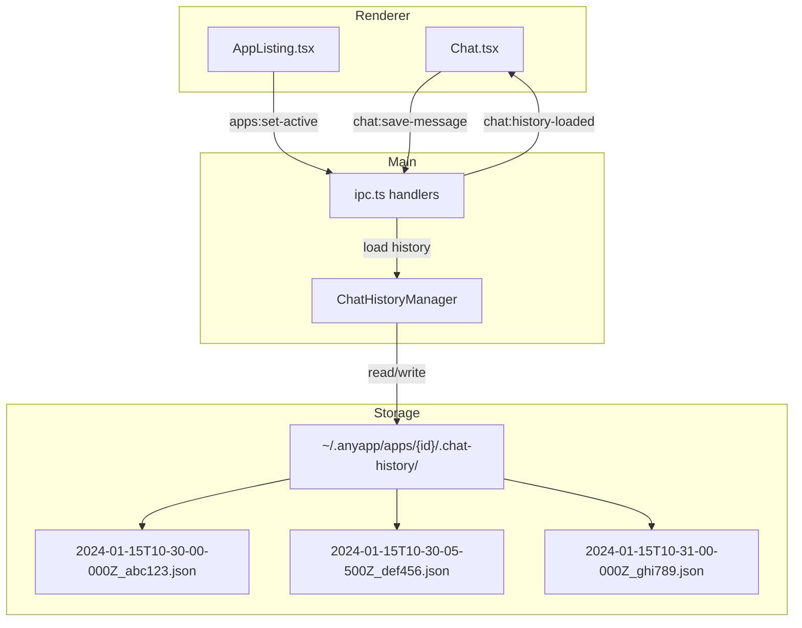

# Session 9: Chat History Persistence

## Overview

This session adds persistent chat history for each sub-app, storing messages as individual JSON files in a `.chat-history/` directory. Messages are sorted by datetime and automatically loaded when switching between apps.

**Estimated scope**: Medium  
**Prerequisites**: Session 7 complete  
**Deliverable**: Persistent chat history per app with automatic load/save

## Current Problems

1. **Messages lost on restart** - Chat history is stored in-memory only (`conversationHistory` array in `ipc.ts`)
2. **Messages lost on app switch** - Switching between apps loses the conversation context
3. **No conversation continuity** - Users must re-explain context each time they return to an app
4. **Claude context reset** - The agent loses prior conversation history needed for context

## Goals

1. **Persistent storage** - Chat messages saved to disk per app
2. **Automatic loading** - History loads when an app becomes active
3. **Incremental saves** - Messages saved as they complete (no data loss)
4. **Easy maintenance** - Directory-based storage allows pruning old messages

---

## Architecture



## Storage Format

Each app stores messages as individual JSON files in a `.chat-history/` directory:

```
~/.anyapp/apps/{app-id}/
├── .anyapp-meta.json
├── .chat-history/
│   ├── 2024-01-15T10-30-00-000Z_abc123.json
│   ├── 2024-01-15T10-30-05-500Z_def456.json
│   └── 2024-01-15T10-31-00-000Z_ghi789.json
└── [app files...]
```

**Filename format**: `{ISO-timestamp}_{message-id}.json`

- Timestamp uses `-` instead of `:` for filesystem compatibility
- Natural alphabetical sorting = chronological order
- Message ID suffix ensures uniqueness for same-millisecond messages

**Benefits of directory approach**:

- Incremental saves (just write a new file)
- No read-modify-write cycles
- Easy to prune old messages (delete files)
- Natural chronological ordering via filenames
- Smaller individual file sizes

---

## Tasks

### Task 1: Add Chat History Types

**File**: `packages/core/src/chat.ts` (new file)

Create type definitions for persisted chat messages:

```typescript
/**
 * Chat history type definitions for anyapp.
 */

/**
 * Serialized text content block.
 */
export interface SerializedTextBlock {
  type: 'text'
  content: string
}

/**
 * Serialized tool execution block.
 */
export interface SerializedToolBlock {
  type: 'tool'
  name: string
  input?: Record<string, unknown>
  output?: string
  status: 'pending' | 'running' | 'complete' | 'error'
}

/**
 * Serialized approval record block.
 */
export interface SerializedApprovalBlock {
  type: 'approval'
  tool: string
  approved: boolean
  timestamp: string
}

/**
 * Union of all serializable content block types.
 */
export type SerializedContentBlock = 
  | SerializedTextBlock 
  | SerializedToolBlock 
  | SerializedApprovalBlock

/**
 * A persisted chat message.
 */
export interface PersistedMessage {
  /** Unique message ID. */
  id: string
  /** Message role. */
  role: 'user' | 'assistant'
  /** Content blocks. */
  blocks: SerializedContentBlock[]
  /** ISO timestamp when message was created. */
  timestamp: string
}
```

**Update**: `packages/core/src/index.ts` - Export new types

---

### Task 2: Create ChatHistoryManager

**File**: `packages/shared/src/chat/manager.ts` (new file)

```typescript
/**
 * Manages persistent chat history for sub-apps.
 */

import { promises as fs } from 'node:fs'
import { join } from 'node:path'
import { homedir } from 'node:os'
import type { PersistedMessage } from '@anyapp/core'

/**
 * Manages chat history storage for sub-apps.
 */
export class ChatHistoryManager {
  private appsDir: string

  constructor() {
    this.appsDir = join(homedir(), '.anyapp', 'apps')
  }

  /**
   * Get the chat history directory for an app.
   */
  getHistoryDir(appId: string): string {
    return join(this.appsDir, appId, '.chat-history')
  }

  /**
   * Generate a filename for a message.
   * Format: {timestamp}_{id}.json
   */
  generateFilename(message: PersistedMessage): string {
    // Replace : with - for filesystem compatibility
    const safeTimestamp = message.timestamp.replace(/:/g, '-')
    return `${safeTimestamp}_${message.id}.json`
  }

  /**
   * Load all chat history for an app, sorted chronologically.
   */
  async loadHistory(appId: string): Promise<PersistedMessage[]> {
    const historyDir = this.getHistoryDir(appId)
    
    try {
      const files = await fs.readdir(historyDir)
      const jsonFiles = files
        .filter(f => f.endsWith('.json'))
        .sort() // Alphabetical = chronological due to filename format
      
      const messages: PersistedMessage[] = []
      for (const file of jsonFiles) {
        try {
          const content = await fs.readFile(join(historyDir, file), 'utf-8')
          messages.push(JSON.parse(content))
        } catch {
          // Skip malformed files
        }
      }
      
      return messages
    } catch {
      // Directory doesn't exist yet
      return []
    }
  }

  /**
   * Save a message to the history directory.
   */
  async saveMessage(appId: string, message: PersistedMessage): Promise<void> {
    const historyDir = this.getHistoryDir(appId)
    await fs.mkdir(historyDir, { recursive: true })
    
    const filename = this.generateFilename(message)
    const filepath = join(historyDir, filename)
    await fs.writeFile(filepath, JSON.stringify(message, null, 2))
  }

  /**
   * Delete a specific message from history.
   */
  async deleteMessage(appId: string, messageId: string): Promise<void> {
    const historyDir = this.getHistoryDir(appId)
    
    try {
      const files = await fs.readdir(historyDir)
      const targetFile = files.find(f => f.includes(`_${messageId}.json`))
      if (targetFile) {
        await fs.unlink(join(historyDir, targetFile))
      }
    } catch {
      // Directory or file doesn't exist
    }
  }

  /**
   * Clear all chat history for an app.
   */
  async clearHistory(appId: string): Promise<void> {
    const historyDir = this.getHistoryDir(appId)
    
    try {
      const files = await fs.readdir(historyDir)
      await Promise.all(
        files.map(f => fs.unlink(join(historyDir, f)))
      )
    } catch {
      // Directory doesn't exist
    }
  }
}
```

**Update**: `packages/shared/src/index.ts` - Export ChatHistoryManager

---

### Task 3: Add IPC Handlers

**File**: `apps/electron/src/main/ipc.ts`

Add new IPC handlers for chat history operations:

```typescript
// Add import
import { ChatHistoryManager } from '@anyapp/shared'
import type { PersistedMessage } from '@anyapp/core'

// Add instance
const chatHistoryManager = new ChatHistoryManager()

// Add handlers in setupIpcHandlers()

ipcMain.handle('chat:load-history', async () => {
  if (!activeAppId) {
    return []
  }
  return chatHistoryManager.loadHistory(activeAppId)
})

ipcMain.handle('chat:save-message', async (_event, message: PersistedMessage) => {
  if (!activeAppId) {
    throw new Error('No active app')
  }
  await chatHistoryManager.saveMessage(activeAppId, message)
})

ipcMain.handle('chat:clear-history', async () => {
  if (!activeAppId) {
    throw new Error('No active app')
  }
  await chatHistoryManager.clearHistory(activeAppId)
  conversationHistory = []
})
```

**Modify** `apps:set-active` handler to load history on app switch:

```typescript
ipcMain.handle('apps:set-active', async (_event, appId: string | null) => {
  // Clear in-memory conversation history
  conversationHistory = []
  
  activeAppId = appId
  
  if (appId) {
    // Load persisted history for the new app
    const history = await chatHistoryManager.loadHistory(appId)
    
    // Rebuild conversationHistory for Claude SDK
    for (const msg of history) {
      const textContent = msg.blocks
        .filter(b => b.type === 'text')
        .map(b => (b as SerializedTextBlock).content)
        .join('')
      
      if (textContent) {
        conversationHistory.push({
          role: msg.role,
          content: textContent
        })
      }
    }
    
    // Emit to renderer
    const win = BrowserWindow.getAllWindows()[0]
    if (win) {
      win.webContents.send('chat:history-loaded', history)
    }
  }
})
```

---

### Task 4: Update Preload API

**File**: `apps/electron/src/preload/index.ts`

```typescript
// Add to electronAPI object
loadChatHistory: () => ipcRenderer.invoke('chat:load-history'),
saveChatMessage: (message: PersistedMessage) => 
  ipcRenderer.invoke('chat:save-message', message),
clearChatHistory: () => ipcRenderer.invoke('chat:clear-history'),
onChatHistoryLoaded: (callback: (messages: PersistedMessage[]) => void) => {
  ipcRenderer.on('chat:history-loaded', (_event, messages) => callback(messages))
},
offChatHistoryLoaded: () => {
  ipcRenderer.removeAllListeners('chat:history-loaded')
},
```

---

### Task 5: Update Type Definitions

**File**: `apps/electron/src/renderer/src/types/electron.d.ts`

Add type definitions for the new API methods:

```typescript
import type { PersistedMessage } from '@anyapp/core'

interface ElectronAPI {
  // ... existing methods ...
  
  // Chat history
  loadChatHistory: () => Promise<PersistedMessage[]>
  saveChatMessage: (message: PersistedMessage) => Promise<void>
  clearChatHistory: () => Promise<void>
  onChatHistoryLoaded: (callback: (messages: PersistedMessage[]) => void) => void
  offChatHistoryLoaded: () => void
}
```

---

### Task 6: Integrate with Chat Component

**File**: `apps/electron/src/renderer/src/components/Chat.tsx`

Add history loading and message saving:

```typescript
import type { PersistedMessage, SerializedContentBlock } from '@anyapp/core'

// Add effect to listen for history loaded
useEffect(() => {
  const handleHistoryLoaded = (history: PersistedMessage[]) => {
    // Convert PersistedMessage[] to Message[] for UI
    const uiMessages: Message[] = history.map(msg => ({
      id: msg.id,
      role: msg.role,
      blocks: convertToUIBlocks(msg.blocks)
    }))
    setMessages(uiMessages)
  }
  
  window.electronAPI.onChatHistoryLoaded(handleHistoryLoaded)
  
  return () => {
    window.electronAPI.offChatHistoryLoaded()
  }
}, [])

// Helper to convert UI Message to PersistedMessage
function toPersistedMessage(msg: Message): PersistedMessage {
  return {
    id: msg.id,
    role: msg.role,
    blocks: convertToSerializedBlocks(msg.blocks ?? []),
    timestamp: new Date().toISOString()
  }
}

// Save user message when sent
const handleSend = async () => {
  const userMessage: Message = {
    id: nanoid(),
    role: 'user',
    blocks: [{ type: 'text', content: currentInput }]
  }
  setMessages(prev => [...prev, userMessage])
  
  // Save to history
  await window.electronAPI.saveChatMessage(toPersistedMessage(userMessage))
  
  // ... rest of send logic
}

// Save assistant message when streaming completes
// In the stream handler, when chunk.type === 'complete':
const assistantMessage = messages[messages.length - 1]
if (assistantMessage?.role === 'assistant') {
  await window.electronAPI.saveChatMessage(toPersistedMessage(assistantMessage))
}
```

---

## Verification Checklist

- [ ] Types compile without errors (`bun run typecheck:all`)
- [ ] ChatHistoryManager correctly saves messages as individual files
- [ ] Files are named with timestamp and sorted chronologically
- [ ] Switching apps loads the correct history
- [ ] Messages persist across app restart
- [ ] Clear history removes all message files
- [ ] Claude SDK `conversationHistory` is rebuilt from persisted messages
- [ ] UI displays loaded history correctly

---

## Commit Checkpoint

```bash
git add -A && git commit -m "feat: add persistent chat history per app

- Add PersistedMessage and SerializedContentBlock types
- Create ChatHistoryManager with directory-based storage
- Add chat:load-history, chat:save-message, chat:clear-history IPC handlers
- Update apps:set-active to load/emit history on switch
- Integrate history loading/saving in Chat component
- Messages stored as individual JSON files sorted by datetime"
```

---

## Considerations

- **Message Pruning**: With individual files, old messages can easily be pruned by deleting files older than a threshold (e.g., keep last 100 messages).
- **Conversation History Sync**: The `conversationHistory` array (for Claude SDK) needs to stay in sync with persisted messages for context continuity.
- **No App Selected**: When no app is active, chat works as before (ephemeral, no persistence).
- **Filesystem Limits**: Very long conversations could create many files. Consider pagination when loading (e.g., load most recent N messages initially).
